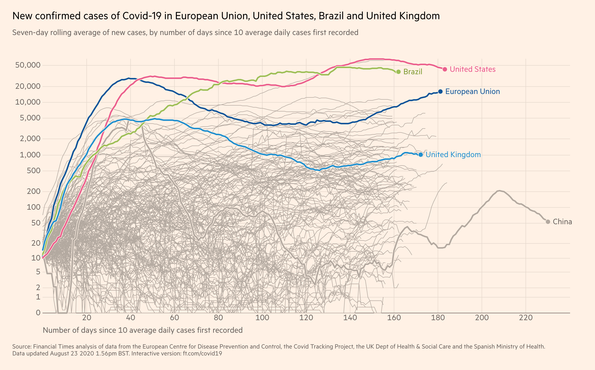
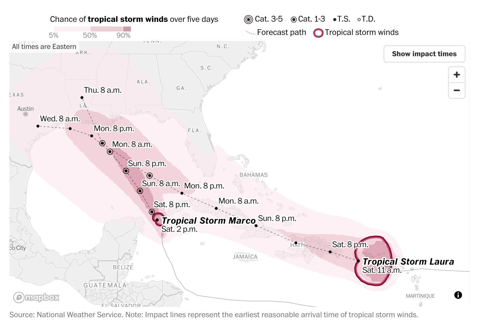
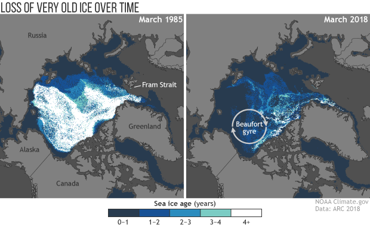
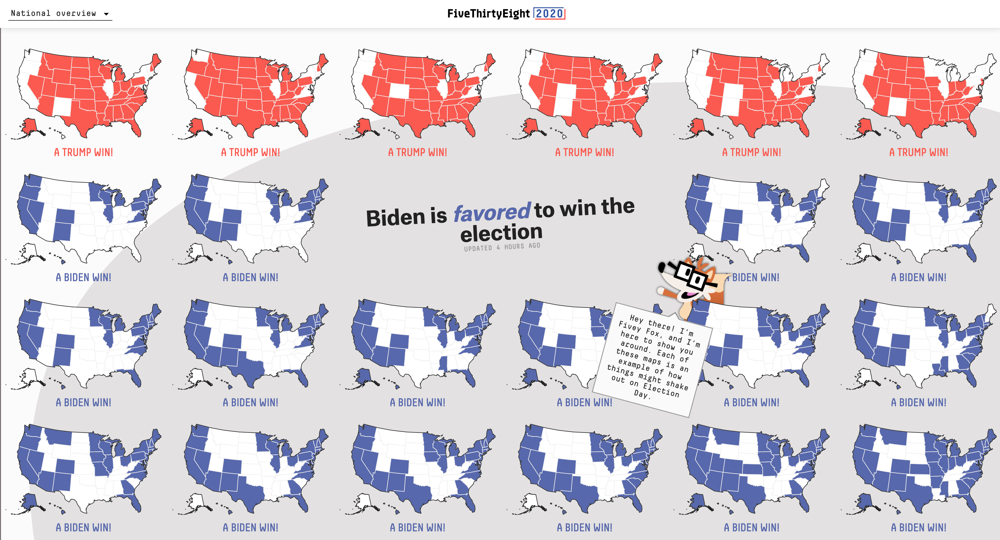
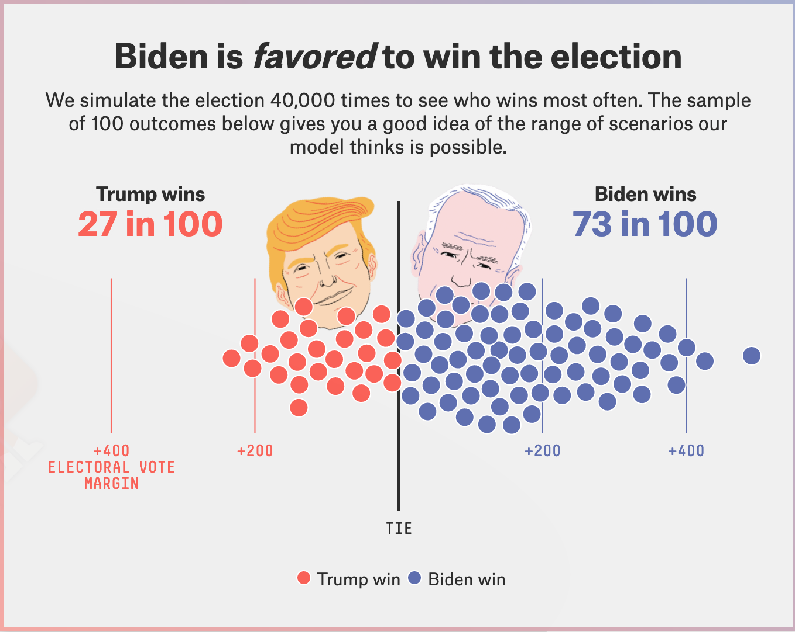
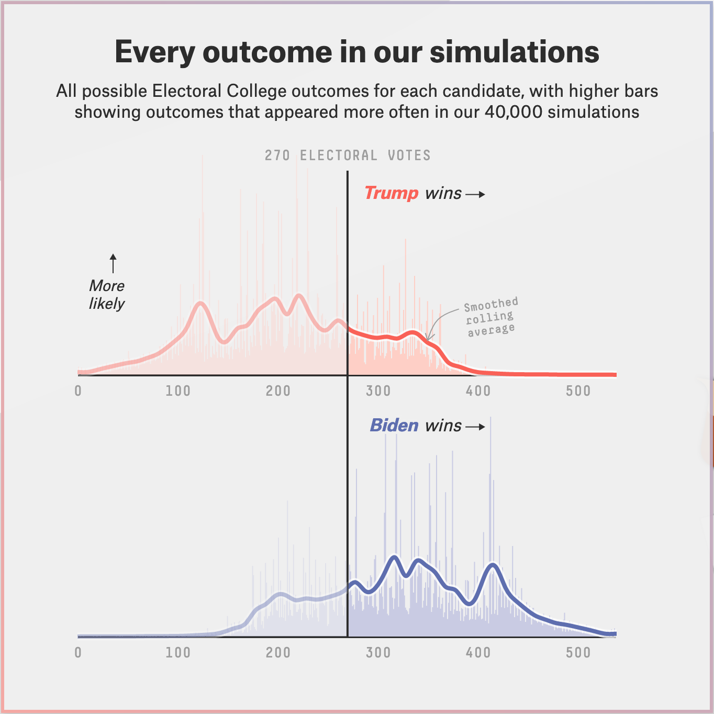
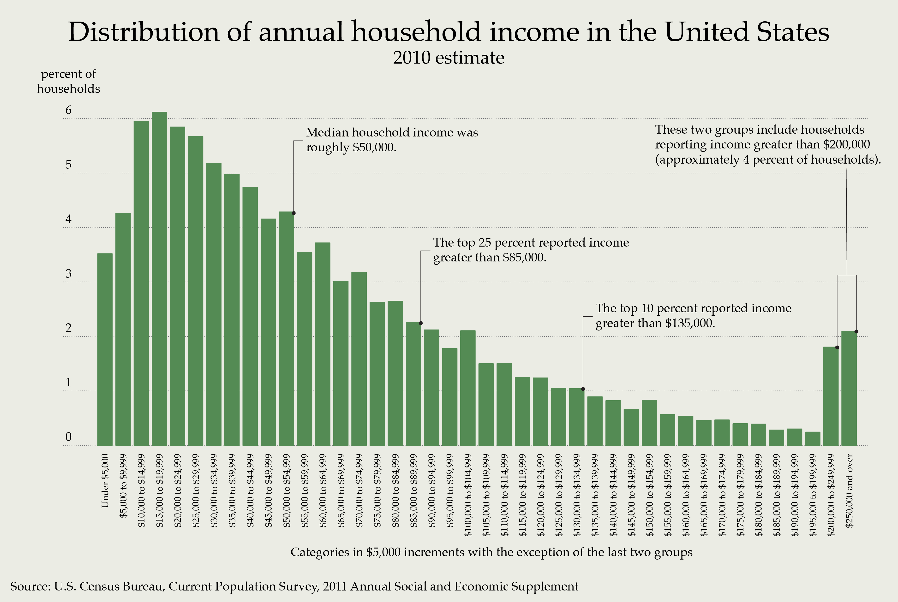

class: clear, middle

```{r preamble, child=here::here("Lecture Slides", "preamble.Rmd")}
```

## Introduction

---
# What to expect from the course
	
.subheader.coral[Objectives:]
- Give you a background on statistical theory and their application

- Learn how to perform basic statistical analysis in the .mono[R] programming language

- Prepare you to succeed in econometrics courses  


---
class: clear, middle

```{r grading-summary, echo=F}

grades <- tribble(
	~Assignment, ~Percentage,
    "Homework", .1,    
    "R Problem Sets", .15,    
    "R Project", .15,    
    "Midterm 1", .2,    
    "Midterm 2", .2,    
    "Final", .2
)

gt(grades) %>% 
	gt_theme_kyle() %>%
	tab_header(title = make_gt_title("Grading Summary")) %>% 
	fmt_percent(columns = "Percentage", decimals = 0)
 
```


---
# Expectations for Students
	
.subheader.coral[Homework & R Homework]

- Weekly homeworks are assigned, the best way to learn mathematics is .bf[practice, practice, practice]
- Absolutely NO late homework; will drop the lowest two homeworks and the lowest R homework.
		
---
# Expectations for Students

.subheader.coral[Attendance]
		      	
- Really important to attend lecture to get handle on new material, but no attendance will be taken.
- Clicker questions will count for extra credit
            
---
# Expectations for Students

.subheader.coral[Recitation]
            
- Recitation attendance is not mandatory, but if you are going to study for 1 hour/week, recitation is the best place to do it. You will walk through examples and really helpful for prepping for exams
            
	
---
# Expectations for Students
	
.subheader.coral[R Project]
            
                
- You will download real world data and perform basic statistical analysis and create data visualizations.
             
---
# Expectations for Students

.subheader.coral[Midterms and Final Exam]
            
- NO makeup midterms, weight of missed midterm will be added to final
		      	
- Must inform me of any accommodations .bf[two weeks] before an exam
            
	
---
# What is Statistics?
	
	

.hi.purple[Statistics gives us a way of linking .it[economic theory] with the real world through data analysis]

- How did the market react when interest rates went up? 

- How did firms respond to a new government policy?
		      
.hi.cranberry[Statistics allows us to translate datasets into .it[usable] information]
		      
- Summary statistics help describe large groups of data

- Use statistics to make predictions

- Statistics helps us inform our decision making
		      
	
	


---
# Real-world examples

.subheader.coral[Coronavirus Tracking]
    
```{r, echo = F, out.width = "90%"}

```


---
# Real-world examples

.subheader.coral[Weather Prediction]

```{r, echo = F, out.width = "90%"}

```

---
# Real-world examples

.subheader.coral[Climate Change]

```{r, echo = F, out.width = "70%"}

```


---
# Real-world examples

.subheader.coral[Election Predictions]

```{r, echo = F, out.width = "90%"}

```

---
# Real-world examples

.subheader.coral[Election Predictions]

```{r, echo = F, out.width = "60%"}

```


---
# Real-world examples

.subheader.coral[Election Predictions]

```{r, echo = F, out.width = "60%"}

```


---
# Other uses of Statistics
	
.hi.purple[Statistics is used in a variety of different ways/fields]
	
		
- Financial markets
		
- Science/medical research
		
- Purchasing insurance --- how risky are you to insure?
		
- Sports -- who do you draft?
	
	


---
class: inverse, middle

# Chapter 1: Picturing Distributions with Graphs

---
# Statistics
    
        
.hi.kelly[Statistics]: the science of data. Deals with the collection, organization, analysis, interpretation and presentation of data
        
- Use statistics to identify patterns and trends in the data in order to inform decision-making
    
    
.hi.cranberry[Observation]: an individual unit of analysis in the dataset
        
- .ex[.hi.slate[Examples]: person, state, country, etc.]
        
.hi.coral[Variable]: characteristic of an observation
        
            
- .ex[.hi.slate[Examples]: age, population, GDP, etc.]
        

---
class: clear, middle

```{r basketball, echo = F}
salary <- tribble(
	~`Player Name`, ~`Position`, ~`Team`, ~`Salary`, ~`Contract Length`, 
	"Stephen Curry", "Point Guard", "Golden State Warriors", 40200000, "5 years",
	"Russell Westbrook", "Point Guard", "Houston Rockets", 38500000, "5 years",
	"Chris Paul", "Point Guard", "Oklahoma City Thunder", 38500000, "4 years",
	"Lebron James", "Small Forward", "Los Angeles Lakers", 37400000, "4 years",
	"James Harden", "Shooting Guard", "Houston Rockets", 38200000, "4 years",
	"Kevin Durant", "Small Forward", "Brooklyn Nets", 37200000, "4 years"
)


salary_tbl <- gt(salary) %>% 
	gt_theme_kyle() %>% 
	tab_header(title = make_gt_title("NBA Salaries"))

salary_tbl
```


---
# Type of Variables
    
        
.pull-left[
.hi.cranberry[Categorical variable]: takes on a unique value for each possible category or trait
            
- .ex[.hi.slate[Examples]: race, political party, dog breed, etc.]
]
.pull-right[
.hi.kelly[Quantitative variable]: measured on a numeric scale
            
- ex[.hi.slate[Examples]: income, unemployment rate, weight, etc.]
- Variables may be either .hi[discrete] (countable) or .hi[continuous] (uncountable)
]


---
class: clear,middle

`r salary_tbl`


---
# Clicker Question
    
Given the following dataset, which of these statements is correct?

```{r electricity-sales, echo = F}
sales <- tribble(
	~`State`, ~`Year`, ~`Electricity Sales`, ~`Government`, ~`Renewable Capacity (MWh)`,
	"AK", 2000, 5250000, "D", 0,
	"AL", 2000, 77470000, "D", 493,
	"AR", 2000, 35600000, "R", 369,
	"AZ", 2000, 63550000, "R", 1,
	"CA", 2000, 219630000, "D", 3053,
	"CO", 2000, 46560000, "R", 29,
	"CT", 2000, 33610000, "R", 262
)

sales_tbl <- gt(sales) %>%
	gt_theme_kyle() %>%
	tab_header(title = make_gt_title("Statwide Electricity Stats")) %>% 
	fmt_currency(columns = "Electricity Sales", currency = "USD", suffixing = T, decimals = 0)

sales_tbl

```


<ol type="a">       
	<li>Electricity sales, renewable capacity and state are all quantitative variables</li>
	<li>Government, state are both categorical variables</li>
	<li>All variables are categorical</li>
	<li>All variables are quantitative</li>
</ol> 


---
# Dummy Variables
    
Often time in datasets .hi.purple[dummy variables], or .it[indicator variables], are used to describe categorical variables. 

- .ex[.hi.slate[Example]: the "Government" variable as 0 for D and 1 for R.] 

Sometimes Dummy/indicator variables put observations into categories, even though they are numerical in value
    
- .ex[.hi.slate[Example]: Years of schooling into "HS Degree" dummy (years $ >12 $)]
    


---
# Distribution of a Variable
    
        
.hi.kelly[Distribution of a variable]: tells us .it[what values] it takes and .it[how often] it takes these values
            
              
- lists all possible outcomes of variable and their associated frequencies

`r sales_tbl`

What is the distribution of Government? 

---
# Distribution of a Variable

```{r sales-dist, echo = F}

sales_color <- sales %>% 
	mutate(
		Government = case_when(
			Government == "D" ~ glue::glue("<span class='hi kelly'>{Government}</span>"),
			TRUE ~ glue::glue("<span class='hi kelly'>{Government}</span>")
		),
		Government = map(Government, gt::html)
	)

gt(sales_color) %>%
	gt_theme_kyle() %>%
	tab_header(title = make_gt_title("Statwide Electricity Stats")) %>% 
	fmt_currency(columns = "Electricity Sales", currency = "USD", suffixing = T, decimals = 0)

```


.hi[Distribution of Government]:
.cranberry[D] - 3/7 and .kelly[R] - 4/7

---
# Visualizing Categorical Variable
    
        
Distribution of categorical variable lists the categories and gives .hi[the count/percent] of individuals who fall into each category.
        
- Often visualize distributions of categorical variables using .hi[pie charts] or .hi[bar graphs].
    


---
# Examples

```{r majors, echo = F}
majors <- tribble(
	~`Field of Study`, ~`Percent of Students`,
	"Arts and Humanities", .101,
	"Biological Sciences", .149,
	"Business", .134,
	"Education", .042,
	"Engineering", .131,
	"Health Professions", .113,
	"Math and Computer Science", .054,
	"Physical Sciences", .108,
	"Other majors", .139,
)

gt(majors) %>%
	gt_theme_kyle() %>%
	tab_header(title = make_gt_title("Distribution of CU Boulder Students")) %>% 
	fmt_percent(columns = "Percent of Students", decimals = 1)
```


---
# Examples

.pull-left[
.hi[Pie Chart]

```{r pie-chart, echo = F}
majors <- majors %>%
	arrange(desc(`Field of Study`)) %>%
	mutate(lab.ypos = cumsum(`Percent of Students`) - 0.5*`Percent of Students`, 
		   lab= paste(`Percent of Students`, "%"))

ggplot(majors, aes(x = "", y = `Percent of Students`, fill= `Field of Study`)) +
	geom_bar(width = 1, stat = "identity", color = "white") +
	coord_polar("y", start = 0) +
	geom_text(aes(y = lab.ypos, label = lab), color = "white") +
	theme_void(base_size = 16) + 
	theme(
		plot.title = element_text(hjust = 0.5, family = "merriweather", face = "bold"),
		text = element_text(family = "fira_sans")
	) +
	# set transparency
	theme(
		panel.grid.major = element_blank(), 
		panel.grid.minor = element_blank(),
		panel.background = element_rect(fill = "transparent", colour = NA),
		plot.background = element_rect(fill = "transparent", colour = NA)
	) + 
	labs(title= "Pie Chart of Student Majors")

```
	
]
.pull-right[
.hi[Bar Chart]
```{r bar-chart, echo = F}
ggplot(majors, aes(x = `Field of Study`, y = `Percent of Students`, fill= `Field of Study`)) +
	geom_bar(width = 1, stat = "identity", color = "white") +
	geom_text(aes(y = `Percent of Students`/2, label = lab), color = "white") +
	scale_x_discrete(guide = guide_axis(n.dodge=2)) + 
	theme_kyle(base_size= 16) +
	theme(
		plot.title = element_text(hjust = 0.5)
	) +
	# set transparency
	theme(
		panel.grid.major = element_blank(), 
		panel.grid.minor = element_blank(),
		panel.background = element_rect(fill = "transparent",colour = NA),
		plot.background = element_rect(fill = "transparent",colour = NA)
	) + 
	labs(title= "Bar Chart of Student Majors")

```
]


---
# Visualizing Continuous Variable
    
.hi.kelly[Distribution of a variable]: tells us .it[what values] it takes and .it[how often] it takes these values
        
- Often visualize distributions of continuous variables using .hi[histograms], .hi[stemplots], or .hi[time plots] if variable is measured over time
    


---
# Histogram
    
- A .hi.purple[histogram] shows the distribution of a continuous variable by using bars whose height represents number of individuals who take on a value within a particular .kelly[interval (bin)]

	- Appropriate for variables that take on many different values or have large number of observations

- To make a histogram:

	- Divide the possible values into .kelly[intervals (bins)] of equal widths
        
	- Count how many observations fall into each .kelly[interval (bin)]
        
	- For each interval, draw a bar whose .cranberry[height] is equivalent to the number (or percent) of observations in each interval
        
        
    


---
class: clear,middle

```{r grad-rates, echo = F}
grad_rates <- read_csv(here::here("Lecture Slides", "Chapter 01", "grad_rates.csv"))

grad_rates %>%
	mutate(grad_rate = grad_rate/100) %>% 
	select(State = state, `Graduation Rate` = grad_rate) %>%
	gt_preview() %>% 
		gt_theme_kyle() %>% 
		tab_header(title = make_gt_title("State-level Graduation Rates")) %>% 
		fmt_percent(columns = "Graduation Rate", decimals = 1)
```


---
# Graduation Rates

```{r histogram, echo = F}
ggplot(grad_rates) + 
	geom_histogram(aes(x= grad_rate)) +
	theme_kyle(base_size= 20) +
	theme(
		plot.title = element_text(hjust = 0.5)
	) +
	labs(
		title= "Histogram of State 2017-2018 Graduation Rate",
		x = "Graduation Rate", y = "Number of States in Bin"
	)
```

---
# Less Informative

```{r histogram-large-bin, echo = F}
ggplot(grad_rates) + 
	geom_histogram(aes(x= grad_rate), binwidth = 10) +
	theme_kyle(base_size= 20) +
	theme(
		plot.title = element_text(hjust = 0.5)
	) +
	labs(
		title= "Histogram of State 2017-2018 Graduation Rate",
		x = "Graduation Rate", y = "Number of States in Bin"
	)
```

---
# Too Many Bins

```{r histogram-small-bin, echo = F}
ggplot(grad_rates) + 
	geom_histogram(aes(x= grad_rate), binwidth = 0.1) +
	theme_kyle(base_size= 20) +
	theme(
		plot.title = element_text(hjust = 0.5)
	) +
	labs(
		title= "Histogram of State 2017-2018 Graduation Rate",
		x = "Graduation Rate", y = "Number of States in Bin"
	)
```


---
# Interpreting Histogram
    
        
How to interpret histograms:
        
- Look for overall pattern and striking deviations from that pattern
	- An important kind of deviation is an .hi.purple[outlier], an observation that falls .it[outside the overall pattern]

- Describe the pattern by its .hi[shape], .hi[center], and .hi[variability] (or spread)
        

---
# Shapes of Distributions
    
We describe the shape of the distribution as
    
        
- .hi.cranberry[symmetric]: the right and left sides of the graph are approximately mirror images of each other
        
- .hi.kelly[right-skewed]: the right side of the graph (containing the half of the observations with larger values) is much longer than the left side
        
- .hi.alice[left-skewed]: the left side of the graph is much longer than the right side 
    


---
# Skewness Examples
    
    
```{r skew, echo = F, out.width = "900"}

# snorm
library("fGarch")

skew <- tibble(
	skew_right= rsnorm(n = 5000, mean = 0, sd = 18, xi = 130),
	symmetric= rnorm(n = 5000, mean = 0, sd = 18),
	skew_left= rsnorm(n = 5000, mean = 0, sd = 18, xi = -130)
)

skew_left <- ggplot(skew) + 
		geom_histogram(aes(x= skew_left)) +
		theme_kyle(base_size= 20) +
		labs(
			title= "Left-skewed",
			x= "Value", y = NULL
		)

symmetric <- ggplot(skew) + 
		geom_histogram(aes(x= symmetric)) +
		theme_kyle(base_size= 20) +
		labs(
			title= "Symmetric",
			x= "Value", y = NULL
		)

skew_right <- ggplot(skew) + 
		geom_histogram(aes(x= skew_right)) +
		theme_kyle(base_size= 20) +
		labs(
			title= "Right-skewed",
			x= "Value", y = NULL
		)

skew_left + symmetric + skew_right
```


---
# Clicker Question

```{r, echo = F, out.width = "85%"}

```

<ol type="a" style="display: block">
	<li style="float:left; width: 200px"> symmetric </li>
	<li style="float:left; width: 200px"> left-skewed </li>
	<li style="float:left; width: 200px"> right-skewed </li>
</ol>


---
# Clicker Question
    
For which of the following variables would you need to use a histogram instead of a bar graph?

<ol type="a" style="display: block">
	<li> month of birth </li>
	<li> distance from nearest metropolitan area </li>
	<li> employment status </li>
	<li> none of the above </li>
</ol>

    


---
# Time Plots
    
        
.hi.purple[Time Series] is a connected line plotting the value of the variable over time
        
- Shows behavior over time which emphasizes .it[trends]

- Time is always on the .bf[horizontal] axis, variable being measured on .bf[vertical] axis

- Shows .it[trends] and .it[deviations from trends]
	- Also want to look for seasonal variation
        
    
 

    
---
# Time Series Plots

```{r college-costs, echo = F, out.width = "90%"}

college_costs <- tibble::tribble(
        ~type, ~year, ~`4-year`, ~`2-year`,
    "Private", 1985L,    21042L,    14849L,
    "Private", 1995L,    28284L,    18571L,
    "Private", 2000L,    30973L,    21125L,
    "Private", 2001L,    31882L,    22036L,
    "Private", 2002L,    32411L,    24189L,
    "Private", 2003L,    33427L,    26078L,
    "Private", 2004L,    33991L,    26273L,
    "Private", 2005L,    34082L,    26689L,
    "Private", 2006L,    35151L,    24655L,
    "Private", 2007L,    35426L,    25417L,
    "Private", 2008L,    36102L,    26266L,
    "Private", 2009L,    36459L,    28006L,
    "Private", 2010L,    36494L,    25926L,
    "Private", 2011L,    36720L,    25737L,
    "Private", 2012L,    37614L,    25048L,
    "Private", 2013L,    38649L,    25207L,
    "Private", 2014L,    39825L,    25504L,
    "Private", 2015L,    41168L,    25383L,
    "Private", 2016L,    42400L,    25449L,
    "Private", 2017L,    43139L,    25596L,
     "Public", 1985L,     8798L,     6797L,
     "Public", 1995L,    11264L,     6772L,
     "Public", 2000L,    12263L,     6857L,
     "Public", 2001L,    12805L,     7154L,
     "Public", 2002L,    13336L,     7632L,
     "Public", 2003L,    14233L,     8016L,
     "Public", 2004L,    14789L,     8252L,
     "Public", 2005L,    15098L,     8095L,
     "Public", 2006L,    15557L,     8284L,
     "Public", 2007L,    15739L,     8178L,
     "Public", 2008L,    16428L,     8725L,
     "Public", 2009L,    17214L,     8824L,
     "Public", 2010L,    17866L,     9067L,
     "Public", 2011L,    18303L,     9396L,
     "Public", 2012L,    18742L,     9575L,
     "Public", 2013L,    19113L,     9803L,
     "Public", 2014L,    19533L,    10049L,
     "Public", 2015L,    19998L,    10324L,
     "Public", 2016L,    19928L,    10318L,
     "Public", 2017L,    20050L,    10281L
    )


ggplot(college_costs) + 
	geom_line(aes(x= year, y= `4-year`, group= type, color= type),
			  size = 1.5) +
	theme_kyle(base_size= 20) +
	labs(
		title= "Cost of 4-year Education Over Time",
		x= "Year",
		y= "Cost of 4 Year Education", 
		color = "Institution"
	) + 
	scale_y_continuous(label= scales::dollar_format()) + 
	scale_color_manual(values = c("#d2382c", "#497eb3"))


```


---
# Deviation from Trends

```{r, echo = F, out.width = "90%"}
gdp <- tribble(
	~Date, ~GDP,
	"1/1/1965", 717.79,
	"4/1/1965", 730.191,
	"7/1/1965", 749.323,
	"10/1/1965", 771.857,
	"1/1/1966", 795.734,
	"4/1/1966", 804.981,
	"7/1/1966", 819.638,
	"10/1/1966", 833.302,
	"1/1/1967", 844.17,
	"4/1/1967", 848.983,
	"7/1/1967", 865.233,
	"10/1/1967", 881.439,
	"1/1/1968", 909.387,
	"4/1/1968", 934.344,
	"7/1/1968", 950.825,
	"10/1/1968", 968.03,
	"1/1/1969", 993.337,
	"4/1/1969", 1009.02,
	"7/1/1969", 1029.956,
	"10/1/1969", 1038.147,
	"1/1/1970", 1051.2,
	"4/1/1970", 1067.375,
	"7/1/1970", 1086.059,
	"10/1/1970", 1088.608,
	"1/1/1971", 1135.156,
	"4/1/1971", 1156.271,
	"7/1/1971", 1177.675,
	"10/1/1971", 1190.297,
	"1/1/1972", 1230.609,
	"4/1/1972", 1266.369,
	"7/1/1972", 1290.566,
	"10/1/1972", 1328.904,
	"1/1/1973", 1377.49,
	"4/1/1973", 1413.887,
	"7/1/1973", 1433.838,
	"10/1/1973", 1476.289,
	"1/1/1974", 1491.209,
	"4/1/1974", 1530.056,
	"7/1/1974", 1560.026,
	"10/1/1974", 1599.679,
	"1/1/1975", 1616.116,
	"4/1/1975", 1651.853,
	"7/1/1975", 1709.82,
	"10/1/1975", 1761.831,
	"1/1/1976", 1820.487,
	"4/1/1976", 1852.332,
	"7/1/1976", 1886.558,
	"10/1/1976", 1934.273,
	"1/1/1977", 1988.648,
	"4/1/1977", 2055.909,
	"7/1/1977", 2118.473,
	"10/1/1977", 2164.27,
	"1/1/1978", 2202.76,
	"4/1/1978", 2331.633,
	"7/1/1978", 2395.053,
	"10/1/1978", 2476.949,
	"1/1/1979", 2526.61,
	"4/1/1979", 2591.247,
	"7/1/1979", 2667.565,
	"10/1/1979", 2723.883,
	"1/1/1980", 2789.842,
	"4/1/1980", 2797.352,
	"7/1/1980", 2856.483,
	"10/1/1980", 2985.557,
	"1/1/1981", 3124.206,
	"4/1/1981", 3162.532,
	"7/1/1981", 3260.609,
	"10/1/1981", 3280.818,
	"1/1/1982", 3274.302,
	"4/1/1982", 3331.972,
	"7/1/1982", 3366.322,
	"10/1/1982", 3402.561,
	"1/1/1983", 3473.413,
	"4/1/1983", 3578.848,
	"7/1/1983", 3689.179,
	"10/1/1983", 3794.706,
	"1/1/1984", 3908.054,
	"4/1/1984", 4009.601,
	"7/1/1984", 4084.25,
	"10/1/1984", 4148.551,
	"1/1/1985", 4230.168,
	"4/1/1985", 4294.887,
	"7/1/1985", 4386.773,
	"10/1/1985", 4444.094,
	"1/1/1986", 4507.894,
	"4/1/1986", 4545.34,
	"7/1/1986", 4607.669,
	"10/1/1986", 4657.627,
	"1/1/1987", 4722.156,
	"4/1/1987", 4806.16,
	"7/1/1987", 4884.555,
	"10/1/1987", 5007.994,
	"1/1/1988", 5073.372,
	"4/1/1988", 5190.036,
	"7/1/1988", 5282.835,
	"10/1/1988", 5399.509,
	"1/1/1989", 5511.253,
	"4/1/1989", 5612.463,
	"7/1/1989", 5695.365,
	"10/1/1989", 5747.237,
	"1/1/1990", 5872.701,
	"4/1/1990", 5960.028,
	"7/1/1990", 6015.116,
	"10/1/1990", 6004.733,
	"1/1/1991", 6035.178,
	"4/1/1991", 6126.862,
	"7/1/1991", 6205.937,
	"10/1/1991", 6264.54,
	"1/1/1992", 6363.102,
	"4/1/1992", 6470.763,
	"7/1/1992", 6566.641,
	"10/1/1992", 6680.803,
	"1/1/1993", 6729.459,
	"4/1/1993", 6808.939,
	"7/1/1993", 6882.098,
	"10/1/1993", 7013.738,
	"1/1/1994", 7115.652,
	"4/1/1994", 7246.931,
	"7/1/1994", 7331.075,
	"10/1/1994", 7455.288,
	"1/1/1995", 7522.289,
	"4/1/1995", 7580.997,
	"7/1/1995", 7683.125,
	"10/1/1995", 7772.586,
	"1/1/1996", 7868.468,
	"4/1/1996", 8032.84,
	"7/1/1996", 8131.408,
	"10/1/1996", 8259.771,
	"1/1/1997", 8362.655,
	"4/1/1997", 8518.825,
	"7/1/1997", 8662.823,
	"10/1/1997", 8765.907,
	"1/1/1998", 8866.48,
	"4/1/1998", 8969.699,
	"7/1/1998", 9121.097,
	"10/1/1998", 9293.991,
	"1/1/1999", 9417.264,
	"4/1/1999", 9524.152,
	"7/1/1999", 9681.856,
	"10/1/1999", 9899.378,
	"1/1/2000", 10002.857,
	"4/1/2000", 10247.679,
	"7/1/2000", 10319.825,
	"10/1/2000", 10439.025,
	"1/1/2001", 10472.879,
	"4/1/2001", 10597.822,
	"7/1/2001", 10596.294,
	"10/1/2001", 10660.294,
	"1/1/2002", 10788.952,
	"4/1/2002", 10893.207,
	"7/1/2002", 10992.051,
	"10/1/2002", 11071.463,
	"1/1/2003", 11183.507,
	"4/1/2003", 11312.875,
	"7/1/2003", 11567.326,
	"10/1/2003", 11769.275,
	"1/1/2004", 11920.169,
	"4/1/2004", 12108.987,
	"7/1/2004", 12303.34,
	"10/1/2004", 12522.425,
	"1/1/2005", 12761.337,
	"4/1/2005", 12910.022,
	"7/1/2005", 13142.873,
	"10/1/2005", 13332.316,
	"1/1/2006", 13603.933,
	"4/1/2006", 13749.806,
	"7/1/2006", 13867.469,
	"10/1/2006", 14037.228,
	"1/1/2007", 14208.569,
	"4/1/2007", 14382.363,
	"7/1/2007", 14535.003,
	"10/1/2007", 14681.501,
	"1/1/2008", 14651.039,
	"4/1/2008", 14805.611,
	"7/1/2008", 14835.187,
	"10/1/2008", 14559.543,
	"1/1/2009", 14394.547,
	"4/1/2009", 14352.85,
	"7/1/2009", 14420.312,
	"10/1/2009", 14628.021,
	"1/1/2010", 14721.35,
	"4/1/2010", 14926.098,
	"7/1/2010", 15079.917,
	"10/1/2010", 15240.843,
	"1/1/2011", 15285.828,
	"4/1/2011", 15496.189,
	"7/1/2011", 15591.85,
	"10/1/2011", 15796.46,
	"1/1/2012", 16019.758,
	"4/1/2012", 16152.257,
	"7/1/2012", 16257.151,
	"10/1/2012", 16358.863,
	"1/1/2013", 16569.591,
	"4/1/2013", 16637.926,
	"7/1/2013", 16848.748,
	"10/1/2013", 17083.137,
	"1/1/2014", 17104.555,
	"4/1/2014", 17432.909,
	"7/1/2014", 17721.657,
	"10/1/2014", 17849.912,
	"1/1/2015", 18003.399,
	"4/1/2015", 18223.577,
	"7/1/2015", 18347.425,
	"10/1/2015", 18378.803,
	"1/1/2016", 18470.156,
	"4/1/2016", 18656.207,
	"7/1/2016", 18821.359,
	"10/1/2016", 19032.58,
	"1/1/2017", 19237.435,
	"4/1/2017", 19379.232,
	"7/1/2017", 19617.288,
	"10/1/2017", 19937.963,
	"1/1/2018", 20242.215,
	"4/1/2018", 20552.653,
	"7/1/2018", 20742.723,
	"10/1/2018", 20909.853,
	"1/1/2019", 21115.309,
	"4/1/2019", 21329.877,
	"7/1/2019", 21540.325,
	"10/1/2019", 21747.394,
	"1/1/2020", 21561.139,
	"4/1/2020", 19520.114,
	"7/1/2020", 21170.252,
	"10/1/2020", 21494.731,
	"1/1/2021",	22061.503
)
	

gdp %>% 
	mutate(Date = lubridate::mdy(gdp$Date)) %>%
	ggplot() + 
		geom_line(aes(x = Date, y = GDP), size = 1.5, color = "#d2382c") + 
		theme_kyle(base_size = 20) + 
		labs(title = "Time Series of GDP", y = "GDP ($)", x = "Year") +
		# Annotation
		geom_curve(data = data.frame(x = as.Date("2020-04-30"), y = 16810, 
									 xend = as.Date("2021-01-29"), yend = 19371),
				   mapping = aes(x = x, y = y, xend = xend, yend = yend),
				   arrow = arrow(30L, unit(0.1, "inches"), "last", "closed"),
				   inherit.aes = FALSE) + 
		geom_text(data = data.frame(x = as.Date("2019-06-21"), y = 15987, label = "Trend Break"),
				  mapping = aes(x = x, y = y, label = label),
				  size = 4.23, family = "fira_sans", fontface = 2, inherit.aes = FALSE)

```

    
