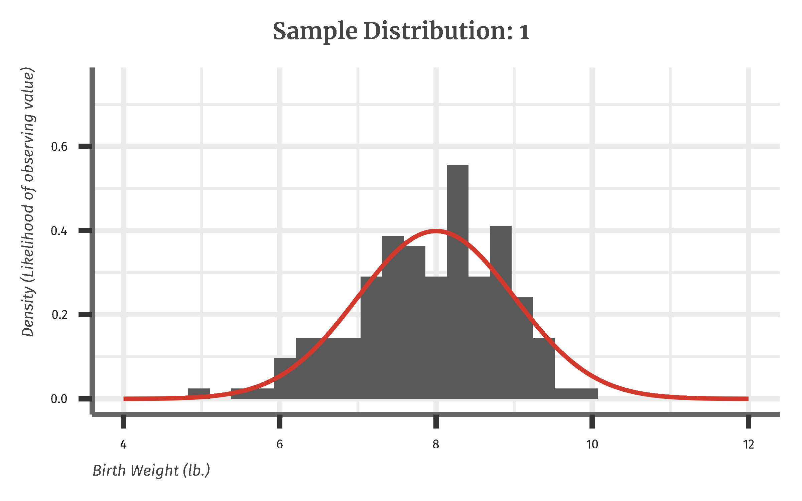

exclude: true

```{R, setup, include = F}

library(knitr)
library(here)
library(gt)
library(patchwork)
library(kfbmisc)
library(tidyverse)

# Knitr options
opts_chunk$set(
    comment = "#>",
    fig.align = "center",
    fig.height = 7,
    fig.width = 10.5,
    warning = F,
    message = F
)

# Use svg for figures
opts_chunk$set(dev = "svg")
options(device = function(file, width, height) {
    svg(tempfile(), width = width, height = height)
})

# HTML output for knitr
options(knitr.table.format = "html")


make_gt_title <- function(title) {
    gt::html(glue::glue("<span class='hi slate' style='display: block; margin-bottom: 8px;'>{title}</span>"))
}

xaringanExtra::use_scribble()
```


---
class: clear, middle

<!-- Custom css -->
```{css, echo = F, code=xfun::read_utf8(here::here("Lecture Slides", "my-css.css"))}
```


<!-- From xaringancolor -->

<div style = "position:fixed; visibility: hidden">
$\require{color}\definecolor{red_pink}{rgb}{0.901960784313726, 0.254901960784314, 0.450980392156863}$
$\require{color}\definecolor{turquoise}{rgb}{0.125490196078431, 0.698039215686274, 0.666666666666667}$
$\require{color}\definecolor{orange}{rgb}{1, 0.647058823529412, 0}$
$\require{color}\definecolor{red}{rgb}{0.984313725490196, 0.380392156862745, 0.0274509803921569}$
$\require{color}\definecolor{blue}{rgb}{0.231372549019608, 0.231372549019608, 0.603921568627451}$
$\require{color}\definecolor{green}{rgb}{0.545098039215686, 0.694117647058824, 0.454901960784314}$
$\require{color}\definecolor{grey_light}{rgb}{0.701960784313725, 0.701960784313725, 0.701960784313725}$
$\require{color}\definecolor{grey_mid}{rgb}{0.498039215686275, 0.498039215686275, 0.498039215686275}$
$\require{color}\definecolor{grey_dark}{rgb}{0.2, 0.2, 0.2}$
$\require{color}\definecolor{purple}{rgb}{0.415686274509804, 0.352941176470588, 0.803921568627451}$
$\require{color}\definecolor{slate}{rgb}{0.192156862745098, 0.309803921568627, 0.309803921568627}$
</div>

<script type="text/x-mathjax-config">
MathJax.Hub.Config({
  TeX: {
    Macros: {
      red_pink: ["{\color{red_pink}{#1}}", 1],
      turquoise: ["{\color{turquoise}{#1}}", 1],
      orange: ["{\color{orange}{#1}}", 1],
      red: ["{\color{red}{#1}}", 1],
      blue: ["{\color{blue}{#1}}", 1],
      green: ["{\color{green}{#1}}", 1],
      grey_light: ["{\color{grey_light}{#1}}", 1],
      grey_mid: ["{\color{grey_mid}{#1}}", 1],
      grey_dark: ["{\color{grey_dark}{#1}}", 1],
      purple: ["{\color{purple}{#1}}", 1],
      slate: ["{\color{slate}{#1}}", 1]
    },
    loader: {load: ['[tex]/color']},
    tex: {packages: {'[+]': ['color']}}
  }
});
</script>

<style>
.red_pink {color: #E64173;}
.turquoise {color: #20B2AA;}
.orange {color: #FFA500;}
.red {color: #FB6107;}
.blue {color: #3B3B9A;}
.green {color: #8BB174;}
.grey_light {color: #B3B3B3;}
.grey_mid {color: #7F7F7F;}
.grey_dark {color: #333333;}
.purple {color: #6A5ACD;}
.slate {color: #314F4F;}
</style>


```{r flair_color, echo=FALSE}
library(flair)
red_pink <- "#E64173"
turquoise <- "#20B2AA"
orange <- "#FFA500"
red <- "#FB6107"
blue <- "#3B3B9A"
green <- "#8BB174"
grey_light <- "#B3B3B3"
grey_mid <- "#7F7F7F"
grey_dark <- "#333333"
purple <- "#6A5ACD"
slate <- "#314F4F"
```

### Chapter 2: Describing Distribution with Numbers

---
## Chapter Overview
	
	
- Population vs. Sample
- Measures of Central Tendency
- Mean
- Median
		      
- Measures of Variability
- Quartiles
- Variance \& Standard Deviation


---
# Population vs Sample
	
	
- .hi.purple[Population]: the entire entities under the study
- Examples: all men, all NBA players, all children under 5
		      
- .hi.green[Sample]: subset of the population
- Can be used to draw inferences about the population
- Examples: our class, Denver Nuggets players, daycares in Colorado
		      
- Interested in parameters of the .hi.purple[population] distribution, we can estimate these parameters using data from .hi.green[samples] since finding population parameters is infeasible
	


---
# Population Distribution

The following graph depicts the underlying population distribution
	
- We are interested in its parameters, but are unable collect data on every single observation

		
```{r population-density, echo = F, out.width = "60%"}

set.seed(12)
n_samp <- 100

df <- tibble(
    x = seq(-10, 10, length = 1000),
    y = dnorm(x, mean = 0, sd = 3),
    count = y * n_samp
)

# 5 samples
sample_df <- tibble(sample = rep(1:5, times = n_samp), values = rnorm(5 * n_samp, 0, 3))


ggplot() +
    geom_line(data = df, aes(x = x, y = y), color = "#d2382c", size = 1.5) +
    theme_kyle(base_size = 20) +
    labs(
        x = "Value of Observation",
        y = "Density (Likelihood of observing value)",
        title = "Population Distribution of Data"
    )
```
	


---
# Population Inference

What we do instead is use a sample of the population and use that sample distribution to determine parameters of interest
	
```{r sample-anim, eval=F, echo=F, cache=T, results='hide'}


png_paths <- c()

for (i in 1:5) {
    p <- ggplot(data = sample_df %>% dplyr::filter(sample == i), aes(x = values)) +
        geom_histogram(aes(y = ..density..)) +
        geom_line(data = df, aes(x = x, y = y), color = "#d2382c", size = 1.5) +
        theme_kyle(base_size = 40) +
        scale_x_continuous(limits = c(-10, 10)) +
        scale_y_continuous(limits = c(0, 0.25)) +
        labs(
            x = "Value of Observation",
            y = "Density (Likelihood of observing value)",
            title = glue::glue("Sample: {i}")
        )

    png_path <- here("Lecture Slides", "Chapter 02", glue::glue("frame{i}.png"))
    png_paths <- c(png_paths, png_path)

    ggsave(filename = png_path, plot = p, dpi = 300, width = 8, height = 5)
}

# Requires magick!!
system(glue::glue("convert -dispose previous -delay 80 frame*.png sample_anim.gif"))

file.remove(png_paths)
```

.center[

]

---
# Parameters of Interest
	
	
Two primary .hi.purple[population] parameters of interest:
		      
- Measures of central tendency:
	      	      
	- Population .orange[mean], $\mu$
	
	- Population .red_pink[median]
	      	      
- Measures of variability:
	      	      
	- Population .blue[variance], $\sigma^2$
	  
We will .it.green[estimate] these using the .hi.green[sample] distribution
	
	


---
# Measuring Center: the Mean
	
	
The most common measure of center is the arithmetic average, or .hi.orange[mean]

$${\color{orange} \bar{x}} = \frac{x_1 + x_2 + .... + x_n}{n}$$

or more compactly:

$${\color{orange} \bar{x}}=\frac{1}{n}\sum_{i=1}^n x_i$$
	
	
---
# Population Inference: Mean

	
```{r sample-anim-mean, eval=F, echo=F, cache=T, results='hide'}

sample_df <- sample_df %>%
    group_by(sample) %>%
    mutate(mean = mean(values))

png_paths <- c()

for (i in 1:5) {
    mean <- sample_df %>%
        dplyr::filter(sample == i) %>%
        slice(1) %>%
        pull(mean)

    p <- ggplot(data = sample_df %>% dplyr::filter(sample == i), aes(x = values)) +
        geom_histogram(aes(y = ..density..)) +
        geom_line(data = df, aes(x = x, y = y), color = "#d2382c", size = 1.5) +
        geom_vline(
            xintercept = mean,
            color = "#8BB174", size = 2
        ) +
        theme_kyle(base_size = 40) +
        scale_x_continuous(limits = c(-10, 10)) +
        scale_y_continuous(limits = c(0, 0.25)) +
        labs(
            x = "Value of Observation",
            y = "Density (Likelihood of observing value)",
            title = glue::glue("Sample Mean {i}: {round(mean,3)}")
        )

    png_path <- here("Lecture Slides", "Chapter 02", glue::glue("frame{i}.png"))
    png_paths <- c(png_paths, png_path)

    ggsave(filename = png_path, plot = p, dpi = 300, width = 8, height = 5)
}

# Requires magick!!
# convert png to gif
system("convert -dispose previous -delay 80 frame*.png sample_anim_mean.gif")

file.remove(png_paths)
```

.center[

]

---
# Measuring Center: the Median
	
	
The .hi.red_pink[median] is the midpoint of a distribution
		      
- Is more resistant to the influence of .hi[extreme observations]
		      
How to calculate median:
		      
- Arrange observations from smallest to largest
- If there is odd number of observations, the median is the center observation. If there are even number of observations, the median is the average of two center observations
		      
	


---
# Mean vs. Median
	
	
- Although we will primarily be using the mean throughout the semester, the biggest drawback of the mean is that it is not resistant to .hi.purple[outliers]
		      
- The median, however, is resistant to .hi.purple[outliers] so it can be important to calculate for smaller samples 


.center[

]


---
# Mean vs. Median Example

```{r rodman-graph, echo=F, out.width = "90%"}

# stats <- nbastatR::bref_players_stats(seasons=1990:1999)
# write_csv(stats, here("Lecture Slides", "Chapter 02", "bball_90_99.csv"))

stats <- read_csv(here("Lecture Slides", "Chapter 02", "bball_90_99.csv"))

stats <- stats %>%
    mutate(Rodman = if_else(namePlayer == "Dennis Rodman", "Dennis Rodman", "Other")) %>%
    dplyr::filter(slugSeason == "1991-92")

mean <- mean(stats$trbTotals)
median <- median(stats$trbTotals)

ggplot(stats) +
    geom_histogram(aes(x = trbTotals, fill = Rodman)) +
    geom_vline(xintercept = mean, linetype = "dashed") +
    geom_vline(xintercept = median, linetype = "dashed") +
    theme_kyle(base_size = 20) +
    labs(
        y = "Count", x = "Total Rebounds",
        title = "1991-92 NBA Season Rebounds",
        caption = "Data from Basketball Reference."
    ) +
    guides(fill = "none") +
    scale_fill_manual(values = c("Other" = "grey80", "Dennis Rodman" = "#d2382c")) +
    geom_text(
        data = data.frame(x = 1530, y = 3, label = "Dennis Rodman"),
        mapping = aes(x = x, y = y, label = label), size = 4,
        colour = "#d2382c", family = "fira_sans", fontface = 2, inherit.aes = FALSE
    ) +
    geom_text(
        data = data.frame(x = c(108, 330), y = c(57, 57), label = c("Median →", "← Mean")),
        mapping = aes(x = x, y = y, label = label),
        size = 5.29, family = "fira_sans", inherit.aes = FALSE
    )
```

.hi[Median]: 205.5 rebounds and .hi[Mean]: 250.5 rebounds


---
# Clicker Question
	
What is the sample average of the participants?
	
```{r drinking-table, echo = F}

drinking <- tribble(
    ~Age, ~Sex, ~BMI, ~`Drinks per week`,
    59, "male", 32.26, "3 drinks",
    62, "male", 25.09, "2 drinks",
    60, "female", 32.58, "1 drink",
    18, "male", 99.99, "6 drinks",
    57, "female", 31.88, "2 drinks",
    56, "male", 42.8, "3 drinks",
)

drinking_tbl <- gt(drinking) %>%
    gt_theme_kyle() %>%
    tab_header(title = make_gt_title("Sample of individuals")) %>%
    tab_options(data_row.padding = px(6))

drinking_tbl
```


<ol type="a">
	<li>58</li>
	<li>51.2</li>
	<li>52</li>
	<li>49.7</li>
</ol>


---
# Clicker Question
	
Which measure of central tendency best describes the age of participants?

`r drinking_tbl`		

<ol type="a">
	<li>Median</li>
	<li>Mean</li>
</ol>
	

---
# Measuring Variability
	
	
Measures of central tendency do not tell the whole story. To further characterize the distribution, we need to know how the data is spread out
		      
- Quartiles
- Variance


---
# Variability: Quartiles
	
	
- Measure of center alone can be misleading
- How to calculate quartiles:
		      
- Arrange observations in increasing order and locate .hi.red_pink[median] 
- The .hi.green[first quartile] is the median of the observations located to the left of the median
- The .hi.green[third quartile] is the median of observations located to the right of the median
              
```{r, echo = F, out.width = "50%"}
knitr::include_graphics("quartiles.png")
```
		      
		      


---
# Boxplots
	
.hi.blue[five-number summary]: smallest observation (minimum), the first quartile, the median, the third quartile, and the largest observation (maximum)

We can use the .hi.purple[boxplot] using this five number summary to display quantitative data

- How to make a boxplot:
		      
- A central box spans the first and third quartiles 
- A line in the box marks the median
- Line extends from the box out to the smallest and largest observations 
		      
	


---
# Boxplots


```{r rodman-box, echo=F, out.width="80%"}
ggplot(stats, aes(x = trbTotals, y = 1)) +
    ggdist::stat_halfeye(
        adjust = .5,
        width = .6,
        .width = 0,
        justification = -.2,
        point_colour = NA
    ) +
    geom_boxplot(
        width = .15
    ) +
    theme_kyle(base_size = 20) +
    labs(x = "Total Rebounds", title = "Boxplot and Underlying Distribution of Total Rebounds") +
    theme(
        axis.line.y = element_blank(), axis.title.y = element_blank(),
        axis.text.y = element_blank(), axis.ticks = element_blank()
    )
```


---
# Interquartile Range
	
	
The .hi.turquoise[interquartile range], IQR, is the distance between the first and third quartiles
		      
- IQR = $Q_3 - Q_1$
- The IQR measures the spread of the data and it also helps to identify outliers
	      
Rule for outliers:
		      
- An observation is an outlier if it falls more than $1.5 \times IQR$ above the third quartile or below the first
		      

---
# Variability: Variance
	
	
.hi.purple[Variance]: denoted, $s^2$, measures how "spread out" the data are on average
		     
$$s^2 = \frac{(x_1-{\color{orange}\bar{x}})^2 + (x_2-{\color{orange}\bar{x}})^2 + .... + (x_n - {\color{orange}\bar{x}})^2}{n-1},$$
or more compactly

$$
s^2 = \frac{1}{n-1} \sum_{i=1}^n (x_i - {\color{orange}\bar{x}})^2
$$
.hi.purple[Standard deviation]: looks at how far each observation is from the mean; square root of the variance

$$s=\sqrt{\frac{1}{n-1}\sum_{i=1}^n(x_i-\bar{x})^2}$$
	
	


---
# Visualizing Standard Deviation
	
	
```{r multiple-vars, echo=F, out.width = "90%"}

multiple_var <- bind_rows(
    tibble(Variance = 1, SD = 1, value = rnorm(1000, 0, 1)),
    tibble(Variance = 4, SD = 2, value = rnorm(1000, 0, 4)),
    tibble(Variance = 9, SD = 3, value = rnorm(1000, 0, 9))
) %>%
    mutate(Variance = as.factor(Variance))

ggplot(multiple_var %>% dplyr::filter(value < 20 & value > -20)) +
    geom_density(
        mapping = aes(x = value, y = after_stat(density), color = Variance),
        fill = NA, size = 1.5
    ) +
    theme_kyle(base_size = 20) +
    labs(x = "Value of Observation", y = "Density") +
    scale_color_manual(values = c("#d2382c", "#497eb3", "#8e549f"))
```


---
# Practice Question

Calculate the standard deviation of age?

`r drinking_tbl`

---
# Properties of Standard Deviation, $s$
	
	
- $n-1$ is referred to as the degrees of freedom
- $s$ measures variability about the mean
- $s$ is always greater than or equal to zero, but usually $> 0$
  - When would it be $=0$?
- As observations become more variable, $s$ gets larger
- $s$ is not resistant in the same way the sample mean is not resistant; a few outliers can change it a lot.
	
	


---
# Summary of Summary Statistics

Two basic ways to summarize the center and spread of a distribution
	
- Mean and standard deviation (or variance)

- The five-number summary
	

.hi.slate[When to Use Which]
	
Use $\bar{x}$ and $s$ when the distribution is reasonably symmetric and free of outliers
		      
Use five-number summary if distribution is skewed, or has outliers
	


---
# Greek Letters and Statistics

.pull-left[
.hi.purple[Greek Letters]

- Greek letters like $\mu$ and $\sigma^2$ represent the truth about the population.
]
.pull-right[
.hi.green[Latin Letters]

- Latin lettes like $\bar{x}$ and $s^2$ are calculations that represent guesses (estimates) at the population values.
]

The goal for the class is for the latin letters to be good guesses for the greek letters:

$$
	{\color{green}\text{Data}} \longrightarrow {\color{green}\text{Calculation}} \longrightarrow {\color{green}\text{Estimates}} \longrightarrow^{hopefully!} {\color{purple}\text{Truth}}
$$

For example, 
$$
	{\color{green}X} \longrightarrow {\color{green} \frac{1}{n} \sum_{i=1}^n X_i} \longrightarrow {\color{green}\bar{x}} \longrightarrow^{hopefullly!} {\color{purple}\mu}
$$


---
# Install R and R Studio
	
.hi[Download R:] [https://www.r-project.org/](https://www.r-project.org/)

- Click "download R" link under "Getting Started"
- Select a CRAN location (mirror site) and click link
- I selected the UC Berkeley one, pick one in USA
- Click on "Download R for Mac/Windows/etc" link at top of page
- Click on package to download, under "Latest Release"
- Save the .pkg file, double click open, and follow instructions 

.hi[Download RStudio:] [https://www.rstudio.com/](https://www.rstudio.com/)

- \url{www.rstudio.com} and click "Download RStudio"
- Click on "download RStudio Desktop"
	

---
# How to use R
	
		
```{r, echo = F, out.width = "90%"}

```
