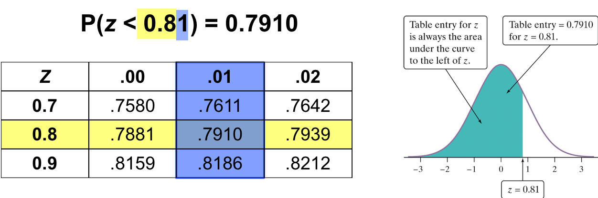
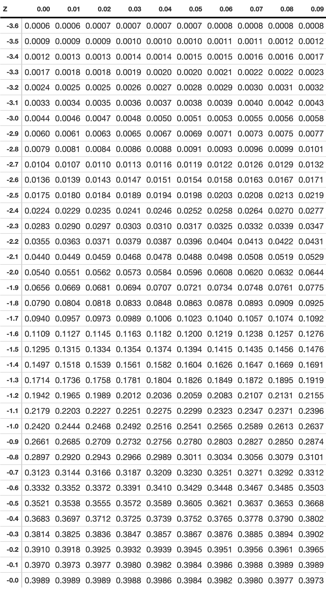
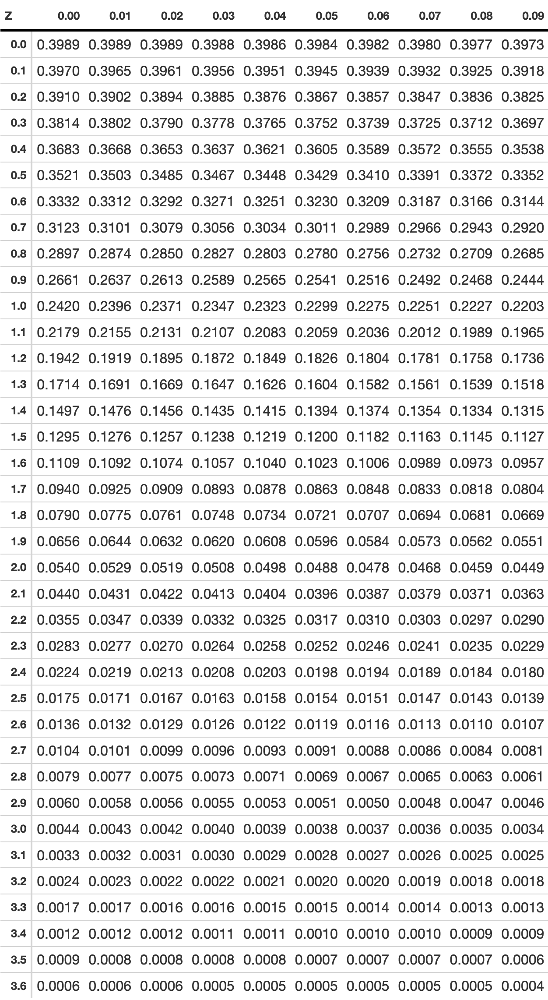

class: clear, middle

```{r preamble, child=here::here("Lecture Slides", "preamble.Rmd")}
```

## Chapter 3: The Normal Distribution

---
# Normal Distribution
    
Normal curve is symmetric about the mean and bell-shaped:

```{r normal, echo=F, out.width="60%"}

set.seed(12)
n_samp <- 1000

df <- tibble(
    x = seq(-10, 10, length = 1000),
    y = dnorm(x, mean = 0, sd = 3),
    count = y * n_samp
)

# 5 samples
sample_df <- tibble(sample = rep(1:5, times = n_samp), values = rnorm(5 * n_samp, 0, 3))


ggplot(data = sample_df %>% dplyr::filter(sample == 1), aes(x = values)) +
    geom_histogram(aes(y = ..density..)) +
    geom_line(data = df, aes(x = x, y = y), color = "#d2382c", size = 1.5) +
    theme_kyle(base_size = 20) +
    scale_x_continuous(limits = c(-10, 10)) +
    scale_y_continuous(limits = c(0, 0.25)) +
    labs(
        x = "Value of Observation",
        y = "Density (Likelihood of observing value)",
        title = glue::glue("Sample and Population Distribution")
    )
```

    
Lots of data naturally follow this distribution

- heights of people, blood pressure, grades on a test

---
# Galton Board

.center[
<iframe width="560" height="315" src="https://www.youtube.com/embed/EvHiee7gs9Y" title="YouTube video player" frameborder="0" allow="accelerometer; autoplay; clipboard-write; encrypted-media; gyroscope; picture-in-picture" allowfullscreen></iframe>
]


---
# Sample Probability
    

```{r, echo = F, out.width = "80%"}

sample_prob <- sample_df %>%
    dplyr::filter(sample == 1) %>%
    mutate(less = values <= -2.5)

ggplot() +
    geom_histogram(data = sample_prob, aes(x = values, y = after_stat(density), fill = (stat(x) < -2.5))) +
    geom_line(data = df, aes(x = x, y = y), color = "#d2382c", size = 1.5) +
    theme_kyle(base_size = 20) +
    scale_fill_manual(values = c("grey80", "#d2382c")) +
    scale_x_continuous(breaks = c(seq(-10, 10, by=5), -2.5)) +
    guides(fill = "none") +
    labs(
        x = "Value of Observation",
        y = "Density (Likelihood of observing value)",
        title = "Sample Probability"
    )
```
    
- What's the probability that the x value is less than -2.5 .hi[in our sample]?
    


---
# Population Probability
    

        
```{r, echo = F, out.width = "80%"}
ggplot() +
    geom_line(data = df, aes(x = x, y = y), color = "#d2382c", size = 1.5) +
    geom_area(data = df %>% dplyr::filter(x < -2.5), aes(x = x, y = y), fill = "#d2382c") +
    scale_x_continuous(breaks = c(seq(-10, 10, by=5), -2.5)) +
    theme_kyle(base_size = 20) +
    labs(
        x = "Value of Observation",
        y = "Density (Likelihood of observing value)",
        title = "Population Probability"
    )
```
    
- What's the probability that the x value is less than -2.5 .hi[in our population distribution]?
    


---
# Parameters of Normal Distribution

Normal distribution is described .it.bf[completely] by two parameters-- its mean $\mu$ and variance $\sigma^2$

- The mean is located at the center of the symmetric curve
      - It is the same as the median 
- Changing $\mu$ (without changing $\sigma^2$), moves the curve along the horizontal axis
- The variance describes the variability of the curve
- Higher variance means a flatter and wider distribution
      


---
# Different Variances
    
        
```{r multiple-vars, echo=F, out.width = "90%"}

multiple_var <- bind_rows(
    tibble(Variance = 1, SD = 1, value = rnorm(1000, 0, 1)),
    tibble(Variance = 4, SD = 2, value = rnorm(1000, 0, 4)),
    tibble(Variance = 9, SD = 3, value = rnorm(1000, 0, 9))
) %>%
    mutate(Variance = as.factor(Variance))

ggplot(multiple_var %>% dplyr::filter(value < 20 & value > -20)) +
    geom_density(
        mapping = aes(x = value, y = after_stat(density), color = Variance),
        fill = NA, size = 1.5
    ) +
    theme_kyle(base_size = 20) +
    labs(x = "Value of Observation", y = "Density") +
    scale_color_manual(values = c("#d2382c", "#497eb3", "#8e549f"))
```

    


---
# 68-95-99 Rule

```{r 68-95-99, echo = F, out.width = "75%"}

# From svmiller

ggplot(data.frame(x = c(-4, 4)), aes(.data$x)) +
    # +/- 1
    stat_function(
        fun = dnorm,
        xlim = c(-1, 1), size = 0,
        geom = "area", fill = "#d2382c", alpha = 0.5
    ) +
    # +/- 2
    stat_function(
        fun = dnorm,
        xlim = c(-2, 2), size = 0,
        geom = "area", fill = "#d2382c", alpha = 0.4
    ) +
    # +/- 3
    stat_function(
        fun = dnorm,
        xlim = c(-3, 3), size = 0,
        geom = "area", fill = "#d2382c", alpha = 0.3
    ) +
    # +/- 1 sd
    geom_segment(
        x = 1, y = 0, xend = 1, yend = dnorm(1, 0, 1),
        color = "white", linetype = "dashed"
    ) +
    geom_segment(
        x = -1, y = 0, xend = -1, yend = dnorm(1, 0, 1),
        color = "white", linetype = "dashed"
    ) +
    # +/- 2 sd
    geom_segment(
        x = 2, y = 0, xend = 2, yend = dnorm(2, 0, 2),
        color = "white", linetype = "dashed"
    ) +
    geom_segment(
        x = -2, y = 0, xend = -2, yend = dnorm(2, 0, 2),
        color = "white", linetype = "dashed"
    ) +
    # 68%
    annotate(
        geom = "text", x = 0, y = 0.2,
        label = "68%", size = 4.5, color = "white"
    ) +
    geom_segment(
        x = -0.15, y = .2, xend = -.98, yend = .2,
        color = "white",
        arrow = arrow(length = unit(0.15, "cm"))
    ) +
    geom_segment(
        x = 0.15, y = .2, xend = .98, yend = .2,
        color = "white",
        arrow = arrow(length = unit(0.15, "cm"))
    ) +
    # 95%
    annotate(
        geom = "text", x = 0, y = 0.05,
        label = "95%", size = 4.5, color = "white"
    ) +
    geom_segment(
        x = -0.15, y = .05, xend = -1.98, yend = .05,
        color = "white",
        arrow = arrow(length = unit(0.15, "cm"))
    ) +
    geom_segment(
        x = 0.15, y = .05, xend = 1.98, yend = .05,
        color = "white",
        arrow = arrow(length = unit(0.15, "cm"))
    ) +
    # 99%
    annotate(
        geom = "text", x = 0, y = 0.01,
        label = "99%", size = 4.5, color = "white"
    ) +
    geom_segment(
        x = -0.15, y = .005, xend = -2.98, yend = .005,
        color = "white",
        arrow = arrow(length = unit(0.15, "cm"))
    ) +
    geom_segment(
        x = 0.15, y = .005, xend = 2.98, yend = .005,
        color = "white",
        arrow = arrow(length = unit(0.15, "cm"))
    ) +
    # Normal curve
    stat_function(fun = dnorm, color = "black", size = 1.5) +
    scale_x_continuous(breaks = -4:4) +
    # scale_x_continuous(breaks = c(-4, -2.58, -1.96, -1.645, -1, 0,
    #                             1, 1.645, 1.96, 2.58, 4)) +
    theme_kyle(base_size = 20) +
    labs(x = "Value", y = "Density")
```

    

.small[
- 68.2% of data is within $\pm 1$ standard deviation of the mean
- 95.4% of data is within $\pm 2$ standard deviation of the mean
- 99.6% of data is within $\pm 3$ standard deviation of the mean
]

---
# Clicker Question

Suppose that the mean birthweight in the sample is 113 oz. with a standard deviation of $\sqrt{484} \approx 22$ oz. Assuming babies' birthweight is normally distributed, how heavy are the middle 95% of babies?

<ol type = "a">
  <li>47 to 179 oz</li>
  <li>69 to 157 oz</li>
  <li>91 and 135 oz</li>
  <li>111 to 120 oz</li>
</ol>


---
# Normal Distribution Notation

If X is distributed normally, we denote it the following way:

$$X \sim N(\coral{\mu}, \kelly{\sigma^2})$$
 
- This notation tells us everything we need to know about the normal distribution
      
- The distribution has mean $\coral{\mu}$
- The distribution has variance $\kelly{\sigma^2}$
      


---
# Standard Normal Distribution

Standard normal distribution is a specific type of normal distribution

If a variable X follows a normal distribution with $\coral{\mu} = 0$ and  $\kelly{\sigma^2} = 1$, we say that X follows the .hi.purple[standard normal distribution]
  
- Since it is so common, it is denoted as $Z \sim N(0,1)$

- It is easier to find out probabilities about normal distributions if they are in the standard form
      
- Therefore we often will .hi.purple[standardize] any general normal distribution to be a standard normal
      


---
# Properties of Standard Normal

Graph of the standard normal distribution has two important properties

Symmetric

$$P(Z < -1) = P(Z > 1)$$

```{r symmetric, echo = F, out.width = "50%"}

ggplot(data.frame(x = c(-4, 4)), aes(.data$x)) +
    stat_function(
        fun = dnorm,
        xlim = c(-4, -1), size = 0,
        geom = "area", fill = "#d2382c", alpha = 0.5
    ) +
    stat_function(
        fun = dnorm,
        xlim = c(1, 4), size = 0,
        geom = "area", fill = "#d2382c", alpha = 0.5
    ) +
    # Normal curve
    stat_function(fun = dnorm, color = "black", size = 1.5) +
    scale_x_continuous(breaks = -4:4) +
    # scale_x_continuous(breaks = c(-4, -2.58, -1.96, -1.645, -1, 0,
    #                             1, 1.645, 1.96, 2.58, 4)) +
    theme_kyle(base_size = 20) +
    labs(x = "Value", y = "Density")
```
    
    

Area under the curve sums to one

$$P(Z < 1) + P(Z > 1) = 1$$


---
# Probabilities: Cumulative Proportions

Suppose we want to know the likelihood of a baby being born underweight (less than 88 oz).

The data suggests $BW \sim N(113, 22^2)$, that is a mean of 113 and a standard deviation of 22. The probability of a baby being underweight is equal to $P(BW \leq 88)$. Graphically:


---
# Left-tail probability

```{r example-left-tail, echo = F, out.width = "75%"}

ggplot(data.frame(x = c(25, 201)), aes(.data$x)) +
    stat_function(
        fun = function(x) {
            dnorm(x, mean = 113, sd = 22)
        },
        xlim = c(25, 88), size = 0,
        geom = "area", fill = "#d2382c", alpha = 0.5
    ) +
    # Normal curve
    stat_function(
        fun = function(x) {
            dnorm(x, mean = 113, sd = 22)
        },
        color = "black", size = 1.5
    ) +
    scale_x_continuous(breaks = c(seq(25, 200, by = 25), 88, 113)) +
    geom_vline(xintercept = 113, linetype = "dashed") +
    geom_vline(xintercept = 88, linetype = "dashed") +
    theme_kyle(base_size = 20) +
    labs(x = "Value", y = "Density")
```

This probability is called the .hi.ruby[left-tail probability] as it's every value .ruby[to the left].

---
# Right-tail Probability

```{r example-right-tail, echo = F, out.width = "75%"}

ggplot(data.frame(x = c(25, 201)), aes(.data$x)) +
    stat_function(
        fun = function(x) {
            dnorm(x, mean = 113, sd = 22)
        },
        xlim = c(88, 201), size = 0,
        geom = "area", fill = "#d2382c", alpha = 0.5
    ) +
    # Normal curve
    stat_function(
        fun = function(x) {
            dnorm(x, mean = 113, sd = 22)
        },
        color = "black", size = 1.5
    ) +
    scale_x_continuous(breaks = c(seq(25, 200, by = 25), 88, 113)) +
    geom_vline(xintercept = 113, linetype = "dashed") +
    geom_vline(xintercept = 88, linetype = "dashed") +
    theme_kyle(base_size = 20) +
    labs(x = "Value", y = "Density")
```

If you want the .hi.ruby[right-tail probability], $P(BW > 88)$, you can use 

$$P(BW > 88) = 1 - P(BW < 88)$$

---
# Standardization
    
If a variable X has any normal distribution, $X\sim N(\mu,\sigma^2)$, then the standardized variable:
$$Z= \frac{X-\coral{\mu}}{\kelly{\sigma}} \sim N(0,1)$$
We call the standardized value the .hi.purple[Z-score]. 

The Z-score is equivalent to the number of .hi.kelly[standard deviations] that $X$ is away from the .hi.coral[mean].


---
# Standardization

Since Z-scores are measured in number of standard deviations, we can compare across samples without having to worry about units.

For example:

- SAT scores are $X\sim N(1500, 250^2)$
- ACT scores are $Y \sim N(20.8, 2.8^2)$

You scored an 1860 on the SAT, your neighbor scored a 29 on the ACT. Who did better? Just compare Z-scores!


---
# Calculating Probabilities

Coming back to the birth-weight example, let's do a little standardizing. 

How do we actually calculate $P(BW\leq 88)$  (when $BW\sim N(113,22^2)$)

First, standardize the distribution 

$$P(BW\leq88)=P(\frac{BW-\mu}{\sigma} \leq \frac{88-113}{22}) = P(Z \leq -1.14)$$

Then, we actually have a big table of left-tail probabilities for the .it[standard] normal distribution

- Table is either left-tail or right-tail (.hi.purple[Z table on exam is left-tailed])

 

---
# Standard Normal Tables
    

```{r, echo = F, out.width = "90%"}

```
    
Standard normal tables show the cumulative probability of different z-scores

- A table like this shows the .hi.purple[left-tail] probabilities. (One is available on the course site.)

- .large.hi[Be Careful!] Some (but not many) tables display .hi.purple[right-tail] probabilities.
    

---
class: clear

.pull-left[.center[
```{r, echo = F, out.width = "80%"}

```
]]
.pull-right[.center[
```{r, echo = F, out.width = "80%"}

```
]]


---
# Using a Z-Table
    
Back to our birth-weight example. We want 

$$P(Z < -1.14)$$
    
.hi[Method 1]: if you have negative values in Z-Table: 

- Look up Z = -1.14 in z-table

.hi[Method 2]: If you have only positive values in Z-Table:

\begin{aligned}
    P(Z \leq -1.14) &= P(Z \geq 1.14) \\
    &= 1 - P(Z \leq 1.14) \\
    &= 1 - .8729 \\ 
    &= 0.1271
\end{aligned}


---
# Normal Example

A company chooses its new entry-level employees from a pool of recent college graduates. The cumulative GPA of the candidates is used as a tie-breaker. GPAs for the successful interviewees are normally distributed, with a mean of 3.3 and a standard deviation of 0.4. What proportion of candidates have a GPA under 3.0?

<ol type="a">
<li style="float:left; width: 150px">2.3%</li>
<li style="float:left; width: 150px">22.7%</li>
<li style="float:left; width: 150px">55.1%</li>
<li style="float:left; width: 150px">77.3%</li>
</ol>


---
# Clicker Question

Consider the scenario on the previous slide, where $GPA \sim N(3.3,0.4^2)$. What percent of candidates have a $GPA$ above 3.9?

<ol type="a">
<li style="float:left; width: 150px">2.3%</li>
<li style="float:left; width: 150px">6.7%</li>
<li style="float:left; width: 150px">93.3%</li>
<li style="float:left; width: 150px">97.7%</li>
</ol>


---
# Area In Between Z-Scores
Suppose we want to calculate $P(-1.13 \leq Z \leq 0.3)$
Graphically we want to calculate the following shaded area:

```{r example-area-between, echo = F, out.width = "75%"}

ggplot(data.frame(x = -4:4), aes(.data$x)) +
    stat_function(
        fun = function(x) {
            dnorm(x, mean = 0, sd = 1)
        },
        xlim = c(-1.13, 0.3), size = 0,
        geom = "area", fill = "#d2382c", alpha = 0.5
    ) +
    # Normal curve
    stat_function(
        fun = function(x) {
            dnorm(x, mean = 0, sd = 1)
        },
        color = "black", size = 1.5
    ) +
    scale_x_continuous(breaks = c(-4:-2, 1:4, -1.13, 0.3)) +
    geom_vline(xintercept = c(-1.13, 0.3), linetype = "dashed") +
    theme_kyle(base_size = 20) +
    labs(x = "Value", y = "Density")
```


---
# Area In Between Z-Scores
In order to calculate the area between two z-scores, 

$$P(-1.13 \leq Z \leq 0.3) = P(Z \leq 0.3) - P(Z \leq -1.13)$$

So we calculate:

- $P(Z \leq 0.3) = 0.6179$
- $P(Z \leq -1.13) = 0.1292$

\begin{aligned}
P(-1.13 \leq Z \leq 0.3) &= P(Z \leq 0.3) - P(Z \leq -1.13) \\
&= 0.6179 - 0.1292 \\
&= 0.4887
\end{aligned}


---
# Clicker Question

A typical college freshman spends an average of $\mu=150$ minutes per day with a standard deviation of $\sigma=50$ minutes, on social media. The distribution of time on social media is known be Normal. What is the probability a college freshman spends between 2 and 3 hours on social media?


<ol type="a">
<li style="float:left; width: 150px">72.57%</li>
<li style="float:left; width: 150px">27.43%</li>
<li style="float:left; width: 150px">45.14%</li>
</ol>
 


---
# Using probability to calculate Z-score

So far, we've used z-scores to calculate probabilities (values inside the table)

In some cases, we will use probabilities to calculate z-scores (values outside the table)

---
# Example

Scores on the SAT verbal test follow approximately the $N(515,109^2)$ distribution. How high must a student score in order to place in top 5% of all students taking the SAT?


---
# Example

Back to the example discussing the distribution of GPAs, where GPA  $\sim N(3.3, 0.4^2)$. If the company is interviewing 163 people, but only 121 can be hired, then what cut-off GPA should the company use?


---
# Clicker Question
Suppose that $P(Z\leq z^*) = 0.025$. Using a standard normal table, find $z^*$

<ol type="a">
<li style="float:left; width: 150px">0.5478</li>
<li style="float:left; width: 150px">-0.5478</li>
<li style="float:left; width: 150px">1.96</li>
<li style="float:left; width: 150px">-1.96</li>
</ol>


---
# Review of Normal Distribution

Consider men's height to be distributed normally with a mean of 5.9 feet and a standard deviation or 0.4 feet.
Calculate the following:

- $P(X>6.5)$
      
- $P(X>5)$
      
- What is the top 10% of men's height?
      
- What is the bottom 20% of men's height?
