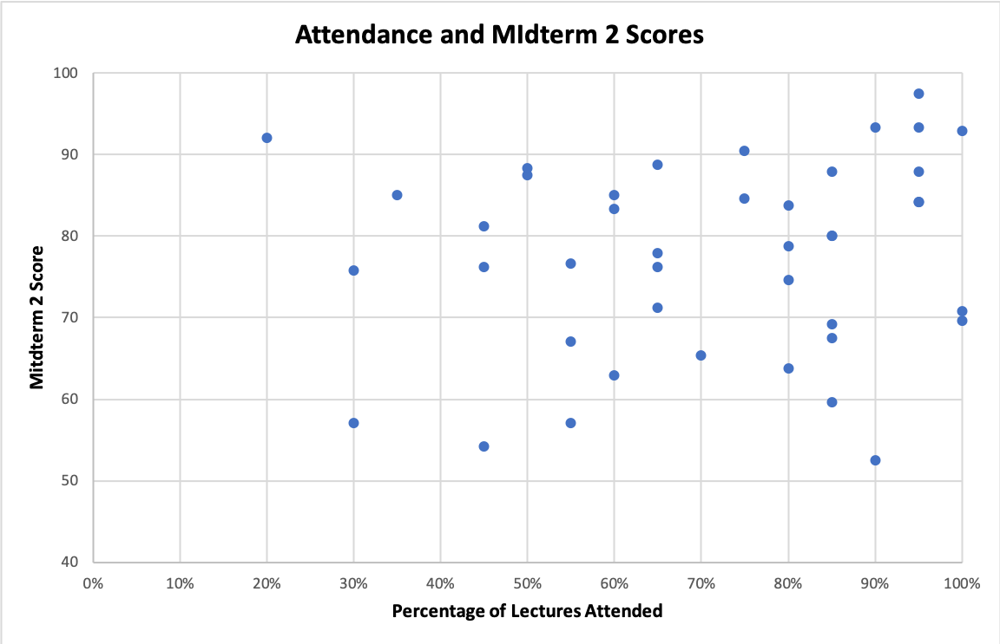
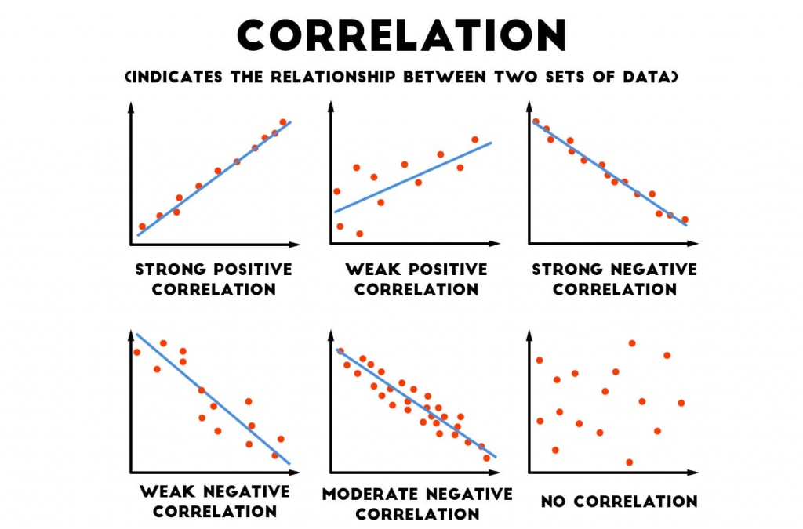
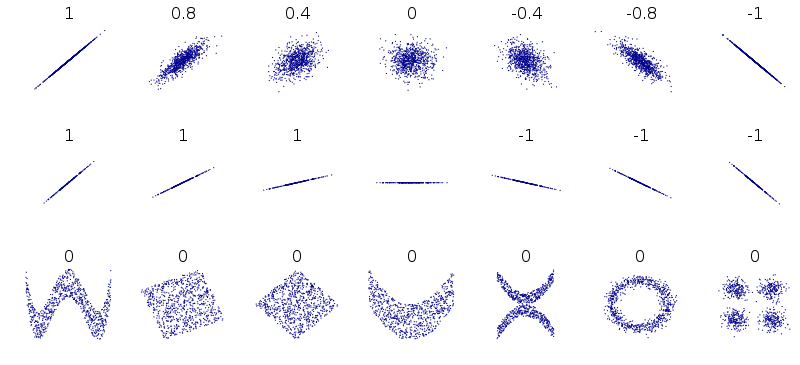

class: clear, middle

```{r preamble, child=here::here("Lecture Slides", "preamble.Rmd")}
```

## Chapter 4: Correlation

---
# Multiple Variables
Almost everything we've done so far has been .it[univariate] statistics, but often we're interested in how multiple random variables are related?

- How does education affect earnings?
- How does race affect earnings?
- How does experience affect earnings?


Many events are .it[dependent] on other random variables. In this chapter we'll formalize this concept.


---
# Probability Theory
Recall that with single random variables we characterized probabilities with

- PMF (probability mass function), $P(X=x)$, in discrete case
- PDF (probability density function), $f(x)$, in continuous case

--

When we have multiple random variables we use the .hi.purple[joint distribution]

- $P(X=x, Y=y)$ in the discrete case
- $f(x,y)$ in the continuous case

The joint distribution describes the probability of obtaining $X=x$ *and* $Y=y$.

- .ex[Example:] If $X$ is education and $Y$ is income, you could ask what's the probability that from the population I have someone who earns $65,000/year *and* has a masters degree.


---
# Properties for Joint Distribution
For short hand, $P(x,y) = P(X=x, Y=y)$

In this class we'll focus solely on the discrete case

- $0 \leq P(x,y) \leq 1$
- $\sum_x \sum_y P(x,y)=1$


As long as X and Y are .hi.purple[not independent]
$$P(x,y) \neq P(x)P(y)$$


---
# Example
Suppose that $X$ is the number of girls born out of three kids and $Y$ is whether the first child is a girl.

```{r joint_pdf_ex1, echo = F}

joint_pdf <- tribble(
  ~`Outcome`, ~`\\(X\\)`, ~`\\(Y\\)`,
  "BBB", 0, 0,
  "GBB", 1, 1,
  "BGB", 1, 0,
  "BBG", 1, 0,
  "GGB", 2, 1,
  "GBG", 2, 1,
  "BGG", 2, 0,
  "GGG", 3, 1
)

gt::gt(joint_pdf) %>% 
  kfbmisc::gt_theme_kyle() %>%
  gt::tab_header(title = kfbmisc::make_gt_title("Sample Space"))

```


---
# Example
Notice that the sample spaces are $S_X =\{0,1,2,3\}$ and $S_Y=\{0,1\}$. The associated joint probabilities are:

```{r cross_tbl_ex1, echo = F}
cross_tbl <- tribble(
  ~" ", ~`\\( Y = 0 \\)`, ~`\\( Y = 1 \\)`,
  "\\(X = 0 \\)", 1/8, 0,
  "\\(X = 1 \\)", 2/8, 1/8,
  "\\(X = 2 \\)", 1/8, 2/8,
  "\\(X = 3 \\)", 0, 1/8,
)

gt::gt(cross_tbl) %>% 
  kfbmisc::gt_theme_kyle() %>%
  gt::tab_header(title = kfbmisc::make_gt_title("Joint PDF"))


```


---
# Example
Let's check this table satisfies the definition of a joint distribution

- $0 \leq P(x,y) \leq 1 \checkmark$

--

- $\sum_x \sum_y P(x,y)=1$


\begin{align}
  \sum_{x \in S_X} \sum_{y \in S_Y} Pr(x,y) &=  Pr(0,0) + Pr(0,1) + Pr(1,0) + Pr(1,1)   \\\\
  &+ Pr(2,0) + Pr(2,1) + Pr(3,0) + Pr(3,1) \\\\
  &= 1/8 + 0 + 2/8 + 1/8 \\\\
  &+ 1/8 + 2/8 + 0 + 1/8 = 1
\end{align}


---
# Clicker Question
Given the following joint probability mass function, what is the probability of the NASDAQ increasing in value and your portfolio loses value?

```{r nasdaq-table, echo = F}

nasdaq <- tribble(
  ~" ", ~"Portfolio Increases", ~"Portfolio Decreases",
  "NASDAQ Increases", 0.40, .05,
  "NASDAQ Decreases", .15, 0.40,
)

nasdaq_table <- gt::gt(nasdaq) %>%
  kfbmisc::gt_theme_kyle() %>% 
  gt::tab_header(title = kfbmisc::make_gt_title("NASDAQ"))

nasdaq_table
```


---
# Clicker Question
Given the following joint probability mass function, what is the probability that the NASDAQ increases in value?

`r nasdaq_table`

<ol type = "a">
  <li>0.40</li>
  <li>0.05</li>
  <li>0.15</li>
  <li>0.45</li>
</ol>


---
# Clicker Question
Given the following joint probability mass function, what is the probability that the NASDAQ increases in value, conditional on the portfolio value decreases?

`r nasdaq_table`

<ol type = "a">
  <li>0.111</li>
  <li>0.889</li>
  <li>0.05</li>
  <li>0.40</li>
</ol>

---
# Visualizing a Joint Distribution

The most useful for displaying the relationship between two .ul[quantitative] variables is a .hi.kelly[scatterplot]

- Shows relationship between two quantitative variables
  - Each axis represents a variable
  - Individual data appear as a point, fixed by the values of both variables
      


---
# Scatterplot Example


```{r, echo = F, out.width = "90%"}

```


---
# Interpreting a Scatterplot

Looking for patterns, and deviations from that pattern
      
- Direction, form, strength of relationship
- Any outliers?
      
Describing the association
      
- .hi.kelly[Positive Association]: above-average values of one tend to accompany above-average values of the other, and below-average values also tend to occur together
- .hi.ruby[Negative Association]: above-average values of one tend to accompany below-average values of the other, and vice versa
      
In general, if one variable is explanatory (influences change) and one is a response variable (outcome), then the explanatory variable is plotted on the x-axis


---
# Correlation
We need to supplement the graph with a numerical measure, generally we use .hi.alice[correlation].

The .alice[correlation] measures the direction and strength of the linear relationship between two quantitive variables. Correlation is usually written as $r$


---
# Covariance
In order to understand correlations, we must first discuss .hi.purple[covariance]

Recall: $V(aX+bY)=a^2V(X)+b^2V(Y)+2ab\cdot cov(X,Y)$

Covariance measures the joint variability of two random variables

- Sign of covariance explains direction of relationship

- Magnitude of covariance is hard to interpret.sup[*]
  
  - The .alice[correlation coefficient] will not have this problem

- Covariance equals zero whenever X and Y are .hi.purple[independent]

.footnote[.sup[*] Double the units, double the covariance!!]


---
# Covariance

We use the following formula to calculate covariance

$$cov(X,Y)=E(XY)-E(X)E(Y)$$

Note: $E(XY) \neq E(X)E(Y)$ unless X and Y are independent and then cov(X,Y)=0


The magnitude of covariance depends on the units of X and Y

- This means $cov(A,B) > cov(C,D)$ .hi[does not] imply that A and B have stronger relationship than C and D

- In order to compare relationships we must find a way to normalize their covariances 


---
# Correlation

The .hi.alice[correlation] measures the direction and strength of the linear relationship between two quantitive variables. Correlation is usually written as $r$

To calculate correlation, we normalize the covariance as so:

$$
  r=\frac{cov(X,Y)}{\sqrt{V(X)}\cdot \sqrt{V(Y)}}
$$


---
# Correlation

.subheader.alice[Notes on correlation]

Values are always between -1 and 1
      
- $1 \implies$ perfectly linear positive relationship (variables move same direction and same magnitude)

- $-1 \implies$ pefectly linear negative relationship (variables move in opposite direction but same magnitude) 
      
- Correlations are unit-less

--

.it.purple[Doesn't imply a causal relationship]

--

Drawbacks of correlation

- Only measures .it[linear relationships] (we will see what this means)
       
- Just because correlation is zero doesn't necessarily mean variables are independent
      
- Not resistant to outliers


---
# Correlations - Example

```{r, echo = F, out.width = "90%"}

nyc_stat <- read_csv(here("Lecture Slides", "Chapter 04", "nyc_sat.csv")) %>%
	filter(!is.na(`Percent Tested`)) %>% 
	mutate(`Percent Tested`= as.numeric(gsub("%", "", `Percent Tested`)))

ggplot(nyc_stat) + 
	geom_point(aes(x= `Average Score (SAT Math)`, y= `Average Score (SAT Reading)`)) +
	kfbmisc::theme_kyle(base_size= 16) +
	theme(
		plot.title = element_text(hjust = 0.5)
	) +
	labs(title= "NYC Math and Reading SAT Scores")
```

---
# Correlations - Example

```{r, echo = F, out.width = "90%"}
ggplot(nyc_stat) + 
	geom_point(aes(x= Latitude, y= `Average Score (SAT Reading)`)) +
	kfbmisc::theme_kyle(base_size= 16) +
	theme(
		plot.title = element_text(hjust = 0.5)
	) +
	labs(title= "NYC Math and Reading SAT Scores")
```


---
# Correlations - Visualized

```{r, echo = F, out.width = "90%"}

```


---
# Why Correlation isn't Perfect


```{r, echo = F, out.width = "90%"}

```

Bottom row is an example of non-linear relationships

<!-- 
--- 
class: center, middle 

 
-->

---
# Covariance and Independence
Since covariance (and correlations) only measure linear relationships:

$$cov(X,Y) = 0 \not\implies X \text{ and } Y \text{ are independent}$$

--

<br/>
However, since $E(XY)=E(X)E(Y)$ when X \text{ and } Y are independent:

$$X \text{ and } Y \text{ are independent} \rightarrow cov(X,Y)=0$$


---
# Joint Distributions
When calculating the covariance we use equation $cov(X,Y) = E(XY)-E(X)E(Y)$


```{r, joint-ex, echo = F}
joint <- tribble(
  ~" ", ~"\\(Y = 0\\)", ~"\\(Y = 1\\)",
  "\\(X = 0\\)", 1/8, 0,
  "\\(X = 1\\)", 2/8, 1/8,
  "\\(X = 2\\)", 1/8, 2/8,
  "\\(X = 3\\)", 0, 1/8,
)
gt::gt(joint) %>% kfbmisc::gt_theme_kyle()
```

$$E(XY)=x\cdot y \cdot P(x,y)$$
In this example:

$$E(XY)=(0\cdot 0 \cdot 1/8) + (0\cdot  1\cdot 0) + (1\cdot 0 \cdot 2/8) + (1\cdot 1 \cdot 1/8) +$$
$$(2\cdot 0 \cdot 1/8) + (2\cdot 1 \cdot 2/8) + (3\cdot 0 \cdot 0) + (3\cdot 1 \cdot 1/8)=1$$


---
# Marginal Probabilties
In order to calculate $E(X)$ and $E(Y)$ from a joint distribution we must first calculate the .hi.purple[marginal probabilities] of both X and Y. 

```{r, marginal-ex, echo = F}
marginal <- tribble(
  ~" ", ~"\\(Y = 0\\)", ~"\\(Y = 1\\)", ~"\\( Pr(X) \\)",
  "\\(X = 0\\)", "1/8", "0", "1/8",
  "\\(X = 1\\)", "2/8", "1/8", "3/8",
  "\\(X = 2\\)", "1/8", "2/8", "3/8",
  "\\(X = 3\\)", "0", "1/8", "1/8",
  "\\(Pr(Y)\\)", "4/8", "4/8", "1",
)

marginal_tbl <- gt::gt(marginal) %>% kfbmisc::gt_theme_kyle()

marginal_tbl
```

These marginal probabilities, $P(X=x)$ are calculated adding up the probabilities across each scenario where $X=x$


---
# Marginal Probabilities
We can use these marginal probabilities to calculate $E(X)$ and $E(Y)$.

`r marginal_tbl`

$E(X)=(0 \cdot 1/8) + (1 \cdot 3/8) + (2 \cdot 3/8) + (3 \cdot 1/8) =1.5$
$E(Y)=(0 \cdot 4/8) + (1 \cdot 4/8) =0.5$


---
# Covariance of Joint Distribution
All of that work leads us here:

$$E(XY)=1$$
$$E(X)= 1.5 $$
$$E(Y)= 0.5$$
$$cov(X,Y)=E(XY)-E(X)E(Y) =1 - (1.5 \cdot 0.5) = 0.25$$

--

What does $0.25$ mean? Is this a strong relationship? A weak one?

---
# Covariance to Correlation

Again, we often use correlation instead of covariance because correlation .hi[does not depend on the units]

To find correlation from covariance we use the following equation:

$$r = \frac{\text{cov(X,Y)}}{\sqrt{\text{V(X)}\cdot \text{V(Y)}}}$$
So we need to calculate the variance of X and Y, using information about the joint probabilities


---
# Covariance to Correlation
Recall the joint probabilities we gathered from the table

`r marginal_tbl`


$$ E(X^2) = (0^2 \cdot 1/8) + (1^2 \cdot 3/8) + (2^2 \cdot 3/8) + (3^2 \cdot 1/8) = 3$$

$$ E(Y^2)=(0^2 \cdot 4/8) + (1^2 \cdot 4/8) = 0.5$$


---
# Covariance to Correlation
$E(X)=1.5$ and $E(X^2)=3 \rightarrow V(X)=3-1.5^2= 0.75$

$E(Y)=0.5$ and $E(Y^2)=0.5 \rightarrow V(Y)=0.5-0.5^2 = 0.25$

$cov(X,Y)=0.25$

$$r = \frac{\text{cov(X,Y)}}{\sqrt{\text{V(X)}}\cdot \sqrt{\text{V(Y)}}} =\frac{0.25}{\sqrt{0.75}\cdot\sqrt{0.25}}=0.577$$


---
# Clicker Question
What can be said of the correlation between the brand of an automobile and its quality?

<ol type = "a">
  <li>The correlation is negative, because smaller cars tend to have higher quality and larger cars tend to have lower quality.</li>
  <li>The correlation is positive, because better brands have higher quality.</li>
  <li>If the correlation is negative, an arithmetic mistake was made; correlation must be positive.</li>
  <li>Correlation makes no sense here, because brand is a categorical variable.</li>
</ol>


---
# Clicker Question
Which of the following statements is false?
<ol type = "a">
  <li>Older men tend to have lower muscle density, so the correlation between age and muscle density in older men must be negative.</li>
  <li>Older children tend to be taller than younger children, so the correlation between age and height in children must be positive.</li>
  <li>A researcher finds that the correlation between two variables is close to 0, so the two variables must be unrelated.</li>
  <li>Taller people tend to be heavier than shorter people, so the correlation between height and weight must be positive.</li>
</ol>
