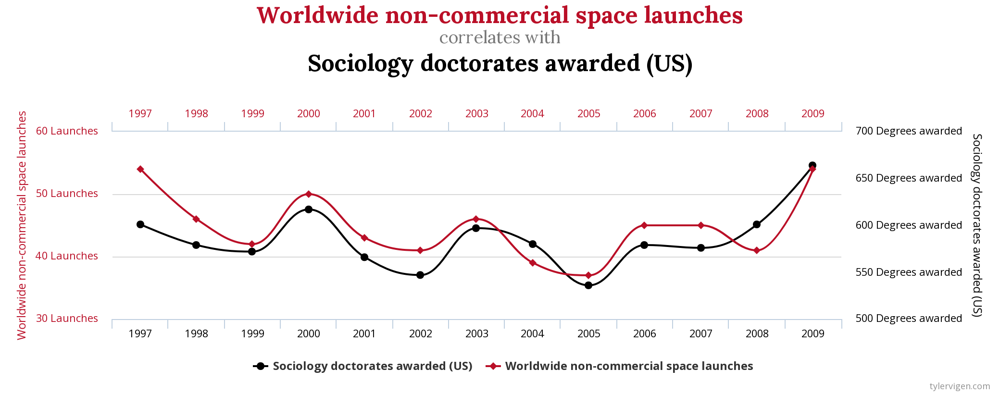

class: clear, middle

```{r preamble, child=here::here("Lecture Slides", "preamble.Rmd")}

```

## Chapter 5: Regression

---
# Review from Last Class

Recall the ways we discussed relationships between two random variables $X$ and $Y$:


Covariance, $\sigma_{XY}$ (sample analogue: \\(s_{XY}\\) )
      
  - Direction matters, but magnitude is hard to interpret
      
Correlation, $\rho_{XY}$ (sample analogue: \\(r_{XY}\\) )

  - Direction and magnitude matter
  
  - Correlation is always value between $[-1,1]$
      


---
# Review from Last Class

Recall: 
$$r=\frac{Cov(X,Y)}{\sqrt{Var(X)}\cdot \sqrt{Var(Y)}}$$


- Correlation is a function of covariance, just normalizes the magnitudes so we can interpret.


---
# Clicker Question

Suppose you calculate the sample covariance, $s_{XY}=1.2$, and the sample standard deviations $s_X=2$ and $s_Y=2.5$. What is the sample correlation, $r_{XY}$?

<ol type = "a">
  <li>0.0576</li>
  <li>0.24</li>
  <li>0.048</li>
  <li>4.17</li>
</ol>


---
# Relationship between X and Y

We often summarize the relationship between $X$ and $Y$ using a straight line:


```{r, echo = F, out.width = "70%"}
nyc_sat <- read_csv(here::here("Lecture Slides", "Chapter 05", "nyc_sat.csv")) %>%
    filter(
        !is.na(`Percent Tested`),
        !is.na(`Average Score (SAT Math)`)
    ) %>%
    mutate(`Percent Tested` = as.numeric(gsub("%", "", `Percent Tested`)))

fit <- lm(`Average Score (SAT Reading)` ~ `Average Score (SAT Math)`, data = nyc_sat)

nyc_sat$residuals <- residuals(fit)
nyc_sat$predicted <- predict(fit)

(reg_line <- ggplot(nyc_sat, aes(x = `Average Score (SAT Math)`, y = `Average Score (SAT Reading)`)) +
    geom_point() +
    geom_smooth(method = "lm", formula = y ~ x, se = FALSE, color = coral) +
    kfbmisc::theme_kyle(base_size = 20) +
    theme(
        plot.title = element_text(hjust = 0.5)
    ) +
    labs(title = "NYC Math and Reading SAT Scores"))
```

This is called the line of best fit, or the .hi.coral[regression line].

---
# Regression Line Example

In the previous example, the regression line is given by 

$$\widehat{\text{Average SAT Reading}} = 78.87 + 0.7983 * \text{Average SAT Math}$$

The $\widehat{ }$ symbol means that we are *predicting* average SAT reading score. 


--

<br/>

.ex[Example:] If a school has an average SAT math score of 600, we would predict their SAT reading score would be 

$$\widehat{\text{Average SAT Reading}} = 78.87 + 0.7983 * 600 = 557.85.$$


---
# Regression Line

Let $X$ and $Y$ be two random variables. A .hi.coral[regression line] is a straight line that describes how the response variable, $Y$, changes as the explanatory variable $X$ changes.

We often use a regression line to predict the value of $Y$ for a given value of $X$, *when we believe the relationship between $X$ and $Y$ is linear*.

--

Since we are predicting $Y$ with a line, our regression line will be given by:

$$\underbrace{\coral{\hat{Y}_i}}_{\text{Prediction for } Y_i} = \underbrace{\hat{a}}_{\text{Intercept}} + \underbrace{\hat{b}}_{\text{Slope}} * X_i$$

$\coral{\hat{Y}_i}$ is called the .hi.coral[predicted value]


---
# Residual Errors

However, $\coral{\hat{Y}}$ will not be equal to $Y$. Therefore our .hi.kelly[prediction error] for unit $i$ is given by 

$$ \kelly{\varepsilon_i} = Y_i - \coral{\hat{Y}_i} $$


```{r, echo = F, out.width = "70%"}
(reg_resids <- ggplot(nyc_sat, aes(x = `Average Score (SAT Math)`, y = `Average Score (SAT Reading)`)) +
    geom_point() +
    geom_smooth(method = "lm", formula = y ~ x, se = FALSE, color = coral) +
    geom_segment(aes(xend = `Average Score (SAT Math)`, yend = .data$predicted), color = kelly) +
    kfbmisc::theme_kyle(base_size = 20) +
    theme(
        plot.title = element_text(hjust = 0.5)
    ) +
    labs(title = "NYC Math and Reading SAT Scores") +
    geom_curve(
        data = data.frame(x = 635, y = 499, xend = 616, yend = 506),
        mapping = aes(x = x, y = y, xend = xend, yend = yend),
        curvature = -0.465, arrow = arrow(48L, unit(0.05, "inches"), "last", "closed"),
        inherit.aes = FALSE
    ) +
    geom_text(
        data = data.frame(x = 635, y = 512, label = "Prediction Error for this unit"),
        mapping = aes(x = x, y = y, label = label),
        size = 5, hjust = 0L, family = "fira_sans", inherit.aes = FALSE
    )
)
```


---
# Being the "best"

**Question:** How do we estimate the intercept $\hat{a}$ and the slope $\hat{b}$ line of "best fit"?


--

**Answer:**

1. What about minimizing of $\sum_i \kelly{\varepsilon_i}$, *i.e. lower total prediction error*?

--

  - $\kelly{\varepsilon_i}$ could be positive or negative if we over/under-estimate $\coral{\hat{Y}_i}$. If we add up all the residuals, the positive and negatives will sometimes cancel out (same reasoning as variance). This isn't good because we want to be 'penalized' for all prediction errors. 
  
--

2. Therefore we minimize $\kelly{\varepsilon_i}^2$ because each $\kelly{\varepsilon_i}^2$ will be positive.

  - In general,*the line of best-fit* means the line that minimizes the .kelly[sum of squared errors] (SSE):

$$ \text{SSE} = \sum_{i = 1}^{n} \kelly{\varepsilon_i}^2 = \sum_{i=1}^n (y_i - \hat{a} - \hat{b} X_i) $$


---
# OLS *vs.* other lines/estimators

Let's consider a random dataset

```{R, ols-vs-lines-1, echo = F, dev = "svg", fig.height = 6}
# From Ed Rubin

theme_empty <- theme_bw() + theme(
    line = element_blank(),
    rect = element_blank(),
    strip.text = element_blank(),
    axis.text = element_blank(),
    plot.title = element_blank(),
    axis.title = element_blank(),
    plot.margin = structure(c(0, 0, -1, -1), unit = "lines", valid.unit = 3L, class = "unit"),
    legend.position = "none"
)


# Set population and sample sizes
n_p <- 100
n_s <- 30

# Set the seed
set.seed(12468)

# Generate data
pop_df <- tibble(
    i = 3,
    x = rnorm(n_p, mean = 5, sd = 1.5),
    e = rnorm(n_p, mean = 0, sd = 1),
    y = i + 0.5 * x + e,
    row = rep(1:sqrt(n_p), times = sqrt(n_p)),
    col = rep(1:sqrt(n_p), each = sqrt(n_p)),
    s1 = sample(x = c(rep(T, n_s), rep(F, n_p - n_s))),
    s2 = sample(x = c(rep(T, n_s), rep(F, n_p - n_s))),
    s3 = sample(x = c(rep(T, n_s), rep(F, n_p - n_s)))
)

ggplot(data = pop_df, aes(x = x, y = y)) +
    geom_point(size = 5, color = asher, alpha = 0.7) +
    theme_empty
```

---
count: false
# OLS *vs.* other lines/estimators

For any line (_i.e._, $\hat{y} = \hat{a} + \hat{b} x$) that we draw

```{R, ols-vs-lines-2, echo = F, dev = "svg", fig.height = 6}
# Define line's parameters
b0 <- 6
b1 <- 0.2

# The plot
ggplot(data = pop_df, aes(x = x, y = y)) +
    geom_point(size = 5, color = asher, alpha = 0.7) +
    geom_abline(intercept = b0, slope = b1, color = ruby, size = 2, alpha = 0.9) +
    theme_empty
```

---
count: false
# OLS *vs.* other lines/estimators

For any line (*i.e.*, $\hat{y} = \hat{a} + \hat{b} x$) that we draw, we can calculate the errors: $e_i = y_i - \coral{\hat{Y}_i}$

```{R, ols-vs-lines-3, echo = F, dev = "svg", fig.height = 6}
# Define a function
y_hat <- function(x, b0, b1) {
    b0 + b1 * x
}

# Define line's parameters
b0 <- 6
b1 <- 0.2

# The plot
ggplot(data = pop_df, aes(x = x, y = y)) +
    geom_segment(aes(x = x, xend = x, y = y, yend = y_hat(x, b0, b1)), size = 0.5, alpha = 0.2) +
    geom_point(size = 5, color = asher, alpha = 0.7) +
    geom_abline(intercept = b0, slope = b1, color = ruby, size = 2, alpha = 0.9) +
    theme_empty
```

---
count: false
# OLS *vs.* other lines/estimators

For any line (_i.e._, $\hat{y} = \hat{a} + \hat{b} x$) that we draw, we can calculate the errors: $e_i = y_i - \coral{\hat{Y}_i}$

```{R, ols-vs-lines-4, echo = F, dev = "svg", fig.height = 6}

# Define line's parameters
b0 <- 3
b1 <- 0.2

# The plot
ggplot(data = pop_df, aes(x = x, y = y)) +
    geom_segment(aes(x = x, xend = x, y = y, yend = y_hat(x, b0, b1)), size = 0.5, alpha = 0.2) +
    geom_point(size = 5, color = asher, alpha = 0.7) +
    geom_abline(intercept = b0, slope = b1, color = ruby, size = 2, alpha = 0.9) +
    theme_empty
```

---
count: false
# OLS *vs.* other lines/estimators

For any line (_i.e._, $\hat{y} = \hat{a} + \hat{b} x$) that we draw, we can calculate the errors: $e_i = y_i - \coral{\hat{Y}_i}$

```{R, ols-vs-lines-5, echo = F, dev = "svg", fig.height = 6}
# Define a function
y_hat <- function(x, b0, b1) {
    b0 + b1 * x
}
# Define line's parameters
b0 <- 10
b1 <- -0.8

# The plot
ggplot(data = pop_df, aes(x = x, y = y)) +
    geom_segment(aes(x = x, xend = x, y = y, yend = y_hat(x, b0, b1)), size = 0.5, alpha = 0.2) +
    geom_point(size = 5, color = asher, alpha = 0.7) +
    geom_abline(intercept = b0, slope = b1, color = ruby, size = 2, alpha = 0.9) +
    theme_empty
```

---
count: false
# OLS *vs.* other lines/estimators

Because SSE squares the errors (_i.e._, $\sum e_i^2$), big errors are penalized more than small ones.

```{R, ols-vs-lines-6, echo = F, dev = "svg", fig.height = 6}
# Define a function
y_hat <- function(x, b0, b1) {
    b0 + b1 * x
}
# Define line's parameters
b0 <- 10
b1 <- -0.8

# The plot
ggplot(data = pop_df, aes(x = x, y = y)) +
    geom_segment(aes(x = x, xend = x, y = y, yend = y_hat(x, b0, b1), color = (y - y_hat(x, b0, b1))^2), size = 0.5) +
    geom_point(size = 5, color = asher, alpha = 0.7) +
    geom_abline(intercept = b0, slope = b1, color = ruby, size = 2, alpha = 0.9) +
    scale_colour_gradient(low = "white", high = kelly) +
    theme_empty
```

---
count: false
# OLS *vs.* other lines/estimators

The OLS estimate is the combination of $\hat{a}$ and $\hat{b}$ that minimize SSE.

```{R, ols-vs-lines-7, echo = F, dev = "svg", fig.height = 6}
# Define line's parameters
lm0 <- lm(y ~ 1 + x, pop_df)
b0 <- lm0$coefficients[1]
b1 <- lm0$coefficients[2]

# The plot
ggplot(data = pop_df, aes(x = x, y = y)) +
    geom_segment(aes(x = x, xend = x, y = y, yend = y_hat(x, b0, b1), color = (y - y_hat(x, b0, b1))^2), size = 0.5) +
    geom_point(size = 5, color = asher, alpha = 0.7) +
    geom_abline(intercept = b0, slope = b1, color = coral, size = 2, alpha = 0.9) +
    scale_colour_gradient(low = "white", high = kelly) +
    theme_empty
```


---
# Least Squares Regression Line

Let $\{X_i,Y_i\}_{i=1}^n$ be a *simple random sample* of $X$ and $Y$. 

The .hi.coral[least squares regression line] is the equation $\widehat{Y}_i = \hat{a} + \hat{b} X_i$, where $\hat{a}$ and $\hat{b}$ minimize

$$
\sum_{i=1}^n (Y_i - a - b * X_i)^2
$$

--

The solution is:

$$\hat{b} = r_{XY}\frac{s_Y}{s_X}$$

$$\hat{a} = \bar{Y} - \hat{b} \bar{X}$$


---
# Clicker Question

Consider the NHIS dataset. Let $Y$ be a person's weight in pounds, and $X$ be the number of drinks per day they consume (on average). You calculate the following:  

$\bar{Y} = 176.5889$, $\bar{X} = 2.2489$, $s_Y = 39.86577$, $s_X = 1.804856$, $r_{XY} = 0.1187268$ 

What is the regression line you fit to the data?

<ol type = "a">
  <li>\( \widehat{Y}_i = 176.5889 + 2.6224 X_i \)</li>
  <li>\( \widehat{Y}_i = 176.5768 + 0.0054 X_i \)</li>
  <li>\( \widehat{Y}_i = 126.9151 + 22.08814 X_i \)</li>
  <li>\( \widehat{Y}_i = 170.6913 + 2.6224 X_i \)</li>
</ol>


---
# Interpreting a Regression

A regression line is a straight line that describes how a response variable $y$ changes as an explanatory variable $x$ changes

We often use a regression line to predict the value of $y$ for a given value of $x$, when we believe the relationship is linear

A linear relationship is of the form:

$$y=a + b x$$

- $a$ is the value of $y$ whenever $x=0$

- $b$ is the amount $y$ changes when $x$ increases by one


---
# Interpreting a Regression

Lets go back to our clicker question, we calculated the line of best fit to be:

$$ \coral{\hat{Y}_i}=170.69+2.62X_i$$

where $Y$ is a person's weight in pounds, and $X$ is the number of drinks per day they consume (on average)


- Our intercept, 170.69 is the predicted weight for someone who doesn't consume any alcohol
  
  - Our best guess at $Y$ when $X = 0$,
      
- Our slope, 2.62 is the amount predicted weight increases when number of drinks per day increases by 1
      
  - The amount $\coral{\hat{Y}_i}$ changes when $X_i$ increases by 1
      


---
# Interpreting a Regression

Say we calculate the following regression line from hours studied and final exam grades:

$$
  \coral{\widehat{\text{Final Exam}}} = 38 + 5.7 * \text{Hours of Studying}
$$

--

- 38 is predicted score with no studying

--

- Each hour of studying increases predicted final exam score by 5.7 points


---
# Clicker Question
Given that same regression line, $\text{Final Exam}=38 + 5.7*\text{Hours of Studying}$, what is the predicted final exam score if you study 8 hours?

<ol type = "a">
  <li> 83.6 </li>
  <li> 45.6 </li>
  <li> 96.3 </li>
</ol>


---
# Clicker Question
A store in Boulder calculates a least squares line that describes how price (in dollars) of juuls affects the quantity sold; 

$$\widehat{\text{Juuls sold}} = 117 - 12.4 * \text{price}$$ 

If price *decreases* by 1 dollar, what happens to number of juuls sold?

<ol type = "a">
  <li>Quantity decreases by 12.4</li>
  <li>Quantity increases 12.4</li>
  <li>Quantity decreases by 117</li>
  <li>Quantity increases by 117</li>
</ol>


---
# Properties of Regression Residuals

The slope, $b$, and intercept, $a$, of the regression line are found by minimizing $\sum_{i=1}^n \varepsilon_i^2$.


This forces $\bar{\varepsilon}=0$. Hence, an .hi.purple[assumption] of regression is that $E(\varepsilon)=0$.

Intuitively, this assumption means that the error in your prediction is due entirely to randomness. 


---
# Overview of Regression Analysis

A researcher is studying the relationship between high school students' SAT scores and their GPA during their freshman year of college. The data has a linear correlation coefficient of 0.503. Additional sample statistics are summarized in the table below:

```{r, echo = F}
tbl_reg_1 <- tribble(
    ~"Variable", ~"Description", ~"Sample Mean", ~"Sample Std. Dev",
    "X", "SAT score", "\\( \\bar{X}=1501.72 \\)", "\\( s_X=104.14 \\)",
    "Y", "GPA", "\\( \\bar{Y}=3.3 \\)", "\\( s_Y=0.45 \\)",
)

gt(tbl_reg_1) %>%
    kfbmisc::gt_theme_kyle()
```


- What is the slope and intercept of this regression line? Write the linear regression using the $Y=a+bX$ format.

- Interpret the slope and intercept coefficients

- What is the predicted GPA if the student got a 1600 on the SAT?


---
# $R^2$

Next we define a measure to evaluate how well the regression line fits:

\[
\cranberry{R^2} = \frac{\sum_{i=1}^n (\coral{\hat{Y}_i} - \bar{Y})^2}{\sum_{i=1}^n (Y_i - \bar{Y})^2}
\]


---
# Intuition of $R^2$

Intuitively, $R^2$ measures the percent of variation in $Y$ explained by the model.

$$\cranberry{R^2}  = \frac{\text{variation in } \hat{y} \text{ along the regression line as x varies}}{\text{total variation in observed values of y}}$$


---
class: clear,middle


```{r, echo = F, out.width = "90%"}

```


---
# $r$ and $R^2$


Correlation, $r$, describes the strength of a straight-line relationship between two variables

$R^2$, is the fraction of the variation in the values of y that is explained by the least-squares regression of y on x

$$\cranberry{R^2} = r^2$$


---
# $r$ and $R^2$

Lets say we have $r = -0.7786$ and $\cranberry{R^2} = (-0.7786)^2 = 0.6062$ between exercise and fat gain. 


- $r = -0.7786$, there is a strong negative linear relationship between time exercised and amount of weight gained

- $\cranberry{R^2} = 0.6062$, about 61% of the variation in fat gained is accounted for by the linear relationship between fat gain and exercise. This means about 39% of the change in fat gained is not explained by this relationship


---
# Clicker Question

Say we run a regression on the temperature and the amount of gas used to heat a home. We find that the $r=-0.99$ and $R^2=0.98$. This suggests that:

<ol type = "a">
  <li>although temperature and gas used are very correlated, the temperature does not make very good predictions of the amount of gas used</li>
  <li>gas used increases by 0.99 cubic feet for each additional degree colder it is outside </li>
  <li>prediction of gas used based off temperature will be quite accurate</li>
</ol>


---
# $R^2$ Sidebar

A small $R^2$ does not mean the result is uninteresting. All it means is that the x variable alone does not explain a large portion of the variation in y.

<br/>

.ex[Example:] You find significant relationship between exercise and income, but it has a small $R^2$. 

We know income is determined by a variety of variables -- parent's income, education, innate ability, experience, etc. 

- Your result isn't uninteresting, it just means there is a lot of variation in income .it[not due] to exercise, which is exactly what we'd expect.


---
# $R^2$ Example

Recall from our previous example that a researcher calculated a correlation coefficient 0.503 between SAT scores and college freshman GPA. This implies an $R^2$ of 0.253. 

What does this $R^2$ mean? 

--

Does this make sense? What other things could explain the variation in freshman year GPA?


---
# Influential Observations

Our regression line is sensitive to outliers, either in the x or y dimension 
 
- We say an outlier is .hi.daisy[influential] if deleting it changes our regression line substantially

- The amount by which the line changes is called the .hi.daisy[leverage] an influential observation has


---
# Example of Influential Observation

Let's revisit the NYC Math and Reading SAT Scores example.

```{r nyc-sat-outlier-1, echo = F, out.width = "80%"}


nyc_sat$important <- FALSE
nyc_sat_w_outlier <- nyc_sat %>%
	add_row(`Average Score (SAT Math)`= 700, `Average Score (SAT Reading)`= 340, important= TRUE)

ggplot(nyc_sat, aes(x= `Average Score (SAT Math)`, y= `Average Score (SAT Reading)`)) +
		geom_point(aes(color= important)) +
		geom_line(data= nyc_sat, aes(x= `Average Score (SAT Math)`, y= predicted)) +
		geom_smooth(method='lm', formula= y~x, se= FALSE, color= coral) +
		kfbmisc::theme_kyle(base_size = 18) +
		theme(
			plot.title = element_text(hjust = 0.5)
		) +
		guides(color = "none") +
		scale_color_manual(values= c(asher, ruby)) +
		labs(title= "NYC Math and Reading SAT Scores")

```

---
# Example of Influential Observation

Suppose we had an outlier of a Math score of 700 and a Reading score of 340.

```{r nyc-sat-outlier-2, echo = F, out.width = "80%"}

nyc_sat_w_outlier <- nyc_sat %>%
	mutate(important= FALSE) %>%
	add_row(`Average Score (SAT Math)`= 700, `Average Score (SAT Reading)`= 340, important= TRUE)

ggplot(nyc_sat_w_outlier, aes(x= `Average Score (SAT Math)`, y= `Average Score (SAT Reading)`)) +
		geom_point(aes(color= important)) +
		geom_line(data= nyc_sat, aes(x= `Average Score (SAT Math)`, y= predicted)) +
		kfbmisc::theme_kyle(base_size = 18) +
		theme(
			plot.title = element_text(hjust = 0.5)
		) +
		guides(color = "none") +
		scale_color_manual(values= c(asher, ruby)) +
		labs(title= "NYC Math and Reading SAT Scores") +
		geom_curve(data = data.frame(x = 694.5, y = 401.9, xend = 695.3, yend = 346.6),
				   mapping = aes(x = x, y = y, xend = xend, yend = yend),
				   arrow = arrow(30L, unit(0.1, "inches"), "last", "closed"),
				   alpha = 1, inherit.aes = FALSE) +
		geom_text(data = data.frame(x = 694.5, y = 420, label = "Outlier"),
				  mapping = aes(x = x, y = y, label = label), family = "fira_sans",
				  size = 5.6, fontface = 2, alpha = 1, inherit.aes = FALSE)

```


---
# Example of Influential Observation

Suppose we had an outlier of a Math score of 700 and a Reading score of 340. That data point has quite a bit of leverage because it is an extreme outlier.

```{r nyc-sat-outlier-3, echo = F, out.width = "80%"}

nyc_sat_w_outlier <- nyc_sat %>%
	mutate(important= FALSE) %>%
	add_row(`Average Score (SAT Math)`= 700, `Average Score (SAT Reading)`= 340, important= TRUE)

(outlier_plot <- ggplot(nyc_sat_w_outlier, aes(x= `Average Score (SAT Math)`, y= `Average Score (SAT Reading)`)) +
		geom_point(aes(color= important)) +
		geom_line(data= nyc_sat, aes(x= `Average Score (SAT Math)`, y= predicted)) +
		geom_smooth(method='lm', formula= y~x, se= FALSE, color = coral) +
		kfbmisc::theme_kyle(base_size = 18) +
		theme(
			plot.title = element_text(hjust = 0.5)
		) +
		guides(color = "none") +
		scale_color_manual(values= c(asher, ruby)) +
		labs(title= "NYC Math and Reading SAT Scores") +
		geom_curve(data = data.frame(x = 694.5, y = 401.9, xend = 695.3, yend = 346.6),
				   mapping = aes(x = x, y = y, xend = xend, yend = yend),
				   arrow = arrow(30L, unit(0.1, "inches"), "last", "closed"),
				   alpha = 1, inherit.aes = FALSE) +
		geom_text(data = data.frame(x = 694.5, y = 420, label = "Outlier"),
				  mapping = aes(x = x, y = y, label = label), family = "fira_sans",
				  size = 5.6, fontface = 2, alpha = 1, inherit.aes = FALSE) +
		geom_curve(data = data.frame(x = 730.4, y = 578.0, xend = 738.9, yend = 652.3),
				   mapping = aes(x = x, y = y, xend = xend, yend = yend),
				   arrow = arrow(30L, unit(0.1, "inches"), "last", "closed"),
				   alpha = 1, inherit.aes = FALSE) +
		geom_text(data = data.frame(x = 710, y = 563, label = "Line with Outlier"),
				  mapping = aes(x = x, y = y, label = label), family = "fira_sans",
				  size = 5.6, fontface = 2, alpha = 1, inherit.aes = FALSE)
	)

```


---
# Cautions about Correlation and Regression
Correlation and regression are powerful tools for describing the relationship between two variables, but they have their limitations

- These tools only describe linear relationships

- They are not resistant to outliers 

--

There is one more major issue with discussing correlations:

--

.center.huge.hi.ruby[Correlation does not imply causation]


---
# Spurious Correlations

.hi[Spurious Correlation] is things move in the same direction, even if they are completely unrelated.

```{r, echo = F, out.width = "100%"}

```

.footnote[http://www.tylervigen.com/spurious-correlations]

---
# Spurious Correlations

.hi[Spurious Correlation] is things move in the same direction, even if they are completely unrelated.

```{r, echo = F, out.width = "100%"}

```

.footnote[http://www.tylervigen.com/spurious-correlations]


---
# Lurking Variable

A .hi[lurking variable] is a variable that is not among the explanatory or response in a study and yet may influence the interpretation of relationships among those variables. Also known as .hi[omitted variable bias].

- Experience in music and test scores -- family background is a lurking variable

- Ice cream sales and number of violent police reports -- both of these things increase when the weather is warm


---
# Ecological Correlation

A correlation based on averages rather than on individuals is called an .hi[ecological correlation]. The idea being that the correlation between averages may be stronger than the correlation at the individual level 

Examples:

- Number of years of education and average income level

- Hours of weekly exercise and body mass index


These relationships are very strong when we look at everyone, but may not be as strong when we analyze at the individual level


---
# Extrapolation

.hi[Extrapolation] is the use of a regression line for a prediction far outside the range of values of the explanatory variable $x$ that you used to obtain the line

The idea here is that not many relationships are linear for .it[all values of x]

Example:

- Age and height, eventually you stop growing 

- Experience and pay, eventually your salary levels off (usually)


---
# Clicker Question
A study of elementary school children, ages 6 to 11, finds a high positive correlation between shoe size and score on a test of reading comprehension. The observed correlation is most likely due to:
<ol type = "a">
	<li>cause and effect (larger shoe size causes higher reading comprehension) </li>
	<li>a mistake, because the correlation must be negative </li>
	<li>the effect of a lurking variable, such as age or years of reading experience </li>
	<li>reverse cause and effect (higher reading comprehension causes larger shoe size) </li>
</ol>

