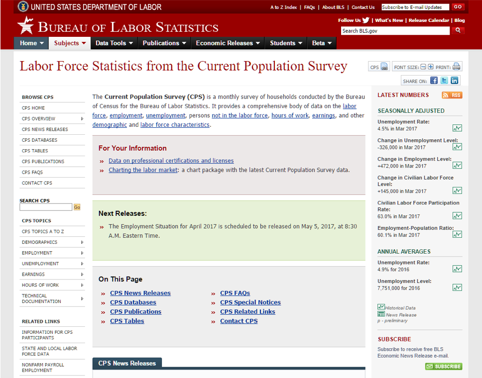
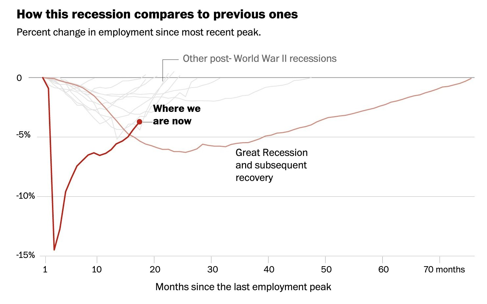
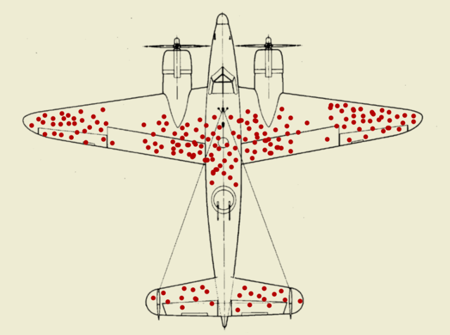
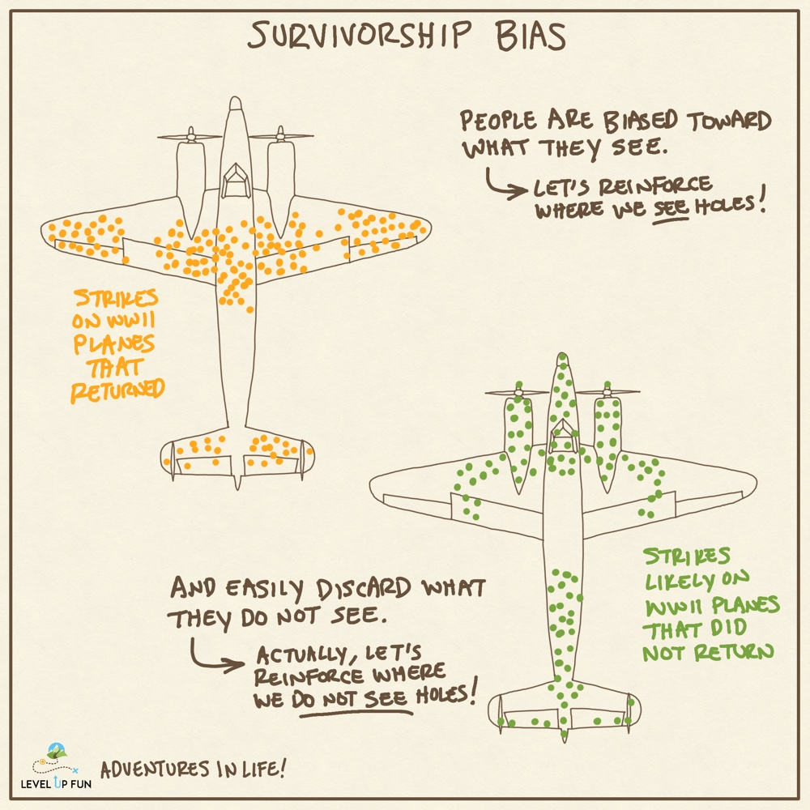

exclude: true

```{R, setup, include = F}

library(tidyverse)
library(svglite)
library(knitr)
library(here)
library(gt)
library(patchwork)
library(kfbmisc)

# Knitr options
opts_chunk$set(
comment = "#>",
fig.align = "center",
fig.height = 7,
fig.width = 10.5,
warning = F,
message = F
)

# Use svg for figures
opts_chunk$set(dev = "svglite")
options(device = function(file, width, height) {
svglite::svglite(tempfile(), width = width, height = height)
})

# HTML output for knitr
options(knitr.table.format = "html")


make_gt_title <- function(title) {
gt::html(glue::glue("<span class='hi slate' style='display: block; margin-bottom: 8px;'>{title}</span>"))
}

xaringanExtra::use_scribble()
```

---
class: clear, middle
<!-- Custom css -->
```{css, echo = F, code=xfun::read_utf8(here::here("Lecture Slides", "my-css.css"))}
```


<!-- From xaringancolor -->

<div style = "position:fixed; visibility: hidden">
$$\require{color}\definecolor{purple}{rgb}{0.337254901960784, 0.00392156862745098, 0.643137254901961}$$
$$\require{color}\definecolor{navy}{rgb}{0.0509803921568627, 0.23921568627451, 0.337254901960784}$$
$$\require{color}\definecolor{ruby}{rgb}{0.603921568627451, 0.145098039215686, 0.0823529411764706}$$
$$\require{color}\definecolor{alice}{rgb}{0.0627450980392157, 0.470588235294118, 0.584313725490196}$$
$$\require{color}\definecolor{daisy}{rgb}{0.92156862745098, 0.788235294117647, 0.266666666666667}$$
$$\require{color}\definecolor{coral}{rgb}{0.949019607843137, 0.427450980392157, 0.129411764705882}$$
$$\require{color}\definecolor{kelly}{rgb}{0.509803921568627, 0.576470588235294, 0.337254901960784}$$
$$\require{color}\definecolor{jet}{rgb}{0.0745098039215686, 0.0823529411764706, 0.0862745098039216}$$
$$\require{color}\definecolor{asher}{rgb}{0.333333333333333, 0.372549019607843, 0.380392156862745}$$
$$\require{color}\definecolor{slate}{rgb}{0.192156862745098, 0.309803921568627, 0.309803921568627}$$
$$\require{color}\definecolor{cranberry}{rgb}{0.901960784313726, 0.254901960784314, 0.450980392156863}$$
</div>
	
<script type="text/x-mathjax-config">
	MathJax.Hub.Config({
		TeX: {
			Macros: {
				purple: ["{\\color{purple}{#1}}", 1],
				navy: ["{\\color{navy}{#1}}", 1],
				ruby: ["{\\color{ruby}{#1}}", 1],
				alice: ["{\\color{alice}{#1}}", 1],
				daisy: ["{\\color{daisy}{#1}}", 1],
				coral: ["{\\color{coral}{#1}}", 1],
				kelly: ["{\\color{kelly}{#1}}", 1],
				jet: ["{\\color{jet}{#1}}", 1],
				asher: ["{\\color{asher}{#1}}", 1],
				slate: ["{\\color{slate}{#1}}", 1],
				cranberry: ["{\\color{cranberry}{#1}}", 1]
			},
			loader: {load: ['[tex]/color']},
			tex: {packages: {'[+]': ['color']}}
		}
	});
</script>

<style>
	.purple {color: #5601A4;}
	.navy {color: #0D3D56;}
	.ruby {color: #9A2515;}
	.alice {color: #107895;}
	.daisy {color: #EBC944;}
	.coral {color: #F26D21;}
	.kelly {color: #829356;}
	.jet {color: #131516;}
	.asher {color: #555F61;}
	.slate {color: #314F4F;}
	.cranberry {color: #E64173;}
</style>


```{r flair_color, echo=FALSE}
	library(flair)
	purple <- "#5601A4"
	navy <- "#0D3D56"
	ruby <- "#9A2515"
	alice <- "#107895"
	daisy <- "#EBC944"
	coral <- "#F26D21"
	kelly <- "#829356"
	jet <- "#131516"
	asher <- "#555F61"
	slate <- "#314F4F"
	cranberry <- "#E64173"
	

```

## Chapter 8: Producing Data -- Sampling
---
# Population vs. Sample

Recall our definitions of population and sample from earlier in the semester:

- .hi.purple[population]: the entire group about which we want information

- .hi.kelly[sample]: the part of the population for which we collect information

We use information from the sample to draw conclusions about the population as a whole. In order to ensure *accurate* inferences of population must follow a sampling design:

- .hi.alice[sampling design]: describes exactly how to choose a sample from the population 

- .hi.ruby[sample survey]: describes the population of interest, the sample to be surveyed, and the way in which they are surveyed (the .alice[sample design]).


---
# Sample Survey Example


```{r, echo = F, out.width = "70%"}

```


---
# Sample Survey Example

```{r, echo = FALSE, fig.cap = "Graphic from https://twitter.com/crampell/status/1423661884759289858/", out.width = "90%"}

```


---
# Clicker Question

An online store contacts 1000 customers from its list of customers who have purchased in the last year. In all, 696 of the 1000 say that they are very satisfied with the store's website. 

The .hi[population] in this setting is:


<ol type = "a">
	<li>all customers who have purchased something in the last year</li>
	<li>the 1000 who were contacted</li>
	<li>the 696 customers who were very satisfied with the store's website</li>
</ol>


---
# Clicker Question

An opinion poll calls 2000 randomly chosen residential telephone numbers in Portland and asks to speak with an adult member of the household. The interviewer asks, "how many movies have you watched in a movie theatre in the past 12 months?". In all, 831 people respond. 

The .hi[sample] in this study is:


<ol type = "a">
	<li>all adults living in Portland</li>
	<li>all 2000 residential phone numbers called</li>
	<li>the 831 people who responded</li>
</ol>


---
# Importance of "good" sampling

In order to draw inferences about the population by using a sample, that sample must be representative. The choice of sample design may hinder representation. The following are examples of poor sample designs:

- A .hi.cranberry[convenience sample] surveys members of the population that are easiest to reach
- A .hi.cranberry[voluntary response sample] consists of people who choose to participate by responding to a general appeal

We say that a sample is .hi.coral[biased] if it systematically favors certain outcomes


---
# Sample Bias

> The late film critic Pauline Kael is reported to have said that Nixon couldn't have won because she didn't know anybody who voted for him.
> - Jonah Goldberg

--

Among the people she surveyed (*friends*), the proportion of people who voted for Nixon was 0 (*sample statistic*)


---
# Sample Bias

.pull-left[
```{r, echo = FALSE, out.width = "100%", fig.cap = "Figure: Bullet holes from returning planes"}

```
]

.pull-right[
In WWII, the US Navy received this diagram that said "bullet holes of the planes that returned"

Where should you put extra armor on the planes?
]


---
# Sample Bias

```{r, echo = FALSE, out.width = "65%"}

```


---
# Sample Bias


```{r, echo = F, out.width = "70%"}
knitr::include_graphics("sample.png")
```

 

---
# Simple Random Samples
The best way to avoid sample bias is to randomly sample.

- .hi.kelly[Random sampling]: the use of chance to select a sample

- .hi.coral[Simple random sample]: consists of $n$ individuals from the population chosen in such a way that every set of $n$ individuals has an equal chance to be the sample actually selected 

Examples:

- Flip a coin to choose someone in the sample
- Assign each individual a number and choose sample by randomly generating set of numbers 


---
# Stratified SRS

We might group individuals into a .hi.daisy[strata] if we are confident they are similar. Selecting SRSs within a strata leads to better representation. This process is called .hi.daisy[stratified SRS].

<br>

.ex[Example:] A SRS from the set of all households in the U.S. may inadvertently select more single-parent households than two-parent, leading to a biased sample. 

Solution: 
1. Create two .daisy[strata]; one for single-parent households and one for two-parent households 
2. Choose SRS within strata.


---
# Stratified SRS

```{r, echo = F, out.width = "50%"}
knitr::include_graphics("stratified.png")
```


---
# Clicker Question

If I randomly choose a sample of 40 from a classroom of 300, what is the probability of each student to be selected into the sample?


<ol type = "a">
	<li>0.003</li>
	<li>0.13</li>
	<li>.025</li>
</ol>


---
# Inference

Recall, we use samples to give us information about a larger population

This process of drawing conclusions about a population on the basis of sample data is called .hi.purple[inference]

- Results from sample inference come with .hi.alice[margins of error]. 
  - bounds on our inferred estimates of population properties. 
      
- These margins of error decrease as the sample size approaches the population size.
      


---
# Inference

.hi[Biased sample design will lead to biased inference.] 

- With biased inference, we cannot make any trustworthy claims about population.

- The sample you use will determine your results


---
# Threats to Valid Inference
A few common sources of bias are:

- .hi[Undercoverage]: when some groups in the population are left out of the process of choosing the sample

- .hi[Oversampling]: when some groups are sampled more often than others in a way that is not representative of the population

- .hi[Nonresponse]: when an individual chosen for the sample can't be contacted or refuses to participate

- .hi[Response Bias]: a systematic pattern of incorrect responses in a sample survey

- .hi[Wording Effect]: a systematic pattern of responses due to poor (or manipulated) wording of survey questions


---
# Clicker Question

Individuals are randomly selected to receive a text message link to an online survey. The survey asks, "Rate your dissatisfaction with Boulder's Soda Tax." This survey suffers from:


<ol type = "a">
	<li>Oversampling</li>
	<li>Nonresponse</li>
	<li>Wording effect</li>
	<li>Both B and C</li>
</ol>


---
# Clicker Question

At a large university, a simple random sample of five female professors is selected, and a simple random sample of 10 male professors is selected. The two samples are combined to give an overall sample of 15 professors. The overall sample is:

<ol type = "a">
	<li>a simple random sample</li>
	<li>biased due to imbalance</li>
	<li>a stratified sample</li>
	<li>All of the answer options are correct</li>
</ol>


---
# Clicker Question -- Midterm Example

A sociologist studying freshmen at a major university carried out a survey, asking (among other
questions) how often students went out per week, how many hours they studied per day, and
how many hours they slept at night. The sociologist, who would like a simple random sample
but finds it too time consuming to obtain such a sample, decides to use all students enrolled in
his own class. This type of sample:
<ol type = "a">
	<li>is a convenience sample.</li>
	<li>likely results in undercoverage of certain types of freshmen.</li>
	<li>could lead to biased conclusions.</li>
	<li>All of the answer options are correct</li>
</ol>

