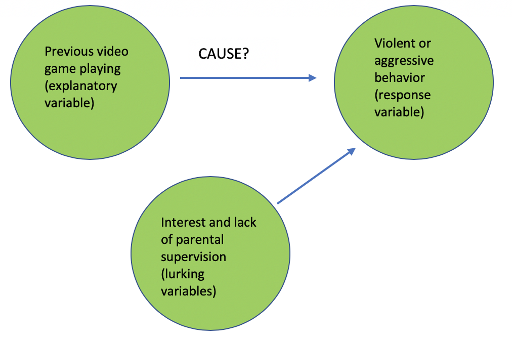
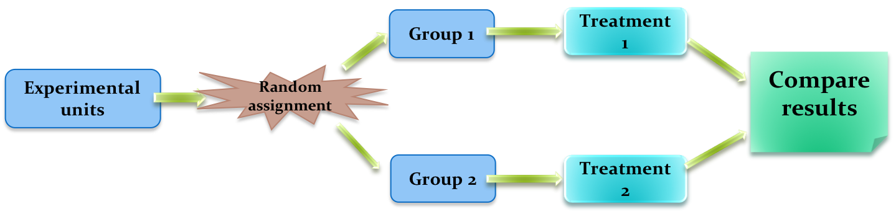
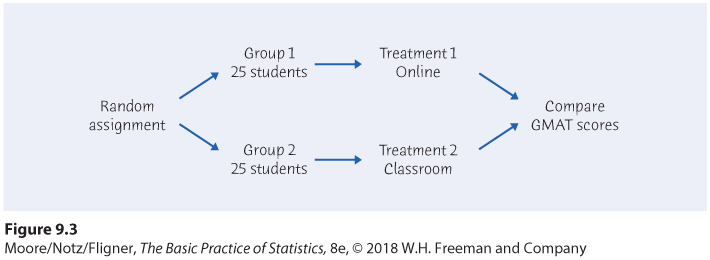
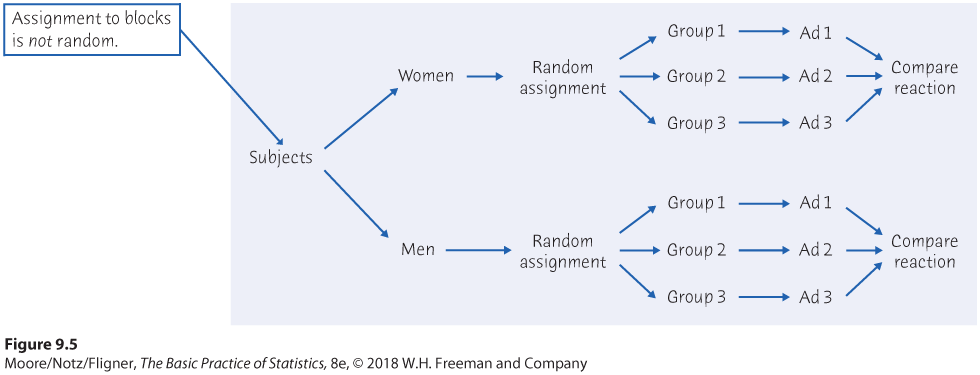

exclude: true

```{R, setup, include = F}

library(tidyverse)
library(svglite)
library(knitr)
library(here)
library(gt)
library(patchwork)
library(kfbmisc)

# Knitr options
opts_chunk$set(
comment = "#>",
fig.align = "center",
fig.height = 7,
fig.width = 10.5,
warning = F,
message = F
)

# Use svg for figures
opts_chunk$set(dev = "svglite")
options(device = function(file, width, height) {
svglite::svglite(tempfile(), width = width, height = height)
})

# HTML output for knitr
options(knitr.table.format = "html")


make_gt_title <- function(title) {
gt::html(glue::glue("<span class='hi slate' style='display: block; margin-bottom: 8px;'>{title}</span>"))
}

xaringanExtra::use_scribble()
```

---
class: clear, middle
<!-- Custom css -->
```{css, echo = F, code=xfun::read_utf8(here::here("Lecture Slides", "my-css.css"))}
```


<!-- From xaringancolor -->

<div style = "position:fixed; visibility: hidden">
$$
\require{color}
\definecolor{purple}{rgb}{0.337254901960784, 0.00392156862745098, 0.643137254901961}
\definecolor{navy}{rgb}{0.0509803921568627, 0.23921568627451, 0.337254901960784}
\definecolor{ruby}{rgb}{0.603921568627451, 0.145098039215686, 0.0823529411764706}
\definecolor{alice}{rgb}{0.0627450980392157, 0.470588235294118, 0.584313725490196}
\definecolor{daisy}{rgb}{0.92156862745098, 0.788235294117647, 0.266666666666667}
\definecolor{coral}{rgb}{0.949019607843137, 0.427450980392157, 0.129411764705882}
\definecolor{kelly}{rgb}{0.509803921568627, 0.576470588235294, 0.337254901960784}
\definecolor{jet}{rgb}{0.0745098039215686, 0.0823529411764706, 0.0862745098039216}
\definecolor{asher}{rgb}{0.333333333333333, 0.372549019607843, 0.380392156862745}
\definecolor{slate}{rgb}{0.192156862745098, 0.309803921568627, 0.309803921568627}
\definecolor{cranberry}{rgb}{0.901960784313726, 0.254901960784314, 0.450980392156863}
$$
</div>
	
<script type="text/x-mathjax-config">
	MathJax.Hub.Config({
		TeX: {
			Macros: {
				purple: ["{\\color{purple}{#1}}", 1],
				navy: ["{\\color{navy}{#1}}", 1],
				ruby: ["{\\color{ruby}{#1}}", 1],
				alice: ["{\\color{alice}{#1}}", 1],
				daisy: ["{\\color{daisy}{#1}}", 1],
				coral: ["{\\color{coral}{#1}}", 1],
				kelly: ["{\\color{kelly}{#1}}", 1],
				jet: ["{\\color{jet}{#1}}", 1],
				asher: ["{\\color{asher}{#1}}", 1],
				slate: ["{\\color{slate}{#1}}", 1],
				cranberry: ["{\\color{cranberry}{#1}}", 1]
			},
			loader: {load: ['[tex]/color']},
			tex: {packages: {'[+]': ['color']}}
		}
	});
</script>

<style>
	.purple {color: #5601A4;}
	.navy {color: #0D3D56;}
	.ruby {color: #9A2515;}
	.alice {color: #107895;}
	.daisy {color: #EBC944;}
	.coral {color: #F26D21;}
	.kelly {color: #829356;}
	.jet {color: #131516;}
	.asher {color: #555F61;}
	.slate {color: #314F4F;}
	.cranberry {color: #E64173;}
</style>


```{r flair_color, echo=FALSE}
	library(flair)
	purple <- "#5601A4"
	navy <- "#0D3D56"
	ruby <- "#9A2515"
	alice <- "#107895"
	daisy <- "#EBC944"
	coral <- "#F26D21"
	kelly <- "#829356"
	jet <- "#131516"
	asher <- "#555F61"
	slate <- "#314F4F"
	cranberry <- "#E64173"
```

## Chapter 9: Producing Data -- Experiments

---
# Observation *vs.* Experiment

An .hi.coral[observational study]: observe individuals and measures variables of interest
       
- Does not attempt to influence response 

- Describe some group or situation

- .ex[Example:] Current Population Survey
      
An .hi.kelly[experiment]: deliberately imposes some treatment on individuals to observe their responses
      
- Purpose is to study whether treatment causes a change in response 

- .ex[Example:] Giving families in developing countries money if they keep their kids in school longer
      


---
# Problem with Observational Studies

The main issue with simply observing people is the issue of .hi.cranberry[confounding variables]


.hi[explanatory variable]: a variable included and accounted for in the experiment/analysis


.hi[lurking variable]: also known as an omitted variable; it is not included in the analysis yet it influences the response variable


---
# Confounding Variables

.ex[Example:] A study is trying to determine whether playing violent video games increases aggressive/violent behavior.


```{r, echo = F, out.width = "80%"}

```


---
# Confounding Variables

In that study,  you are comparing people who chose to play video games and those that do not. The effect of playing video games is confounding with the characteristics who choose to play more video games.

- These differences between the type of people who choose to play or not play video games, makes determining the .it[true] effects of playing video games hard to tease out


---
# Dealing with Confounding Variable


In summary, observational studies often suffer from confounding effects because they don't (or can't) measure lurking variables

Experiments seek to resolve the issue of confounding variables. 

- Well-designed experiments avoid confounding effects by measuring lurking variables directly or creating an environment where they are no longer relevant


---
# Experimental Terminology

An .hi.kelly[experiment] is a statistical study in which we actually implement a .hi.daisy[treatment] to .hi.coral[subjects] to observe their .hi.purple[response]

- A .daisy[treatment] is any specific experimental condition applied to the subjects

- .coral[Subjects] refers to the individuals (people, animal, objects) being studied


---
# Poorly Designed Experiments

Experiments don't guarantee good data -- good designs are essential

.ex[Example:] A college regularly offers a course to prepare students for the GMAT. This year it will only offer an online version of the course.
      
- If the results are 10% higher this year than last year. Can we conclude the online course is more effective?

--

Experiments that don't have .hi.purple[randomized treatments] are highly susceptible to confounding effects

- Separating sample into .daisy[treatment] and .daisy[control] groups helps with this issue. Comparison of the outcomes across the two groups is less likely to be confounding
      
- this is called a .hi.kelly[randomized comparative experiment]


---
# Randomized Comparative Experiments

Proper .hi.kelly[randomization] leads to treatment and control groups that are similar before any treatment is applied. 

.center[
```{r, echo = F, out.width = "60%"}

```
]

If assignment is truly random, then the difference in average response must be due to either the treatment 


---
# Randomized Comparative Experiment

Correct way to test difference between classroom versus online GMAT course. Given 50 students need to take the course, list them from 1-50 and randomly assign numbers to the two groups. One that takes the course online and one that takes the course in the classroom. 

```{r, echo = F, out.width = "90%"}

```


---
# Ways to Properly Randomize
The log of a randomized comparative experiment depends on our ability to treat all the subjects the same in every way, except for the actual treatments being compared

- .hi[Placebo]: gives the real treatment to one group, and a fake (but similar) treatment to the other group

- .hi[Double-Blind]: neither the subjects nor the experimenters know which treatment each subject is receiving 

- .hi[Matched-Pairs]: compares two treatments, where the subjects are as closely matched as possible. 

- .hi[Block design]: a block is a group of individuals that are known to be similar in some way. A block design randomly assigns individuals separately within each block. 


---
# Experiments in Economics

**2019 Nobel Prize in Economics: Abahjuit Banerjee and Esther Duflo**


```{r, echo = F, out.width = "90%"}

```


---
# Duflo and Banerjee

Comparing towns/governments that have different infrastucture/social programs is filled with omitted variables.

Duflo and Banerjee focus on developing countries and run many small-scale experiments 

- Does Microfinancing work? They find it .it[really] depends on the loan structure.

- How to improve education outcomes? Computers and supporting family income are highly effective. 

- Improving government services. Large-scale experiments to test how to best distribute funding. 

.it[https://www.nobelprize.org/prizes/economic-sciences/2019/duflo/lecture/]


---
# Matched Pairs Example

How much does schooling improve wages? What are some confounding variables?

--

- Confounding Variables: family characteristics, like income, intelligence, and parental education levels.


Krueger and Ashenfelter went to an Ohio Twins Festival to survey twins. By comparing twins, you can avoid many omitted (lurking) variables regarding family characteristics.

They are able to better quantify the increase in wages due to schooling directly. 

.footnote.mono-small[.sup[*] Krueger and Ashenfelter, 1994. "Estimates of the Economic Return to Schooling from a New Sample of Twins," American Economic Review]


---
# Natural Experiments: Family Wealth

Does family wealth improve childhood outcomes?

- Possible confounding variables: parents profession, education levels, and economic connections.

Bleakley and Ferrie (2016) look at Georgia’s Cherokee Land Lottery of 1832 which was a lottery that gave away large plots of land. 

They find that family wealth has no effect on childhood education outcomes, i.e. confounding variables explain why wealthier families have improved childhood outcomes


.footnote.mono-small[.sup[*] Bleakley and Ferrie, 2016. "Shocking Behavior: Random Wealth in Antebellum Georgia and Human Capital Across Generations," Quarterly Journal of Economics]


---
# Natural Experiments: Fetal Health
How does poor fetal health affect long-run outcomes?


- Confounding variables: family income!


This is a question that can't be answered with a true experiment (can not randomly assign this treatment).

Almond (2006) compares babies born just before and just after the Influenze of 1918. Those born during the Influenze display "reduced educational attainment, increased rates of physical disability, lower income, lower socioeconomic status"

.footnote.mono-small[.sup[*] Douglas, 2006. "Is the 1918 Influenza Pandemic Over?," Journal of Political Economy]

---
# Natural Experiments: Medicaid
Did Medicaid reduce childhood mortality?


- Confounding Variables: family income, local pollution, disabilities that would lead to being on Medicaid


Goodman-Bacon uses variation in Medicaid rollout to compare children who are eligible for Medicaid. He finds that Medicaid indeed reduced childhood mortality with a particularly strong effect among non-white children (a decrease of 11%).

.footnote.mono-small[.sup[*] Goodman-Bacon, 2018. "Public Insurance and Mortality: Evidence from Medicaid Implementation," Journal of Political Economy]

---
# Block Design Example

If you suspect that the effects of treatment depend on a variable, then you can .hi.kelly[block-randomise]

- .ex[Example:] Perhaps men and women respond differently to advertisement. Then you could, randomize treatment and compare outcomes *within each group* 

```{r, echo = F, out.width = "70%"}

```


---
# Clicker Question

An educator wishes to study the effects of sleep deprivation on the ability to concentrate. He decides to study the students in a calculus class. After consultation with a statistician, the educator decides to randomly allocate students to either a group that will sleep for 8 hours the night before class or 6 hours. The educator does not know which group a student belongs to when she or he comes to class. The educator, after talking to some students and before the experiment, decides that the number of classes students have on the same day before calculus could potentially confound the study and wishes to make an adjustment. The design that allows for such an adjustment is called:

<ol type = "a">
	<li>randomized block design</li>
	<li>placebo controlled randomized design</li>
	<li>double-blinded design</li>
	<li>matched block design</li>
</ol>


---
# Clicker Question

An insurance company wonders whether sports cars "cause" people to drive too fast, or whether those with a propensity for speeding are drawn to sports cars. Researcher has a sample of 100 and randomly assigns 25 drivers to each of four groups: 1) sports car - white, 2) sports car - red, 3) sedan - white, and 4) sedan - red. The primary research questions are: Do sports cars make people drive faster? Does color make a difference? The result shows that people driving red cars drive faster than those driving white cars. There is no statistically significant difference by type. This conclusion is:

<ol type = "a">
	<li>wrong, because the stated purpose was to only study type</li>
	<li>valid, because this was a randomized study and drivers were randomized on color and type</li>
	<li>wrong, because you cannot study two different things, like type and color, at once</li>
	<li>valid, because sports cars obviously make people drive fast</li>
</ol>
