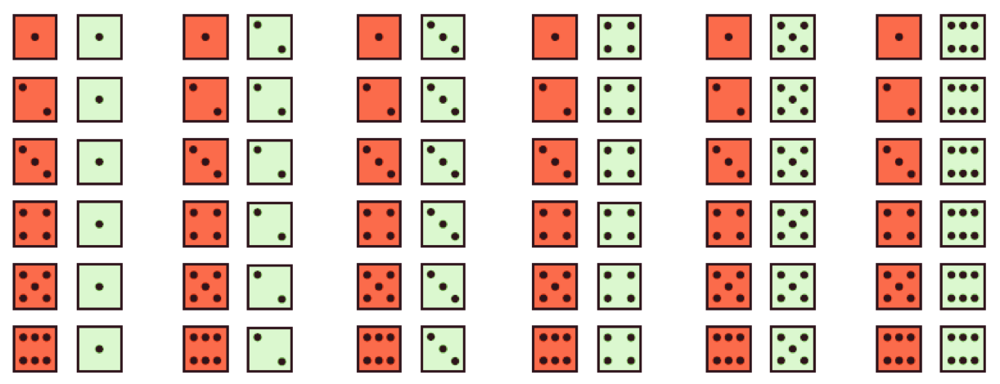

class: clear, middle

```{r preamble, child=here::here("Lecture Slides", "preamble.Rmd")}
```

## Chapter 12: Introducing Probability

---
# Randomness


What is randomness? A phenomenon is .hi.purple[random] if:
      
1. Individual outcomes are uncertain

2. Has a distributions of outcomes in a large number of repetitions
      
.it[Example]: A coin toss


---
# Probability


.hi.cranberry[Probability]: proportion of times a particular outcome would occur in a very long series of repetitions. 
      
- .it[Example]: What is the .cranberry[probability] of a coin landing on heads?
      

For a given observation, the .cranberry[probability] that an .coral[event] occurs is:
  
$$\frac{\text{Number of ways event could occur}}{\text{Number of total possible outcomes}}$$


---
# Probability and Randomness

```{r coin-toss, echo = F, out.width = "100%"}

toss_img <- png::readPNG(here("Lecture Slides", "Chapter 12", "coinflip.png")) %>%
    grid::rasterGrob(., interpolate = TRUE)


set.seed(40)

n_toss <- 500

df <- tibble(toss = 1:n_toss, head = as.numeric(runif(n_toss) >= 0.5)) %>%
    mutate(
        n_head = cumsum(head),
        prop_head = n_head / toss
    )

small_n <- ggplot(df %>% dplyr::filter(toss <= 20)) +
    geom_point(aes(x = toss, y = prop_head)) +
    geom_line(aes(x = toss, y = prop_head)) +
    geom_hline(yintercept = 0.5, linetype = "dashed", color = "#549f69") +
    scale_y_continuous(limits = c(0, 1)) +
    theme_kyle() +
    annotation_custom(toss_img, xmin = 10, xmax = 20, ymin = 0.6, ymax = 1) +
    labs(x = "Toss", y = "Cumulative Proportion of Heads")

large_n <- ggplot(df) +
    geom_line(aes(x = toss, y = prop_head)) +
    geom_hline(yintercept = 0.5, linetype = "dashed", color = "#549f69") +
    scale_y_continuous(limits = c(0, 1)) +
    theme_kyle() +
    annotation_custom(toss_img, xmin = 250, xmax = 500, ymin = 0.6, ymax = 1) +
    labs(x = "Toss", y = "Cumulative Proportion of Heads")

small_n + large_n
```


---
# Probability Models


We think of probability utilizing a particular framework, first we define a few useful terms:
      
-  .hi.kelly[Sample Space]: set of all possible outcomes

-  .hi.coral[Event]: outcome (or set of outcomes) of a random phenomenon
    - .coral[Event] is a subset of the .kelly[sample space]

-  .hi.cranberry[Probability Model]: assigns a probability to every .coral[event] in the .kelly[sample space]
      


---
# Probability: Example

Say we roll two six-sided die, the following would be our .kelly[sample space]: 

```{r, echo = F, out.width = "75%"}

```

Each outcome is equally likely, specifically each outcome has .cranberry[probability] of 1/36


---
# Clicker Question

If I roll two six-sided die, what is the .cranberry[probability] I roll a one and a two?

<ol type = "a">
  <li>1/36</li>
  <li>2/36</li>
  <li>3/36</li>
  <li>4/36</li>
</ol>


---
# Set Notation

$\coral{A} = \{1,2,3\}$, $\coral{B}=\{3,4,5\}$, $\coral{C}=\{1,2,3,4,5,6\}$, $\coral{D}=\{4\}$


$\in$: "belongs to"
      
-  Example: $1 \in \coral{A}$
      
$\notin$: "does not belong to"
      
-  Example: $4 \notin \coral{A}$
      
$\cup$: Union; combination of two or more sets; "or"
      
-  Example: $\coral{A} \cup \coral{B} = \{1,2,3,4,5\}$
      
$\cap$: Intersection; overlap of two or more sets; "and"
      
-  Example: $\coral{A} \cap \coral{B} = \{3\}$
      


---
# Set Notation, cont.

$\coral{A} = \{1,2,3\}$, $\coral{B}=\{3,4,5\}$, $\coral{C}=\{1,2,3,4,5,6\}$, $\coral{D}=\{4\}$


$\coral{A}^c$: "A complement"
      
-  Example: $\coral{A}^c = \{x: x \notin \coral{A} \} = \{4,5,6\}$

-  Interpreted as "not .coral[A]"
      
$\subseteq$: Subset
      
-  Example: $\coral{A} \subseteq \coral{C}$, however $\coral{C} \not\subseteq \coral{A}$.
      
$\coral{\emptyset}$: is the null or empty set 

- contains nothing 
      
$\coral{A} \cap \coral{D}= \emptyset$: Disjoint


---
# Clicker Question

Given the following sets, $\coral{A}=\{5,10,15,20\}$ and $\coral{B}=\{1,2,3,4,5\}$
Which of the following is true?

<ol type = "a">
  <li>\(\coral{A} \cup \coral{B} = \{1,2,3,4,5,10,15,20\}\)</li>
  <li>\(\coral{A} \cup \coral{B} = \{5\}\)</li>
  <li>\(\coral{A} \cap \coral{B} = \{5\}\)</li>
  <li>\(\coral{A} \cap \coral{B} = \{1,2,3,4,5,10,15,20\}\)</li>
  <li>Both a. and c.</li>
</ol>


---
# Axioms of Probability

Let $\coral{A}$ and $\coral{B}$ be .coral[events], and $P(\coral{A})$ and $P(\coral{B})$ are the .cranberry[probability] of those outcomes. We have a set of rules:

1. Any .cranberry[probability] is a number between 0 and 1

2. All possible outcomes together must have the .cranberry[probability] of 1

3. If two .coral[events] are disjoint, 

  $$P(\coral{A} \cap \coral{B})=0 \implies P(\coral{A} \cup \coral{B}) = P(\coral{A}) + P(\coral{B})$$

4. $P(\coral{A}^c)=1-P(\coral{A})$


---
# Clicker Question
Given the three following scenarios:

- A person is randomly selected. .coral[A] is the .coral[event] they are under 18. .coral[B] is the .coral[event] they are over 18.
- A person is selected at random. .coral[A] is the .coral[event] that they earn more than $100,000 per year. .coral[B] is the .coral[event] that they earn more than $250,000.
- A pair of dice are tossed. .coral[A] is the .coral[event] that one of the die is a 3. .coral[B] is the .coral[event] that the sum of two dice is 3.

In which cases are the .coral[events], A and B, disjoint?

<ol type = "a">
  <li>1 only</li>
  <li>2 only</li>
  <li>3 only</li>
  <li>1 and 2</li>
  <li>1 and 3</li>
</ol>


---
# De Morgan's Law

 
.hi.slate[De Morgan's law] of union and intersection. For any two finite sets .coral[A] and .coral[B]:
      
1. $(\coral{A} \cup \coral{B})^c = \coral{A}^c \cap \coral{B}^c$

2. $(\coral{A} \cap \coral{B})^c = \coral{A}^c \cup \coral{B}^c$
      


---
# De Morgan's Law Example

Let $\kelly{S}=\{j, k, l, m, n\}$ and $\coral{A}=\{j, k, m\}$ and $\coral{B}=\{k, m, n\}$


1. $(\coral{A} \cup \coral{B})^c = (\coral{A}^c \cap \coral{B}^c)$

  <ol type="i">
    <li>
      \((\coral{A} \cup \coral{B})= \{j, k, m, n\} \implies (\coral{A} \cup \coral{B})^c=\{l\}\)
    </li>
    <br/>
    <li>
      \(\coral{A}^c = \{l, n\}\) and \(\coral{B}^c=\{j, l\} \implies \coral{A}^c \cap \coral{B}^c = \{l\}\)
    </li>
  </ol>

2. $(\coral{A} \cap \coral{B})^c = \coral{A}^c \cup \coral{B}^c$
  <ol type="i">
    <li>
      \( (\coral{A} \cap \coral{B})=\{k,m\} \implies (\coral{A} \cap \coral{B})^c=\{j, l, n\} \)
    </li>
    <br/>
    <li>
      \( \coral{A}^c \cup \coral{B}^c=\{l, n\} \cup \{j, l\} \implies \coral{A}^c \cup \coral{B}^c = \{j, l, n\} \)
    </li>
  </ol>


---
# Random Variables


.hi.purple[Random variable]: variable whose value is a numerical outcome of a random phenomenon
      
- .hi.purple[Random variables] can be .hi[discrete] or .hi[continuous]
      
.it[Example:] Coin toss
      
- $X$ can be defined as the number of heads we see in two tosses:
  
  - $X$ is a discrete random variable; $X=0,1,2$

.hi.cranberry[Probability distribution]: tell us what values random variable X can take, and how to assign probabilities to those values


---
# Example

Flip a coin two times

.kelly[Sample space]:
      
- {.coral[(Head, Tail)], .coral[(Head, Head)], .coral[(Tail, Head)], .coral[(Tail, Tail)]}
      
What is the .cranberry[probability] of each .coral[event]?


---
# Clicker Question

If I toss a coin two times, and $X$ is the number of heads, then what is $P(\coral{X=2})$?

<ol type = "a">
<li>1/4</li>
<li>1/2</li>
<li>3/4</li>
<li>5/4</li>
</ol>


---
# Additional Examples


Still flipping a coin twice, what is the .cranberry[probability] of getting at least one head?
      
$P(\coral{X=1}) + P(\coral{X=2}) = 1-P(\coral{X=0})$

- Now I only have to calculate one .cranberry[probability]!
      


---
# Additional Dice Example

What is the .cranberry[probability] of rolling a 7, 11, or double when rolling two dice?

- Axiom 3 tells us we can find probabilities simply by adding if the .coral[event] is disjoint. 

.coral[Roll a 7]: $\left\{(1,6), (6,1), (2, 5), (5,2), (3,4), (4,3) \right\}$

.coral[Roll a 11]: $\left\{(5,6), (6,5) \right\}$

.coral[Roll a double]: $\left\{(1,1), (2,2), (3,3), (4,4), (5,5), (6,6) \right\}$

- Are all 3 .coral[events] disjoint?


---
# Additional Dice Example

.coral[Roll a 7]: $\left\{(1,6), (6,1), (2, 5), (5,2), (3,4), (4,3) \right\}$

.coral[Roll a 11]: $\left\{(5,6), (6,5) \right\}$

.coral[Roll a double]: $\left\{(1,1), (2,2), (3,3), (4,4), (5,5), (6,6) \right\}$

$P(\coral{7}) + P(\coral{11}) + P(\coral{\text{doubles}})=\frac{6}{36}+\frac{2}{36}+\frac{6}{36} \approx 0.4$

