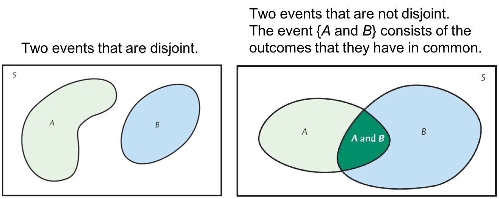
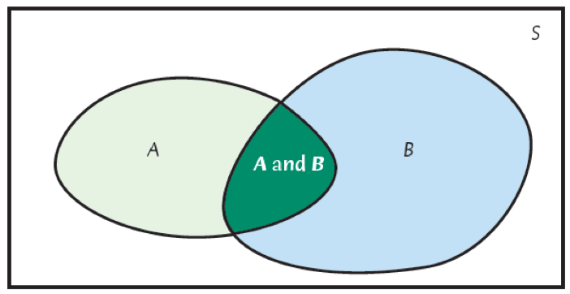
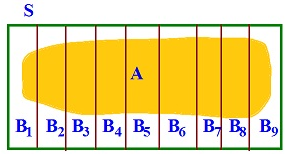

class: clear, middle

```{r preamble, child=here::here("Lecture Slides", "preamble.Rmd")}
```

## Chapter 13: General Rules of Probability
---
# Basic Rules of Probability

${\color{coral} A}$ is an .coral[event/outcome] and $P({\color{coral} A})$ is the .cranberry[probability] of that outcome, and ${\color{kelly} S}$ is that .kelly[state space]


- $0 \leq P({\color{coral} A}) \leq 1$ for all ${\color{coral} A} \in {\color{kelly} S}$
      
- $P({\color{kelly} S})=1$
      
- If ${\color{coral} A}$ and ${\color{coral} B}$ are disjoint events 

  $$
    \implies P({\color{coral} A} \cup {\color{coral} B}) = P({\color{coral} A}) + P({\color{coral} B})
  $$
      
- $P({\color{coral} A}^c) = 1 - P({\color{coral} A})$


---
# Disjoint versus Not Disjoint

Using Venn diagrams can help us visualize each of the probability rules


```{r, echo = F, out.width = "90%"}

```


---
# General Addition Rule


If ${\color{coral} A}$ and ${\color{coral} B}$ are disjoint events: $P({\color{coral} A} \cup {\color{coral} B})=P({\color{coral} A})+P({\color{coral} B})$
      
For any two events (not necessarily disjoint): 
  
  $$
  P({\color{coral} A} \cup {\color{coral} B}) = P({\color{coral} A}) + P({\color{coral} B})- P({\color{coral} A} \cap {\color{coral} B})
  $$

- Why does this make sense? What is ${\color{coral} A} \cap {\color{coral} B}$ when ${\color{coral} A}$ and ${\color{coral} B}$ are disjoint?


---
# Venn Diagram Example

```{r, echo = F, out.width = "60%"}
knitr::include_graphics("vd1.png")
```


.small[
If we want to find Soccer $\cup$ Tennis:

- Soccer + Tennis = Alex, Casey, Drew, Hunter, Casey, Drew, Jade 

- Soccer $\cap$ Tennis = Casey, Drew

- Soccer $\cup$ Tennis = Soccer + Tennis - (Soccer $\cap$ Tennis) = Alex, Casey, Drew, Hunter, Jade
]


---
# Clicker Question

Let $P({\color{coral} A}) = 0.4$, $P({\color{coral} B}) = 0.3$, and $P({\color{coral} A}\cap {\color{coral} B})=0.1$

What is $P({\color{coral} A}\cup {\color{coral} B})$?

<ol type = "a">
  <li>1.1</li>
  <li>0.9</li>
  <li>0.3</li>
  <li>0.6</li>
</ol>


---
# Independence


Two events, ${\color{coral} A}$ and ${\color{coral} B}$, are .hi.purple[independent] if knowing that one occurs does not change the probability that the other occurs

- Die lands on a 4 & Broncos win the Super Bowl

- Club is drawn from deck of cards & You get an A on the final exam


If ${\color{coral} A}$ and ${\color{coral} B}$ are independent: 
$$
    P({\color{coral} A} \cap {\color{coral} B}) = P({\color{coral} A})P({\color{coral} B})
$$


---
# Clicker Question

Let $P({\color{coral} A}) = 0.4$, $P({\color{coral} B}) = 0.3$, and $P({\color{coral} A}\cap {\color{coral} B})=0.1$

Which of the following statements is true:
<ol type = "a">
  <li>\({\color{coral} A}\) and \({\color{coral} B}\) are independent because \(P({\color{coral} A} \cap {\color{coral} B}) = P({\color{coral} A})P({\color{coral} B})\)</li>
  <li>\({\color{coral} A}\) and \({\color{coral} B}\) are independent because \(P({\color{coral} A} \cap {\color{coral} B}) \neq P({\color{coral} A})P({\color{coral} B})\)</li>
  <li>\({\color{coral} A}\) and \({\color{coral} B}\) are not independent because \(P({\color{coral} A} \cap {\color{coral} B}) = P({\color{coral} A})P({\color{coral} B})\)</li>
  <li>\({\color{coral} A}\) and \({\color{coral} B}\) are not independent because \(P({\color{coral} A} \cap {\color{coral} B}) \neq P({\color{coral} A})P({\color{coral} B})\)</li>
</ol>


---
# Independent vs. Disjoint


Two events being independent is .hi[NOT] the same as them being disjoint:

1. Say event ${\color{coral} A}$ is being 18 or over, and ${\color{coral} B}$ is under 18

  - I cannot be both 18 or over, and under 18. This means ${\color{coral} A}$ and ${\color{coral} B}$ are .it[disjoint]

2. If I am not 18 or over, then I am under 18. That means if ${\color{coral} A}$ isn't true then ${\color{coral} B}$ must be true. 

  - Since event ${\color{coral} A}$ tells me about event ${\color{coral} B}$, ${\color{coral} A}$ and ${\color{coral} B}$ are .it[not independent]


---
# Conditional Probability

 
Sometimes one event occurring tells us something about the probability of a different event

.hi.purple[Conditional probability]: probability of an event, ${\color{coral} A}$, given that another event, ${\color{coral} B}$, has already occurred

$$P({\color{coral} A} \ \vert \  {\color{coral} B})= \frac{P({\color{coral} A} \cap {\color{coral} B})}{P({\color{coral} B})}$$


---
# Visualizing Conditional Probability

```{r, echo = F, out.width = "70%"}

```

You throw a dart and land in ${\color{coral} B}$. What is the probability that you landed in ${\color{coral} A}$ as well? $P({\color{coral} A} \ \vert \  {\color{coral} B})$. We can now think of ${\color{coral} B}$ as the sample space which changes our likelihood of landing in ${\color{coral} A}$.


---
# Conditional Probability v. Intersection

$P({\color{coral}\text{work in tech}} \cap {\color{coral}\text{live in Boulder}})$ vs. $P({\color{coral}\text{work in tech}} \ \vert \  {\color{coral}\text{live in Boulder}})$
      
$P({\color{coral}\text{work in tech}})$ = work in tech/entire US population = relatively small, let's say $7\%$. 

$P({\color{coral}\text{live in Boulder}})$ = Boulder population/entire US population = also small, $<1\%$.
      
- This means the probability of BOTH happening is small, because both events are unlikely compared to the .i[state space of the entire US population]
- But the $P({\color{coral}\text{work in tech}} \ \vert \  {\color{coral}\text{live in Boulder}})$ will be higher because now the .it[state space is Boulder population], which has a greater concentration of high-tech employees


---
# Identifying Conditional Probabilities
In Colorado, the DMV identifies individuals as having either blonde, brunette or red hair. It also has eyes color. For each of the following statements, identify if this is a conditional probability.

1. 2.1% of the drivers are redheads with alice eyes
2. 45% of blondes have alice eyes                  
3. 51% of people have brown hair or brown eyes    
4. 77% of the population is brunette              
5. 4.7% of people with alice eyes are redheads.    


---
# Clicker Question

Lactose intolerance causes difficulty digesting dairy products that contain lactose. It is particularly common among people of African and Asian ancestry. In the United States, 82% of the population is white, 14% is black, and 4% is Asian. 

Moreover, 15% of whites, 70% of blacks, and 90% of Asians are lactose intolerance.

Which of the following statements is true?

<ol type = "a">
  <li>\(P({\color{coral} \text{Asian}} \cap {\color{coral} \text{Lactose Intolerant}}) = 0.9\)</li>
  <li>\(P({\color{coral} \text{Asian}} \ \vert \ {\color{coral} \text{Lactose Intolerant}}) = 0.9\)</li>
  <li>\(P({\color{coral} \text{Lactose Intolerant}} \ \vert \ {\color{coral} \text{Asian}}) = 0.9\)</li>
  <li>\(P({\color{coral} \text{Asian}} \cup {\color{coral}\text{Lactose Intolerant}}) = 0.9\)</li>
</ol> 


---
# Calculating Conditional Probability

Consider light truck and car sales in the U.S.:

```{r crash-table, echo = F}
crash_data <- tribble(
  ~Name, ~Domestic, ~Imported, ~Total,
  "Light Truck", 712700, 187000, 899700,
  "Car", 472100, 155500, 627600,
  "Total", 1184800, 342500, 152730,
)

crash_tbl <- gt(crash_data, rowname_col = "Name") %>%
  gt_theme_kyle() %>% 
  tab_header(title = make_gt_title("Automobile Accidents Cross-table")) %>%
  fmt_number(columns = c("Domestic", "Imported", "Total"), sep_mark = ",", decimals = 0)

crash_tbl
```

If we consider .it[only cars], what is the likelihood of a randomly selected sale being a domestic vehicle?

\begin{aligned}
P({\color{coral} \text{domestic}} \ \vert \  {\color{coral} \text{car}}) &= \frac{P({\color{coral} \text{domestic}} \text{ and } {\color{coral} \text{car}})}{P({\color{coral} \text{car}})} \\
&= \frac{\frac{472,100}{1,527,300}}{\frac{627,600}{1,527,300}}=\frac{472,100}{627,600}=0.75
\end{aligned}


---
# General Multiplication Rule

Can use the equation for conditional probability to find the probability of two events happening together:

$$P({\color{coral} A}\ \vert \ {\color{coral} B})=\frac{P({\color{coral} A}\cap {\color{coral} B})}{P({\color{coral} B})}$$

If we multiply both sides by $P({\color{coral} B})$ we get:

$$P({\color{coral} A}\cap {\color{coral} B})=P({\color{coral} B})P({\color{coral} A}\ \vert \ {\color{coral} B})$$


---
# Clicker Question
Lactose intolerance causes difficulty digesting dairy products that contain lactose. It is particularly common among people of African and Asian ancestry. In the United States, 82% of the population is white, 14% is black, and 4% is Asian. 

Moreover, 15% of whites, 70% of blacks, and 90% of Asians are lactose intolerance.

What is the probability an individual is Asian and lactose intolerant? 

<ol type = "a">
  <li>0.036</li>
  <li>0.044</li>
  <li>0.9</li>
  <li>0.004</li>
</ol>


---
# Conditional Prob. and Independence

If 
$$P({\color{coral} A}) = P({\color{coral} A} \ \vert \ {\color{coral} B}),$$
then the probability of ${\color{coral} A}$ is the same conditional on ${\color{coral} B}$ or not, then the two events ${\color{coral} A}$ and ${\color{coral} B}$ are .hi.purple[independent]


---
# Clicker Question
Recall we calculated the probability of a car being domestic is 0.75. 

One event is that the vehicle is a car, another event is that the vehicle is domestic. Are these two events independent? 

`r crash_tbl`

<ol type = "a">
  <li>Yes, they are independent</li>
  <li>No, they are not independent</li>
</ol>


---
# Law of Total Probability

Suppose we partition sample space into n different parts, ${\color{coral} B_1}, {\color{coral} B_2}, ..., {\color{coral} B_n}$

If there is an event ${\color{coral} A}$, we can calculate its probability by adding all of its intersections with ${\color{coral} B_i}$'s


```{r, echo = F, out.width = "90%"}

```


---
# Law of Total Probability

The .hi.slate[Law of Total Probability] states:

$$P({\color{coral} A})=\sum_{i=1}^nP({\color{coral} A} \cap {\color{coral} B_i})$$
An equivalent formula, uses the multiplication rule to show:
$$P({\color{coral} A})=\sum_{i=1}^n P({\color{coral} A} \cap {\color{coral} B_i}) = \sum_{i=1}^n P({\color{coral} A}\ \vert \ {\color{coral} B_i})P({\color{coral} B_i})$$


---
# Law of Total Probability

The .hi.purple[Law of Total Probability] says that we can calculate the probability of any event by 

<ol type="i">
  <li>partitioning the entire sample space into disjoint events</li>
  <li>calculating the probabilities of those disjoint events</li>
  <li>multiply those by the conditional probabilities, and </li>
  <li>add them all together.</li>
</ol>

- Use the law of total probability when you don't know the probability of an event, but you know its occurrence under several disjoint scenarios and the probability of each scenario


---
# Midterm Example
Let ${\color{coral} A}$ be the event that a flight from New York to San Francisco arrives on time, and let ${\color{coral} B}$ be the event that it is a clear day in San Francisco.

Suppose the probability of a clear day is $P({\color{coral} B})=0.6$, We also know that the probability that a plane arrives on a sunny day is 0.9, and on a cloudy day it is 0.5

<ol type = "a">
  <li>What is the probability that the plan lands on time and it is a sunny day?</li>
  <li>What is the probability that the plane lands on time and it is .it[not] a sunny day?</li>
  <li>What is the probability the plan does not land on time?</li>
</ol>


---
# Clicker Question
Lactose intolerance causes difficulty digesting dairy products that contain lactose. It is particularly common among people of African and Asian ancestry. In the United States, 82% of the population is white, 14% is black, and 4% is Asian. 

Moreover, 15% of whites, 70% of blacks, and 90% of Asians are lactose intolerance.

What percent of the entire population is lactose intolerant? 

<ol type = "a">
- 22.5%
- 25.7%
- 0.04%
- 0.036%
</ol>

---
# Bayes' Law

.hi.purple[Bayes Law]: gives us a different way to calculate conditional probabilities 
Let ${\color{coral} B_1}, {\color{coral} B_2}, ..., {\color{coral} B_n}$ be a partition of ${\color{kelly} S}$. Let ${\color{coral} A}$ be an event in ${\color{kelly} S}$. 

Then:
$$P({\color{coral} B_i}\ \vert \ {\color{coral} A})=\frac{P({\color{coral} A}\ \vert \ {\color{coral} B_i})P({\color{coral} B_i})}{P({\color{coral} A}\ \vert \ {\color{coral} B_1})P({\color{coral} B_1})+P({\color{coral} A} \ \vert \ {\color{coral} B_2})P({\color{coral} B_2})+...+P({\color{coral} A} \ \vert \ {\color{coral} B_n})P({\color{coral} B_n})}$$

- Bayes rule is used to "flip" a conditional probability 


---
# Bayes' Law: Example

Suppose testing for a disease is 99% accurate, and 0.5% of people have the diseases. What is the probability that you have the disease, given that the test was positive?

$$ 
P(Sick \ \vert \  Positive) = \frac{P(Positive \ \vert \  Sick)P(Sick)}{P(Positive \ \vert \  Sick)(Sick) + P(Positive \ \vert \  Healthy)P(Healthy)}
$$

$$ 
P(Sick \ \vert \  Positive)= \frac{0.99*0.005}{(0.99*0.005)+(0.01*0.995)} = 0.332
$$

