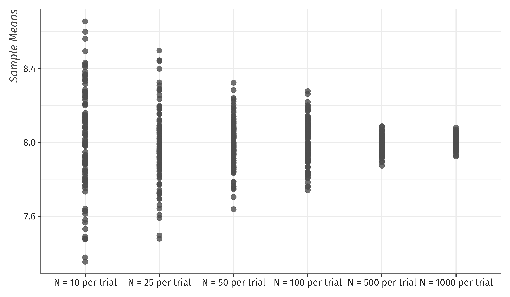

exclude: true

```{R, setup, include = F}

library(tidyverse)
library(svglite)
library(knitr)
library(here)
library(gt)
library(patchwork)
library(kfbmisc)

# Knitr options
opts_chunk$set(
  comment = "#>",
  fig.align = "center",
  fig.height = 7,
  fig.width = 10.5,
  warning = F,
  message = F
)

# Use svg for figures
opts_chunk$set(dev = "svglite")
options(device = function(file, width, height) {
  svglite::svglite(tempfile(), width = width, height = height)
})

# HTML output for knitr
options(knitr.table.format = "html")


make_gt_title <- function(title) {
  gt::html(glue::glue("<span class='hi slate' style='display: block; margin-bottom: 8px;'>{title}</span>"))
}

xaringanExtra::use_scribble()
```

---
class: clear, middle
<!-- Custom css -->
```{css, echo = F, code=xfun::read_utf8(here::here("Lecture Slides", "my-css.css"))}
```


<!-- From xaringancolor -->

<div style = "position:fixed; visibility: hidden">
$\require{color}\definecolor{red_pink}{rgb}{0.901960784313726, 0.254901960784314, 0.450980392156863}$
$\require{color}\definecolor{turquoise}{rgb}{0.125490196078431, 0.698039215686274, 0.666666666666667}$
$\require{color}\definecolor{orange}{rgb}{1, 0.647058823529412, 0}$
$\require{color}\definecolor{red}{rgb}{0.984313725490196, 0.380392156862745, 0.0274509803921569}$
$\require{color}\definecolor{blue}{rgb}{0.231372549019608, 0.231372549019608, 0.603921568627451}$
$\require{color}\definecolor{green}{rgb}{0.545098039215686, 0.694117647058824, 0.454901960784314}$
$\require{color}\definecolor{grey_light}{rgb}{0.701960784313725, 0.701960784313725, 0.701960784313725}$
$\require{color}\definecolor{grey_mid}{rgb}{0.498039215686275, 0.498039215686275, 0.498039215686275}$
$\require{color}\definecolor{grey_dark}{rgb}{0.2, 0.2, 0.2}$
$\require{color}\definecolor{purple}{rgb}{0.415686274509804, 0.352941176470588, 0.803921568627451}$
$\require{color}\definecolor{slate}{rgb}{0.192156862745098, 0.309803921568627, 0.309803921568627}$
</div>

<script type="text/x-mathjax-config">
MathJax.Hub.Config({
  TeX: {
    Macros: {
      red_pink: ["{\color{red_pink}{#1}}", 1],
      turquoise: ["{\color{turquoise}{#1}}", 1],
      orange: ["{\color{orange}{#1}}", 1],
      red: ["{\color{red}{#1}}", 1],
      blue: ["{\color{blue}{#1}}", 1],
      green: ["{\color{green}{#1}}", 1],
      grey_light: ["{\color{grey_light}{#1}}", 1],
      grey_mid: ["{\color{grey_mid}{#1}}", 1],
      grey_dark: ["{\color{grey_dark}{#1}}", 1],
      purple: ["{\color{purple}{#1}}", 1],
      slate: ["{\color{slate}{#1}}", 1]
    },
    loader: {load: ['[tex]/color']},
    tex: {packages: {'[+]': ['color']}}
  }
});
</script>

<style>
.red_pink {color: #E64173;}
.turquoise {color: #20B2AA;}
.orange {color: #FFA500;}
.red {color: #FB6107;}
.blue {color: #3B3B9A;}
.green {color: #8BB174;}
.grey_light {color: #B3B3B3;}
.grey_mid {color: #7F7F7F;}
.grey_dark {color: #333333;}
.purple {color: #6A5ACD;}
.slate {color: #314F4F;}
</style>


```{r flair_color, echo=FALSE}
library(flair)
red_pink <- "#E64173"
turquoise <- "#20B2AA"
orange <- "#FFA500"
red <- "#FB6107"
blue <- "#3B3B9A"
green <- "#8BB174"
grey_light <- "#B3B3B3"
grey_mid <- "#7F7F7F"
grey_dark <- "#333333"
purple <- "#6A5ACD"
slate <- "#314F4F"
```

## Chapter 15: Parameters and Statistics

---
# Parameters and Statistics
We have discussed using sample data to make inference about the population.  In particular, we will use sample .hi.green[statistics] to make inference about population .hi.purple[parameters].

A .hi.purple[parameter] is a number that describes the population. In practice, parameters are unknown because we cannot examine the entire population.

A .hi.green[statistic] is a number that can be calculated from sample data without using any unknown parameters. In practice, we use statistics to estimate parameters.


---
# Greek Letters and Statistics

.pull-left[
.hi.green[Latin Letters]

- Latin letters like $\bar{x}$ and $s^2$ are calculations that represent guesses (estimates) at the population values.
]
.pull-right[
.hi.purple[Greek Letters]

- Greek letters like $\mu$ and $\sigma^2$ represent the truth about the population.
]

The goal for the class is for the latin letters to be good guesses for the greek letters:

$$
	{\color{green}\text{Data}} \longrightarrow {\color{green}\text{Calculation}} \longrightarrow {\color{green}\text{Estimates}} \longrightarrow^{hopefully!} {\color{purple}\text{Truth}}
$$

For example, 
$$
	{\color{green}X} \longrightarrow {\color{green} \frac{1}{n} \sum_{i=1}^n X_i} \longrightarrow {\color{green}\bar{x}} \longrightarrow^{hopefullly!} {\color{purple}\mu}
$$


---
# Examples of Parameters
Some parameters of distributions we've encountered are

- $n$ and $p$ in $X\sim B(n,p)$ with probability mass function
$$
	P(X=x)={n \choose x} p^x \left(1-p\right)^{n-x}
$$ 

- $a$ and $b$ in $X\sim U(a,b)$ with probability density function
$$
	f(x)=\frac{1}{b-a}
$$

- $\mu$ and $\sigma^2$ in $X\sim N(\mu,\sigma^2)$ with probability density function

$$
	f(x)=\frac{1}{\sqrt{2\pi\sigma^2}}e^{-\left(\frac{x-\mu}{\sigma}\right)^2} 
$$ 


---
# Mean and Variance

Two population parameters of particular interest are 

- the mean, denoted $\mu$, defined by $E(X)$
- the variance, denoted $\sigma^2$, defined by $E(X^2)-E(X)^2$
  

We .hi[do not] observe these. Therefore, we guess using


- the sample mean, $\bar{X}$
- the sample variance, $s^2$


Why do we use these as our guess?


---
# Getting the right sample
Before we talk about the properties of sample statistics, we need to make sure we have the right sample. We talked about good ways to generate a sample.

.hi.it[The right sample is the most important part of any data analysis.]

A .hi.green[Simple Random Sample] has no bias and has observations that are from the same population.


---
# Identically Distributed

If every observation is from the same population, we say all of the observations in our sample are .hi.red_pink[identically distributed].  In math, this means for any two observations $X_i$ and $X_j$,

$$
	Pr(X_i < x) = Pr(X_j < x)
$$


---
# Independent Observations

Does observing $X_i$ impact our best guess of $X_j$?  Sometimes yes (time series, spatial dependence), but hopefully not.

To simplify things, we need to assume .hi.red[independent sample observations], meaning 
$$
	Pr(X_i=a \ \vert \ X_j=b) = Pr(X_i=a)
$$

Intuitively, this means that .it[observing] one outcome doesn't help you .it[predict] any other outcome.

To summarize, we want an .it[i.i.d.] sample, i.e. sample observations that are .hi.purple[independent and identically distributed].


---
# Sample Statistics are Random Variables

For a sample $X_1,..., X_n$ of the random variable $X$, any function of that sample, $\hat{\theta}=g(X_1,...,X_n)$, is a .hi.turquoise[sample statistic].  For example,

$${\color{turquoise}\bar{X}} = \frac{1}{n} \sum_{i=1}^{n} X_i$$

$${\color{turquoise}\displaystyle s^2} = \frac{1}{n-1} \sum_{i=1}^{n} (X_i - \bar{X})^2$$ 


Because $X_1,..., X_n$ are random variables, any sample statistic ${\color{turquoise} \hat{\theta}} = g(X_1,...,X_n)$ is itself a random variable! 

That means, there is some distribution for the values of ${\color{turquoise} \hat{\theta}}$


---
# Sampling Distributions

This is one of the most important concepts in the course. One .hi[trial] would consist of the following:

- .hi.green[Random Sample] - Grab a group of observations from the population 

- .hi.turquoise[Sample Statistic] - Take your particular random sample and calculate a sample statistic (e.g. sample mean)


.hi.orange[Sampling Distribution] - Imagine repeatedly grabbing a different group of observations from the population and calculating the sample mean. This is performing many .hi[trials]. The sample means themselves will have a distribution.

---
class: clear

```{r, echo=F, out.width="100%"}

```

---
class: clear

```{r, echo=F, out.width="100%"}

```


---
class: clear 

```{r sample-dist-anim, eval = F, echo = F, results="hide"}

set.seed(2)

png_paths <- c()
means <- c()

for(i in 1:1000) {
	
print(i)	

sample <- tibble(values = rnorm(n = 50, 8, 1))
mean <- mean(sample$values)
means <- c(means, mean)


p1 <- ggplot(data = sample, aes(x = values)) +
	geom_histogram(binwidth = 0.2, fill = "grey20", color = NA) +
	geom_vline(xintercept = mean, linetype = "dashed") +
    theme_kyle(base_size = 40) +
    scale_x_continuous(limits = c(5, 11)) +
    scale_y_continuous(limits = c(0, 10), breaks = seq(0,10,2)) +
    labs(
        x = "Birth Weight (lb.)",
        y = "Count"
    )


p2_lbl <- glue::glue("bar(x)[{i}] == {format(mean, digits = 3)}")
p2 <- ggplot(data.frame()) + 
	geom_point() + 
	xlim(0, 16) + ylim(3, 17) + 
	theme_void() + 
	annotate("text", x = 8, y=10, label = p2_lbl, parse = TRUE, size = 14, color = "#497eb3") + 
	annotate("segment", x = 1, xend = 15, y = 8, yend = 8, color = "grey20", size = 1, arrow = arrow(type = "closed", length = unit(0.3,"cm")))


p3 <- ggplot(data = tibble(means = means)) + 
    geom_histogram(aes(x = means), binwidth = 0.05, fill = "#497eb3") + 
	annotate("segment", x = mean, xend = mean, 
			 y = -15, yend = -1, color = "grey20", size=1, 
			 arrow=arrow(type = "closed", length = unit(0.15,"cm"))) +
	annotate("text", x = mean, y = -22,
			 label= glue::glue("bar(x)[{i}]"), 
			 size=10, parse = T, color = "#497eb3") +
	ylim(-25, 150) +
	xlim(7.3, 8.7) + 
    theme_kyle(base_size = 40) + 
	labs(x = "Sample Mean", y = NULL)

p <- cowplot::plot_grid(p1, p2, p3, align ="h", rel_widths = c(1, 0.4, 1), ncol = 3)


# Export 
png_path <- here("Lecture Slides", "Chapter 15", glue::glue("frame{i}.png"))
png_paths <- c(png_paths, png_path)

if(i %% 9 == 0 | i == 1 | i == 2 | i == 3 | i == 1000) {
	ggsave(png_path, p, width = 8, height = 3)	
}

}

# Requires magick!!

# Make gif with 2/100th second per frame
system("convert -dispose previous -delay 200 frame1.png frame2.png frame3.png -delay 2 frame9.png frame18.png frame27.png frame36.png frame45.png frame54.png frame63.png frame72.png frame81.png frame90.png frame99.png frame108.png frame117.png frame126.png frame135.png frame144.png frame153.png frame162.png frame171.png frame180.png frame189.png frame198.png frame207.png frame216.png frame225.png frame234.png frame243.png frame252.png frame261.png frame270.png frame279.png frame288.png frame297.png frame306.png frame315.png frame324.png frame333.png frame342.png frame351.png frame360.png frame369.png frame378.png frame387.png frame396.png frame405.png frame414.png frame423.png frame432.png frame441.png frame450.png frame459.png frame468.png frame477.png frame486.png frame495.png frame504.png frame513.png frame522.png frame531.png frame540.png frame549.png frame558.png frame567.png frame576.png frame585.png frame594.png frame603.png frame612.png frame621.png frame630.png frame639.png frame648.png frame657.png frame666.png frame675.png frame684.png frame693.png frame702.png frame711.png frame720.png frame729.png frame738.png frame747.png frame756.png frame765.png frame774.png frame783.png frame792.png frame801.png frame810.png frame819.png frame828.png frame837.png frame846.png frame855.png frame864.png frame873.png frame882.png frame891.png frame900.png frame909.png frame918.png frame927.png frame936.png frame945.png frame954.png frame963.png frame972.png frame981.png frame990.png frame999.png -delay 400 frame1000.png -loop 0 sample_dist.gif")

# Extend first frame to be 2 seconds long
# system("convert temp.gif \( -clone 1 -set delay 200 \) -swap 1,-1 +delete temp.gif")

png_paths = png_paths[!str_detect(png_paths, c("frame1.png", "frame2.png", "frame3.png", "frame1000.png"))]
file.remove(png_paths)

```

.center[

]

---
class: clear

```{r, echo=F, out.width="100%"}

```


---
# Sample Size

The variance of the .it.orange[sampling distribution] depends on the sample size. As $n$ gets larger, each individual .hi[trial] gives a better guess at the mean. Hence, the .orange[sampling distribution] gets more narrow


```{r dist-n-anim, eval = F, echo = F, results="hide"}

set.seed(3)

png_paths <- c()

for(i in 1:7) {
	
df <- tibble(n = c(10, 25, 100, 1000)) %>%
	mutate(means = lapply(n, function(n) rnorm(n, 8, 2))) %>%
	unnest(cols = means) %>%
	mutate(
		n = glue::glue("N = {n}"),
		n = factor(n, levels = c("N = 10", "N = 25", "N = 100", "N = 1000"))
	)

mean10 <- mean(df[df$n == "N = 10",][["means"]])
mean25 <- mean(df[df$n == "N = 25",][["means"]])
mean100 <- mean(df[df$n == "N = 100",][["means"]])
mean1000 <- mean(df[df$n == "N = 1000",][["means"]])

p10 <- ggplot(df %>% filter(n == "N = 10")) + 
	geom_vline(xintercept = mean10, linetype = "dashed", size = 1.2) + 
	geom_histogram(aes(x = means, fill = n)) +
	labs(x = "Value", y = "Count", title = "N = 10") +
	scale_fill_manual(values = c("N = 10" = "#d2382c", "N = 25" = "#497eb3", "N = 100" = "#8e549f", "N = 1000" = "#d28b2c")) +
	guides(fill = "none") +
	scale_y_continuous(limits = c(0, 3), breaks = seq(0,3,1)) +
	scale_x_continuous(limits = c(5, 11), breaks = seq(5,11,1)) +
	kfbmisc::theme_kyle(base_size = 40)

p25 <- ggplot(df %>% filter(n == "N = 25")) + 
	geom_vline(xintercept = mean25, linetype = "dashed", size = 1.2) + 
	geom_histogram(aes(x = means, fill = n)) + 
	labs(x = "Value", y = "Count", title = "N = 25") +
	scale_fill_manual(values = c("N = 10" = "#d2382c", "N = 25" = "#497eb3", "N = 100" = "#8e549f", "N = 1000" = "#d28b2c")) +
	guides(fill = "none") +
	scale_y_continuous(limits = c(0, 5), breaks = seq(0,5,1)) +
	scale_x_continuous(limits = c(5, 11), breaks = seq(5,11,1)) +
	kfbmisc::theme_kyle(base_size = 40)


p100 <- ggplot(df %>% filter(n == "N = 100")) +
	geom_vline(xintercept = mean100, linetype = "dashed", size = 1.2) + 
	geom_histogram(aes(x = means, fill = n)) + 
	labs(x = "Value", y = "Count", title = "N = 100") +
	scale_fill_manual(values = c("N = 10" = "#d2382c", "N = 25" = "#497eb3", "N = 100" = "#8e549f", "N = 1000" = "#d28b2c")) +
	guides(fill = "none") +
	scale_y_continuous(limits = c(0, 14), breaks = seq(0,14,2)) +
	scale_x_continuous(limits = c(5, 11), breaks = seq(5,11,1)) +
	kfbmisc::theme_kyle(base_size = 40)

p1000 <- ggplot(df %>% filter(n == "N = 1000")) + 
	geom_vline(xintercept = mean1000, linetype = "dashed", size = 1.2) + 
	geom_histogram(aes(x = means, fill = n)) + 
	labs(x = "Value", y = "Count", title = "N = 1000") +
	scale_fill_manual(values = c("N = 10" = "#d2382c", "N = 25" = "#497eb3", "N = 100" = "#8e549f", "N = 1000" = "#d28b2c")) +
	guides(fill = "none") +
	scale_y_continuous(limits = c(0, 120), breaks = seq(0,120,20)) +
	scale_x_continuous(limits = c(5, 11), breaks = seq(5,11,1)) +
	kfbmisc::theme_kyle(base_size = 40)

p <- cowplot::plot_grid(p10, p25, p100, p1000, ncol = 2)

# Export 
png_path <- here("Lecture Slides", "Chapter 15", glue::glue("dist_n{i}.png"))
png_paths <- c(png_paths, png_path)

ggsave(png_path, p, width = 8, height = 5)	
}

# Requires magick!!

# Make gif with 2/100th second per frame
system("convert -dispose previous -delay 40 dist_n*.png -loop 0 dist_n.gif")

file.remove(png_paths)

```

.center[

]


---
# Sampling Distributions

```{r, echo = F, out.width = "100%"}

sample_dist <- function(n) {
	means <- c()
	for(i in 1:1000){
		sample <- rnorm(n, 8, 1)
		means <- c(means, mean(sample))
	}
	
	return(means)
}

df <- tibble(n = c(10, 25, 100, 1000)) %>%
	mutate(means = lapply(n, sample_dist)) %>%
	unnest(cols = means) %>% 
	mutate(
		n = glue::glue("N = {n} per trial"),
		n = factor(n, levels = c("N = 10 per trial", "N = 25 per trial", "N = 100 per trial", "N = 1000 per trial"))
	)


p10 <- ggplot(df %>% filter(n == "N = 10 per trial")) + 
	geom_histogram(aes(x = means, fill = n)) + 
	labs(x = "Sample Mean", y = "Count", title = "N = 10 per trial") +
	scale_fill_manual(values = c("N = 10 per trial" = "#d2382c", "N = 25 per trial" = "#497eb3", "N = 100 per trial" = "#8e549f", "N = 1000 per trial" = "#d28b2c")) +
	guides(fill = "none") +
	scale_x_continuous(limits = c(6.5, 9.5)) +
	kfbmisc::theme_kyle(base_size = 40)

p25 <- ggplot(df %>% filter(n == "N = 25 per trial")) + 
	geom_histogram(aes(x = means, fill = n)) + 
	labs(x = "Sample Mean", y = "Count", title = "N = 25 per trial") +
	scale_fill_manual(values = c("N = 10 per trial" = "#d2382c", "N = 25 per trial" = "#497eb3", "N = 100 per trial" = "#8e549f", "N = 1000 per trial" = "#d28b2c")) +
	guides(fill = "none") +
	scale_x_continuous(limits = c(6.5, 9.5)) +
	kfbmisc::theme_kyle(base_size = 40)


p100 <- ggplot(df %>% filter(n == "N = 100 per trial")) + 
	geom_histogram(aes(x = means, fill = n)) + 
	labs(x = "Sample Mean", y = "Count", title = "N = 100 per trial") +
	scale_fill_manual(values = c("N = 10 per trial" = "#d2382c", "N = 25 per trial" = "#497eb3", "N = 100 per trial" = "#8e549f", "N = 1000 per trial" = "#d28b2c")) +
	guides(fill = "none") +
	scale_x_continuous(limits = c(6.5, 9.5)) +
	kfbmisc::theme_kyle(base_size = 40)

p1000 <- ggplot(df %>% filter(n == "N = 1000 per trial")) + 
	geom_histogram(aes(x = means, fill = n)) + 
	labs(x = "Sample Mean", y = "Count", title = "N = 1000 per trial") +
	scale_fill_manual(values = c("N = 10 per trial" = "#d2382c", "N = 25 per trial" = "#497eb3", "N = 100 per trial" = "#8e549f", "N = 1000 per trial" = "#d28b2c")) +
	guides(fill = "none") +
	scale_x_continuous(limits = c(6.5, 9.5)) +
	kfbmisc::theme_kyle(base_size = 40)

p <- cowplot::plot_grid(p10, p25, p100, p1000, ncol = 2, align = "hv")

ggsave(here("Lecture Slides", "Chapter 15", "sample_dist_diff_n.png"), p, width=8, height=5)



```

---
# Sampling Distributions
We will only observe 1 sample in the world though. 

How does the concept of .orange[sampling distribution] help us?

--

- Since we don't know the true population parameter, Our .turquoise[sample statistic] will be our best guess at the possible true value.

- If we know the .orange[sampling distribution], then we can consider uncertainty about our .turquoise[sample statistic].


---
# Law of Large Numbers

Is $\bar{X}$ actually a good guess for $\mu$? Under certain conditions, we can use the .hi.purple[Law of Large Numbers (LLN)] to guarantee that $\bar{X}$ approaches $\mu$ as the sample size grows large.

--

.hi[Theorem]: Let $X_1,X_2,...,X_n$ be an i.i.d. set of observations with $E(X_i) = \mu$. 

Define the sample mean of size $n$ as $\bar{X}_n = \frac{1}{n}\sum_{i = 1}^{n}X_i$. Then

$$ \bar{X}_n \to \mu \quad \text{as} \quad n \to \infty. $$

Intuitively, as we observe a larger and larger sample, we average over randomness and our sample mean approaches the true population mean. 


---
# Law of Large Numbers

```{r lln-anim, eval = F, echo = F, results="hide"}

set.seed(13)

png_paths <- c()
vals <- c()
mean <- c()
idx <- c()


for(i in 1:1000) {
idx <- c(idx, i)
vals <- c(vals, rnorm(1, 8, 1))
mean <- c(mean, mean(vals))
}


df <- tibble(idx = idx, mean = mean) 

for(i in 1:1000) {
	
p <- ggplot(df[df$idx <= i, ], mapping = aes(x = idx, y = mean)) +
	geom_hline(yintercept = 8, linetype = "dashed") + 
	geom_line(size = 1.2, color = "#d2382c") +
	geom_point(data = df[df$idx == i, ], color = colorspace::darken("#d2382c", amount = 0.5), size = 3) + 
	labs(x = "Observation", y = "Sample Mean") + 
	scale_y_continuous(limits = c(7.6, 8.4)) +
	scale_x_continuous(limits = c(1,1000)) +
	kfbmisc::theme_kyle(base_size = 40)
	
# Export 
png_path <- here("Lecture Slides", "Chapter 15", glue::glue("lln_n{i}.png"))
png_paths <- c(png_paths, png_path)

if(i == 2 | i == 3 | i %% 9 == 0 | i == 1000) {
	ggsave(png_path, p, width = 8, height = 5)	
}
}

# Requires magick!!

# Make gif with 2/100th second per frame
system("convert -dispose previous -delay 100 lln_n2.png -delay 2 lln_n18.png lln_n27.png lln_n36.png lln_n45.png lln_n54.png lln_n63.png lln_n72.png lln_n81.png lln_n90.png lln_n99.png lln_n108.png lln_n117.png lln_n126.png lln_n135.png lln_n144.png lln_n153.png lln_n162.png lln_n171.png lln_n180.png lln_n189.png lln_n198.png lln_n207.png lln_n216.png lln_n225.png lln_n234.png lln_n243.png lln_n252.png lln_n261.png lln_n270.png lln_n279.png lln_n288.png lln_n297.png lln_n306.png lln_n315.png lln_n324.png lln_n333.png lln_n342.png lln_n351.png lln_n360.png lln_n369.png lln_n378.png lln_n387.png lln_n396.png lln_n405.png lln_n414.png lln_n423.png lln_n432.png lln_n441.png lln_n450.png lln_n459.png lln_n468.png lln_n477.png lln_n486.png lln_n495.png lln_n504.png lln_n513.png lln_n522.png lln_n531.png lln_n540.png lln_n549.png lln_n558.png lln_n567.png lln_n576.png lln_n585.png lln_n594.png lln_n603.png lln_n612.png lln_n621.png lln_n630.png lln_n639.png lln_n648.png lln_n657.png lln_n666.png lln_n675.png lln_n684.png lln_n693.png lln_n702.png lln_n711.png lln_n720.png lln_n729.png lln_n738.png lln_n747.png lln_n756.png lln_n765.png lln_n774.png lln_n783.png lln_n792.png lln_n801.png lln_n810.png lln_n819.png lln_n828.png lln_n837.png lln_n846.png lln_n855.png lln_n864.png lln_n873.png lln_n882.png lln_n891.png lln_n900.png lln_n909.png lln_n918.png lln_n927.png lln_n936.png lln_n945.png lln_n954.png lln_n963.png lln_n972.png lln_n981.png lln_n990.png lln_n999.png -delay 400 lln_n1000.png -loop 0 lln.gif")

file.remove(png_paths)

```

.center[

]


---
# Law of Large Numbers

```{r, echo=F, out.width="100%"}

```

---
# Properties of the sample mean

.hi[Theorem]:
Let $X_1,X_2,...,X_n$ be an i.i.d. sample with $E(X_i) = \mu$ and $Var(X_i) = \sigma^2 < \infty$. Then

$$E(\bar{X}_n) = \mu$$

$$Var(\bar{X}_n) = \frac{\sigma^2}{n}$$

Intuitively, we grab many samples from a population. The variance of our sample averages shrinks as we observe more observations per sample. 


---
# Clicker Question
Suppose we sample 100 observations from a distribution with $\mu = 15$ and $\sigma^2 = 25$. What are $E(\bar{X}_{100})$ and $Var(\bar{X}_{100})$?

<ol type = "a">
	<li>\(E(\bar{X}_{100}) = 15\), \(Var(\bar{X}_{100}) = 25\)
	<li>\(E(\bar{X}_{100}) = 0.15\), \(Var(\bar{X}_{100}) = 0.25\)
	<li>\(E(\bar{X}_{100}) = 15\), \(Var(\bar{X}_{100}) = 5\)
	<li>\(E(\bar{X}_{100}) = 15\), \(Var(\bar{X}_{100}) = 0.25\)
</ol>


---
class: clear

## When is the sample mean Normally Distributed?

Although we know the mean and variance of $\bar{X}$, we generally don't know its distribution function. 

.hi[Theorem]: Let $X_1,X_2,...,X_n$ be an i.i.d. sample with $X_i \sim N(\mu, \sigma^2)$ for $i=1,2,...,n$. 

Then 
$$
	\bar{X}_n \sim N(\mu, \frac{\sigma^2}{n}).
$$


Intuitively, if all the observations come from the same normal distribution then the sample average is also normally distributed and centered at the true mean (but much more narrow).


---
# Central Limit Theorem

What if $X_i$ are not normally distributed?

If the number of observation, $n$, per sample is large (we will discuss this more later), then the distribution of $X_i$ doesn't matter. We will always have 

$$
	\bar{X}_n \sim N(\mu, \frac{\sigma^2}{n}).
$$ 


