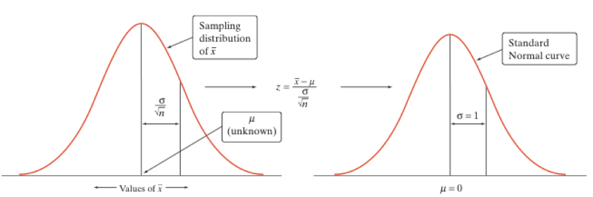
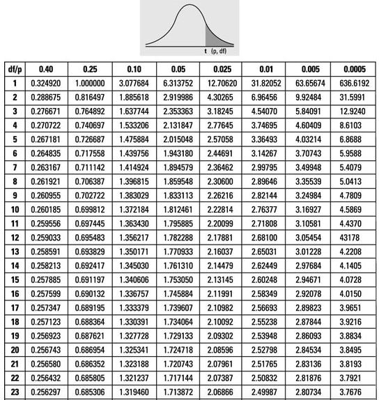
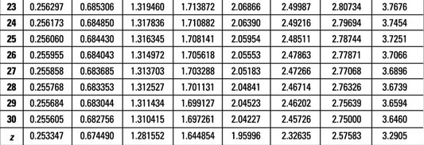
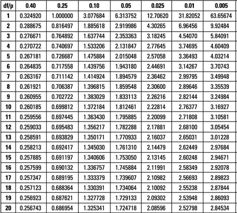
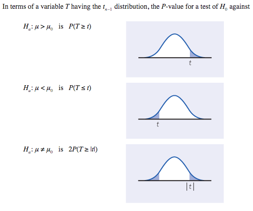
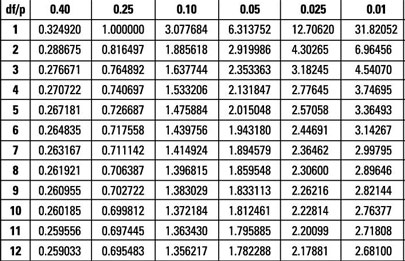

class: clear, middle

```{r preamble, child=here::here("Lecture Slides", "preamble.Rmd")}
```

## Chapter 20: Inference about a Population Mean

---
# Conditions for Inference about a Mean

We've discussed using confidence intervals and tests of significance for the mean $\mu$ of a population
 
In general, our analysis relied on two conditions:


- The data is from a .hi[simple random sample] from the population

- Observations from the population have a .hi[normal distribution] with a mean, $\mu$, which is generally unknown and a variance $\sigma^2$, which we've been assuming is known. 

We'll now talk about the situation where $\mu$ and $\sigma^2$ are both unknown.


---
# Important Reminder

For a sample mean $\bar{X}_n$, the sampling distributino has the following variance and standard deviation:

$$
\text{Variance} = \frac{\sigma^2}{n}
$$

$$
\text{Standard Deviation} = \frac{\sigma}{\sqrt{n}}
$$


---
# When $\sigma^2$ is Known

Whenever we know the population variance, $\sigma^2$, we base confidence intervals and tests for $\mu$ with the z-statistic:

$$
Z = \frac{\bar{X}-\mu}{\sigma/\sqrt{n}} \implies Z \sim N(0,1)
$$

```{r, echo = F, out.width = "90%"}

```


---

# When $\sigma^2$ is Unknown

When we don't know the true variance, we must estimate it using the sample variance $s^2$. Again, since we're talking about sample means, the standard deviation of a sample mean, based of a .it[population with unknown variance] is:

$$
\frac{\sigma^2}{n} \text{ which is estimated by } \frac{s^2}{n} 
$$

$\frac{s}{\sqrt{n}}$ is called the .hi.alice[standard error].


---
# When $\sigma^2$ is Unknown

When we don't know $\sigma$, we estimate it by the .it[sample standard deviation], $s$. What happens when we standardize?

$$
\frac{\bar{X}-\mu}{s/\sqrt{n}} \sim \quad ?
$$

--

<br/>
.center.it[This new statistic does not have a normal distribution!]


---
# The $t$ Distribution

When we standardize based on the sample standard deviation, $s$, our statistic has a new distribution called a .hi.daisy[t-distribution]

Consider a simple random sample of size $n$, the .hi.daisy[t-statistic]:

$$
\daisy{t} = \frac{\bar{X}-\mu}{s/\sqrt{n}}
$$

has the .daisy[t-distribution] with $n-1$ degrees of freedom

The .daisy[t-statistic] has the same interpretation as z-statistic: it says how far away $\bar{X}$ is from its mean $\mu$, in standard deviation units.

- The distribution is different because we have one aditional source of .it[uncertainty]: we estimate the standard deviation with $s$.


---
# The $t$-Distribution

There is a different $t$ distribution for each sample size, specified by its .hi.coral[degrees of freedom]

- We denote the $t$ distribution with $n-1$ degrees of freedom as $t_{n-1}$


- The curve has a different shape than the standard normal curve

  - It is still symmetric about it's peak at 0
      
  - But, it has more area in the tails.


---
# "More Area in the Tails"?

.ex[Example:] Let's say I want to predict the height of the class by selecting $n = 3$ people and taking their mean. Sometimes I will pick 3 basketball players or 3 short people.

- If I am using $n = 20$ people, then it is much more rare to select only tall or only short people (this means that extreme sample means are more rare).

- I might still select the tallest or shortest person in the class, but they're only one of 20 instead of one of 3.


---
# Graphs of $t$-Distributions


```{r, echo = F, out.width = "90%"}

ggplot(data.frame(x = c(-4, 4)), aes(.data$x)) +
	stat_function(
    fun = function(x) dt(x, df = 1), aes(color = "1 degree of freedom"),
    size = 1.5, n = 203) +
  stat_function(
    fun = function(x) dt(x, df = 5), aes(color = "5 degrees of freedom"),
    size = 1.5, n = 203) +
  stat_function(
    fun = function(x) dt(x, df = 30), aes(color = "30 degrees of freedom"),
    size = 1.5, n = 203) +
  scale_color_manual(values = c(alice, coral, daisy)) +
	kfbmisc::theme_kyle(base_size = 20) +
	labs(x = "Value", y = "Density", color = "Degrees of Freedom") +
  theme(
    legend.position = c(0.2, 0.8),
    legend.background = element_rect(fill = "white")
  )

```


---
# Graphs of $t$-Distributions


Greater degree of dispersion in the $t$ distribution
      
- It has an additional source of random variability in the sample standard deviation $s$
      
The variance from estimating $s$ decreases when the sample size increases
      
- This means the t-distribution looks more like the z-distribution as sample size grows to infinity

- Once degrees of freedom exceeds 31, the t-distribution is close enough to standard normal to approximate probabilities using the z-distribution
      


---
# Finding $t$-values


```{r, echo = F, out.width = "90%"}

```


---
# Finding $t$-values
As you see, once we have more than 30 degrees of freedom, we can use the z-scores

<br/>

```{r, echo = F, out.width = "90%"}

```


---
# Confidence Interval with $t$-Distribution

Calculating a confidence interval:

If the variance, $\sigma^2$, is known:
      
- Use Z-distribution
      
If the variance, $\sigma^2$, is unknown:
      
- 31 or more observations in sample, use Z-distribution

- 30 or fewer observations in sample, use t-distribution
      


---
# Example
Say you want to construct a 95% confidence interval using 20 observations from population with unknown $\mu$ and $\sigma$, with a sample mean, $\bar{X}=22.21$ and a sample standard deviation, $s=1.963$. 

$\sigma$ is unknown and $n \leq 31 \implies$ use t-distribution:

$$
CI = \bar{X} \pm t^* \frac{s}{\sqrt{n}}
$$

where $t^*$ is the critical value: 

$$
t^{\frac{1-C}{2}}_{df} = t_{19}^{0.025}
$$


---
# Example

Find $t^{0.025}_{19}$ using t-distribution table:

.pull-left[
```{r, echo = F, out.width = "100%"}

```
]
.pull-right[
$$t^{0.025}_{19}=2.093$$
]


---
# Example

$$CI = \bar{X} \pm t^* \frac{s}{\sqrt{n}}$$

$$CI = 22.21 \pm 2.093 \cdot \frac{1.963}{\sqrt{20}}$$
 
Which means the confidence interval is [21.29, 23.13].

We are 95\% confident that the population mean is between 21.29 and 23.13.


---
# Clicker Question
Which table would you use for the following confidence interval?

99% confidence interval with $n=1000$ observations

<ol type = "a">
  <li>z-table</li>
  <li>t-table</li>
</ol>


---
# Clicker Question
What critical value $t^*$ would you use for the following confidence interval?

90% confidence interval with $n=2$ observations


<div class="pull-left">
<ol type = "a">
  <li>2.92</li>
  <li>6.31</li>
  <li>3.08</li>
  <li>1.89</li>
</ol>
</div>

<div class="pull-right">
```{r, echo = F, out.width = "100%"}

```
</div>

---
# Clicker Question
What critical value $t^*$ would you use for the following confidence interval?


95% confidence interval with $n=16$ observations


<div class="pull-left">
<ol type = "a">
  <li>1.753</li>
  <li>1.745</li>
  <li>2.13</li>
  <li>2.12</li>
</ol>
</div>

<div class="pull-right">

```{r, echo = F, out.width = "100%"}

```

</div>

---
# Clicker Question -- Midterm Example
A randomly sampled group of patients at a major U.S. regional hospital became part of a nutrition study on dietary habits. Part of the study consisted of a 50-question survey asking about types of foods consumed. Each question was scored on a scale from one (most unhealthy behavior) to five (most healthy behavior). The answers were summed and averaged. The population of interest is the patients at the regional hospital. A sample of $n = 15$ patients produced the following statistics $\bar{X}=3.3$ and $s=1.2$. A 99% confidence interval is given by:

<ol type = "a">
  <li> \( (2.37, 4.22). \) </li>
  <li> \( (2.64, 3.97). \) </li>
  <li> \( (2.69, 3.91). \) </li>
  <li> \( (2.5, 4.1). \) </li>
</ol>


---
# Hypothesis Test with $t$-Distribution

Like the confidence interval, the $t$ test is very similar to the $Z$ test introduced earlier.

If we have  SRS of size $n$ from population with unknown $\mu$ and $\sigma$. To test the hypothesis: $H_0: \mu = \mu_0$, compute the .hi.daisy[t-statistic]:

$$
t=\frac{\bar{X}-\mu_0}{s/\sqrt{n}}
$$

We then use this t-statistic to calculate the p-value

- The p-values are exact if the population does happen to be normally distributed

- Otherwise, they are approximately correct for large enough $n$


---
# p-Values in $t$-Distribution


```{r, echo = F, out.width = "80%"}

```


---
# Example
Suppose we have a sample of 12 observations and calculate a sample mean $\bar{X}=113.75$ and a sample standard deviation, $s=93.90$, and we want to test the following hypothesis at the $\alpha=0.10$ level:

$$ 
H_0: \mu=88 
$$

$$ 
H_1: \mu > 88 
$$

The set up is similar to how we've done hypothesis testing before, but we must use the t distribution.

--

$$ 
P(\bar{X} > 113.75 \ \vert \ \mu = 88) 
$$


---
# Example
When we "standardize", we are going to be using the t-distribution since we don't know the population variance and we have a small sample.

$$\begin{align*}
P(\bar{X} > 113.75 \ \vert \ \mu=88) &= P(\frac{\bar{X}-\mu_0}{s/\sqrt{n}} > \frac{113.75-88}{93.90/\sqrt{12}}) \\
&= P(t_{11}>0.95)
\end{align*}$$


---
# Example
Our next step is to find the p-value associated with that t-statistic

We can pin down the p-value between two points by using the t-table used earlier. 
      
- Look at the row, df=11
- See which columns 0.95 lies between, and look at their associated probabilities 
      


---
# Example


```{r, echo = F, out.width = "70%"}

```

We see that along the row with 11 degrees of freedom,  Our t-statistic (0.95) is between 0.25, which has a t-statistic of 0.697, and 0.10, which has a t-statistic of 1.36.

We conclude that $0.10 \leq p-\text{value} \leq 0.25$


---
# Example
Our level of significance is $\alpha=0.10$, and we concluded that the p-value associated with this hypothesis is test is greater than 0.10. 

Therefore:

$$
\alpha \leq p-\text{value} \implies \text{ Do not reject } H_0
$$

That main difference between solving a hypothesis test with z-statistic versus t-statistic is that we will generally only be able to find a range for the p-value with t-statistic, whereas we found an exact value with a z-statistic.

- You would need 30 seperate $t$ tables to have matching exactness of Z-table. 


---
# Clicker Question

Say we have calculated a $t$-statistic of 1.6 from a sample of 24 observations. Do we reject at the $\alpha=0.10$ level? What about the $\alpha=0.05$ level?

<ol type = "a">
  <li>Reject at both \( \alpha=0.05 \) and \( \alpha=0.10\)</li>
  <li>Do not reject at both \( \alpha=0.05 \) and \( \alpha=0.10\)</li>
  <li>Reject at \( \alpha=0.05 \), but do not reject at  \( \alpha=0.10\)</li>
  <li>Reject at \( \alpha=0.10 \), but do not reject at  \( \alpha=0.05\)</li>
</ol>


---
# Hypothesis Testing with t-Distribution
When we conduct a hypothesis test we follow these steps:

1. Calculate the test statistic
      $$t=\frac{\bar{X}-\mu_0}{s/\sqrt{n}}$$

2. Determine range of p-values associated with test statistic using t-table

  - Row is determined by degrees of freedom, $n-1$

  - Find which two columns your t-statistic lies between

3. Similar to hypothesis testing with a Z distribution, if using a two-tailed test, multiply $p$-value by 2.

4. Compare range of p-values to $\alpha$


---
# Work in Groups 

A researcher collected a sample of 12 fish and measured gill length. They calculated $\bar{X} = 3.12$ and $s = 0.7$. Test the following hypothesis at the $\alpha = 0.05$ level:

$$
H_0: \mu = 3.5
$$

$$
H_1: \mu < 3.5
$$


---
# Example
Observe sample of 27 newborns in a hospital near Chernobyl and record number of fingers. You calculate $\bar{X} = 9.2$ and $s = 1.8$. You want to test to the following hypothesis at the $\alpha=0.10$ level:
$$
H_0:\mu=10
$$
$$
H_1: \mu \neq 10
$$


---
# Rejection Region from $t$-Table

Lookup the critical value $t^*$, based off the degrees of freedom and level of significance, $\alpha$


Right tailed test:

- Reject $H_0$ when $t > t^*$

      
Left tailed test:

- Reject $H_0$ when $t < -t^*$

--

Can work back out the rejection region to find range for $\bar{X}$

$$
\daisy{t} = \frac{\bar{X}-\mu}{s/\sqrt{n}} > t^* \implies \bar{X} > t^{*} \frac{s}{\sqrt{n}} + \mu
$$
      


---
# Example
Suppose you collect a sample of 17 family incomes. You calculate \(s = 6,000\). You want to test the following hypothesis:

$$ 
H_0: \mu = \$29,000
$$

$$ 
H_1: \mu > \$29,000
$$

If we test at the $\alpha = 0.05$ level, what is our rejection region?


---
# Example
Suppose you collect a sample of 25 students and record their test scores. You calculate $s=4.2$. If we're testing the following hypothesis:
$$ 
H_0: \mu=82
$$

$$ 
H_1: \mu<82
$$

If we're testing at the $\alpha=0.01$, when do we reject the null hypothesis?


---
# Example

Back to our newborn example. Observe sample of 27 newborns in a hospital near Chernobyl and record number of fingers. You calculate $s = 1.8$. If we're testing the following hypothesis at the $\alpha = 0.05$ level, what is the rejection region?

$$ 
H_0:\mu=10
$$

$$ 
H_1: \mu \neq 10
$$


---
# Matched Pairs
Often we are interested in seeing if a particular treatment has an effect

- Does pollution impact your exam scores?
- Does access to birth control increase female labor force participation rates?
- Does taking turmeric improve your focus?


These questions can be solved using a .hi.kelly[matched pair design]

- a matched pair design involves making two observations on the same individual, or one observation on two similar individuals.


---
# Matched Pairs

If the conditions for inference are met, we can use a one-sample t procedures to perform inference about the .it[mean difference]

Essentially, you just consider an observation as the difference between the pair:

- Example: $X_i$ = (Country's labor force before birth-control $-$ Country's labor force after birth-control)

In these types of problems:

- the parameter interest, $\mu$, is the true population difference

- $s$ is the sample standard deviations of within pair difference


---
# Matched Pairs Example
Counselor selects 25 students who enrolled at the same school in seventh and eighth grade to see if their GPAs improved compared to the previous school year, after the school decided to implement mandatory study halls.

```{r matched-pair, echo = F}

pair <- tribble(
~"Variable",  ~"Sample Mean",  ~"Standard Deviation", 
"Seventh grade GPA", "\\( \\bar{x}_7 = 2.89433 \\)", "\\( s_7 = 0.51053 \\)", 
"Eighth grade GPA", "\\( \\bar{x}_8 = 2.96493 \\)", "\\( s_8 = 0.57332 \\)", 
"Difference (8th - 7th)", "\\( \\bar{x} = 0.07060 \\)", "\\( s = 0.23495 \\)", 
)

gt::gt(pair) %>% 
  kfbmisc::gt_theme_kyle()

```

She conducts the following hypothesis at $\alpha = 0.05$:

$$
H_0: \mu = 0
$$

$$
H_1: \mu > 0,
$$

where $\mu$ is the mean change in GPA from 7th to 8th grade.


---
# Matched Pairs Example

Calculate p-value of the hypothesis test:

Calculate t-stat: 
$$ 
\daisy{t} = \frac{\bar{X}-\mu}{s/\sqrt{n}} = \frac{0.07-0}{.235/\sqrt{25}} = 1.49
$$

Calculate range of p-values:

- Row 24, $\daisy{t} = 1.49$ between 0.10 and 0.05 $\implies$ $0.05 < p < 0.10$.


- $p>\alpha$ so she would not reject the null that the mandatory study halls had no effect on grades


---
# Matched Pairs Example

Say 16 cows are randomly fed two different diets. Milk production was measured for each of the cows during each of the two diets, so that 32 milk production values were recorded. You find the average within cow difference is 0.7 liters of milk, and the sample standard deviation of the within cow difference is 1 liter. 

Consider the following hypothesis test:
$$H_0: \mu=0$$
$$H_1: \mu \neq 0$$

Do we reject the null that the cow's produce the same amount of milk at the $\alpha=0.05$ significance level?


---
# Matched Pairs Example
Calculate the p-value of hypothesis test:
$$ 
t=\frac{0.7-0}{1/\sqrt{16}}=2.8 
$$

$t_{15} = 2.6$ when $\alpha = 0.01$ and $t_{15} = 2.95$ when $\alpha = 0.005$

This means the p-value is in between $2 \cdot (0.005)$ and $2 \cdot (0.01)$ because we are looking at a two-tailed test.

Therefore, $0.01 < p \text{-value} < 0.02$, 
 
and we reject the null of no difference because our p-value range is less than $\alpha = 0.05$


---
# Clicker Question -- Midterm Example
Which of the following is an example of a matched pairs design?
<ol type = "a">
  <li> A teacher compares the pretest and posttest scores of students. </li>
  <li> A teacher compares the scores of students who had a computer-based method of instruction with the scores of other students who had a traditional method of instruction. </li>
  <li> A teacher compares the scores of students in her class on a standardized test with the national average score. </li>
  <li> A teacher calculates the average of students' scores on a pair of tests and wishes to see if this average is larger than 80\%. </li>
</ol>


---
# When to Use Which Distribution

If we have SRS, Normal X, and $\sigma$ known:

- Use Z distribution


If we have SRS, Normal X, and $\sigma$ unknown:

- Use the t distribution


.purple[What if we don't know that X is normal?]

- $n<15 \implies$ only use t if X looks very normally distributed.

- $15 < n < 31 \implies$ use t as long as there are no extreme outliers

- $n>31$, probably okay using Z


Recall Law of Large numbers that says as $n \to \infty$:
$$ 
\frac{\bar{X}-\mu}{\sigma/\sqrt{n}} \to^d Z\sim(0,1)
$$