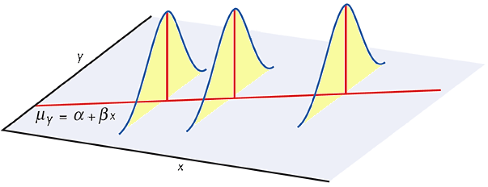
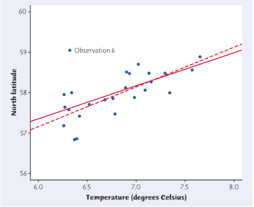
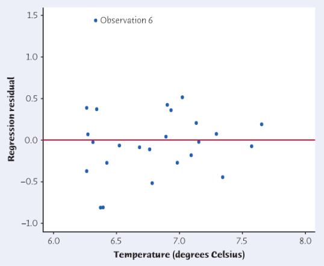

class: clear, middle

```{r preamble, child=here::here("Lecture Slides", "preamble.Rmd")}
```

## Chapter 26: Regression Inference

---
# Introduction

Chapter 4 and 5 discussed how scatterplots and lines of best fit show us linear relationships, but there are remaining questions


Is there really a linear relationship between x and y, or is the pattern just by chance

- Spurious correlations
  
What is the estimated slope that explains how $y$ responds to $x$ .it[in the population]. What is the margin of error for our estimate?

- If we use the least-squares line to predict $y$ for a given $x$, how accurate is that prediction?

- In econometrics, you will discuss when you can answer what is the **effect** on $y$ of changing $x$


---
# Regression Review

We can model the linear relationship between X and Y by thinking of a conditional expectation: 

$$ 
E(Y|X)= a + bX 
$$

We want estimates for a and b, $\hat{a}$ and $\hat{b}$, and we find these estimates by minimizing the sum of squared residuals

$$ 
\varepsilon_i = Y_i - \coral{\widehat{Y}_i} \equiv Y_i - (\coral{\hat{a} + \hat{b} X_i})
$$


---
# OLS Estimators

We pick the values of $\hat{a}$ and $\hat{b}$ to minimize the sum of least squares, $\sum_{i=1}^n \varepsilon_i^2 $. This yields the Ordinary Least Squares estimators

$$ 
\hat{a}=\bar{Y}-\hat{b}\bar{X} 
$$

$$ 
\hat{b}=r_{XY}\frac{s_Y}{s_X} 
$$


---
# Next Steps
This chapter will answer

- How can I interpret $\hat{a}$ and $\hat{b}$?

- What conditions are necessary for those interpretations?

- Inference from a Regression


---
# Interpreting $a$ and $b$


$$ 
\hat{\coral{\text{Calcification Rate}}} = -12.103 + 0.4615 * \text{Temperature} 
$$

We can now predict how temperature affects the calcification rate. The $R^2$ will tell us how much of the variation in calcification rate is due to temperature, but it will not tell us whether this relationship is .hi.daisy[statistically significant]. 

In order for this regression to be meaningful, we must determine whether the results are .hi.daisy[statistically significant]


---
# Estimating the Parameters

When the conditions for the regression are met.super[1]

- The slope $\hat{b}$ of the least-squares line is an unbiased estimator of the population slope $b$
      
- The intercept $\hat{a}$ of the least-squares line is an unbiased estimator of the population intercept $a$

Now we only need to estimate the remaining parameters, $\sigma$, the standard deviation of the error term $\varepsilon_i$.

.footnote[.super[1] We will discuss the conditions later]

---
# Regression Standard Error

Our regression model is: 

$$ 
y = a + X b + \varepsilon
$$

$\varepsilon$ is the error term that describes why an individual doesn't fall directly on regression line $a + X b$.

We denote the variance of $\varepsilon$ as $\sigma^2$. The standard deviation, $\sigma$, describes variability of response variable $y$ about the population regression line ($\pm$). 


---
# Estimating Std. Dev. of the Error Term

The least-squares line estimates the population regression line

- The .hi.kelly[residuals] are the deviations of data points from the least-squares line 

$$ 
\hat{\varepsilon} \equiv \text{residual} = y - \coral{\hat{y}}
$$


Therefore we estimate $\sigma$ by the sample standard deviation of the residuals, known as the .hi.kelly[regression standard error]


---
# Regression Standard Error
$$ 
s=\sqrt{\frac{1}{n-2} \sum\text{residual}^2} \equiv \sqrt{\frac{1}{n-2} \sum(y - \coral{\hat{y}})^2}
$$

We use $s$ to estimate the standard deviation, $\sigma$, of responses about the mean given by the population regression line

We will use this error to determine whether our predictions are .daisy[statistically significant] 


---
# Testing the Hypothesis of No Linear Relationship
To answer questions about whether associations between two variables are .daisy[statistically significant], we must test a hypothesis about the slope $b$:


$$H_0: \ b = 0$$
$$H_1: b \neq 0$$ 

If we fail to reject $H_0$:

- Regression line with slope 0 is horizontal -- meaning y does not change at all when x changes

- $H_0$ says that there is no linear relationship between X and Y


If we reject $H_0$, and accept $H_1$:

- There is some linear relationship between X and Y


---
# Null of No Linear Relationship

If we fail to reject $H_0$:

- Regression line with slope 0 is horizontal -- meaning $y$ does not change at all when $x$ changes

```{r, echo = F, out.width = "70%"}
df <- tibble(x = runif(150, 0, 2), y = 2 + rnorm(150, 0, 0.2))

reg <- lm(y ~ x, df)

ggplot(df, aes(x = x, y = y)) + 
  geom_point() + 
  geom_abline(slope = 0, intercept = 2, size = 1.2, color = "#829356") +
  labs(title = "Line of Best Fit under Null") +
  kfbmisc::theme_kyle(base_size = 24)
```


---
# Population *vs.* sample

**Question:** Why do we care about *population vs. sample*?

```{R, gen dataset, include = F, cache = T}
# Set population and sample sizes
n_p <- 100
n_s <- 30
# Set the seed
set.seed(12468)
# Generate data
pop_df <- tibble(
  i = 3,
  x = rnorm(n_p, mean = 5, sd = 1.5),
  e = rnorm(n_p, mean = 0, sd = 1),
  y = i + 0.5 * x + e,
  row = rep(1:sqrt(n_p), times = sqrt(n_p)),
  col = rep(1:sqrt(n_p), each = sqrt(n_p)),
  s1 = sample(x = c(rep(T, n_s), rep(F, n_p - n_s))),
  s2 = sample(x = c(rep(T, n_s), rep(F, n_p - n_s))),
  s3 = sample(x = c(rep(T, n_s), rep(F, n_p - n_s)))
)
# Regressions
lm0 <- lm(y ~ x, data = pop_df)
lm1 <- lm(y ~ x, data = filter(pop_df, s1 == T))
lm2 <- lm(y ~ x, data = filter(pop_df, s2 == T))
lm3 <- lm(y ~ x, data = filter(pop_df, s3 == T))

# Simulation
set.seed(12468)
sim_df <- lapply(X = 1:1e3, FUN = function(x, size = n_s) {
  lm(y ~ x, data = pop_df %>% sample_n(size = size)) %>% broom::tidy()
}) %>% 
  do.call(rbind, .) %>% 
  as_tibble()
```

.pull-left[

```{R, pop1, echo = F}
ggplot(data = pop_df, aes(x = row, y = col)) +
  geom_point(color = "darkslategray", size = 10) +
  theme_empty
```

.center[**Population**]

]

--

.pull-right[

```{R, scatter1, echo = F}
ggplot(data = pop_df, aes(x = x, y = y)) +
  geom_abline(
    intercept = lm0$coefficients[1], slope = lm0$coefficients[2],
    color = coral, size = 3
  ) +
  geom_point(color = "darkslategray", size = 6) +
  theme_empty
```

.center[**Population relationship**]

$$ y_i = `r round(lm0$coefficients[1], 2)` + `r round(lm0$coefficients[2], 2)` x_i + u_i $$

$$ y_i = \beta_0 + \beta_1 x_i + u_i $$


]

---
# Population *vs.* sample

**Question:** Why do we care about *population vs. sample*?

.pull-left[

```{R, sample1, echo = F}
ggplot(data = pop_df, aes(x = row, y = col, shape = s1)) +
  geom_point(color = "darkslategray", size = 10) +
  scale_shape_manual(values = c(1, 19)) +
  theme_empty
```

.center[**Sample 1:** 30 random individuals]

]

.pull-right[

```{R, sample1 scatter, echo = F}
ggplot(data = pop_df, aes(x = x, y = y)) +
  geom_abline(
    intercept = lm0$coefficients[1], slope = lm0$coefficients[2],
    color = coral, size = 3, alpha = 0.3
  ) +
  geom_point(aes(shape = s1), color = "darkslategray", size = 6) +
  geom_abline(
    intercept = lm1$coefficients[1], slope = lm1$coefficients[2],
    size = 2, linetype = 2, color = "black"
  ) +
  scale_shape_manual(values = c(1, 19)) +
  theme_empty
```

.center[

**Population relationship**
<br>
$y_i = `r round(lm0$coefficients[1], 2)` + `r round(lm0$coefficients[2], 2)` x_i + u_i$

**Sample relationship**
<br>
$\hat{y}_i = `r round(lm1$coefficients[1], 2)` + `r round(lm1$coefficients[2], 2)` x_i$

]

]

---
# Population *vs.* sample

**Question:** Why do we care about *population vs. sample*?

.pull-left[

```{R, sample2, echo = F}
ggplot(data = pop_df, aes(x = row, y = col, shape = s2)) +
  geom_point(color = "darkslategray", size = 10) +
  scale_shape_manual(values = c(1, 19)) +
  theme_empty
```

.center[**Sample 2:** 30 random individuals]

]

.pull-right[

```{R, sample2 scatter, echo = F}
ggplot(data = pop_df, aes(x = x, y = y)) +
  geom_abline(
    intercept = lm0$coefficients[1], slope = lm0$coefficients[2],
    color = coral, size = 3, alpha = 0.3
  ) +
  geom_point(aes(shape = s2), color = "darkslategray", size = 6) +
  geom_abline(
    intercept = lm1$coefficients[1], slope = lm1$coefficients[2],
    size = 2, linetype = 2, color = "black", alpha = 0.3
  ) +
  geom_abline(
    intercept = lm2$coefficients[1], slope = lm2$coefficients[2],
    size = 2, linetype = 2, color = "black"
  ) +
  scale_shape_manual(values = c(1, 19)) +
  theme_empty
```

.center[

**Population relationship**
<br>
$y_i = `r round(lm0$coefficients[1], 2)` + `r round(lm0$coefficients[2], 2)` x_i + u_i$

**Sample relationship**
<br>
$\hat{y}_i = `r round(lm2$coefficients[1], 2)` + `r round(lm2$coefficients[2], 2)` x_i$

]

]
---
# Population *vs.* sample

**Question:** Why do we care about *population vs. sample*?

.pull-left[

```{R, sample3, echo = F}
ggplot(data = pop_df, aes(x = row, y = col, shape = s3)) +
  geom_point(color = "darkslategray", size = 10) +
  scale_shape_manual(values = c(1, 19)) +
  theme_empty
```

.center[**Sample 3:** 30 random individuals]

]

.pull-right[

```{R, sample3 scatter, echo = F}
ggplot(data = pop_df, aes(x = x, y = y)) +
  geom_abline(
    intercept = lm0$coefficients[1], slope = lm0$coefficients[2],
    color = coral, size = 3, alpha = 0.3
  ) +
  geom_point(aes(shape = s3), color = "darkslategray", size = 6) +
  geom_abline(
    intercept = lm1$coefficients[1], slope = lm1$coefficients[2],
    size = 2, linetype = 2, color = "black", alpha = 0.3
  ) +
  geom_abline(
    intercept = lm2$coefficients[1], slope = lm2$coefficients[2],
    size = 2, linetype = 2, color = "black", alpha = 0.3
  ) +
  geom_abline(
    intercept = lm3$coefficients[1], slope = lm3$coefficients[2],
    size = 2, linetype = 2, color = "black"
  ) +
  scale_shape_manual(values = c(1, 19)) +
  theme_empty
```

.center[

**Population relationship**
<br>
$y_i = `r round(lm0$coefficients[1], 2)` + `r round(lm0$coefficients[2], 2)` x_i + u_i$

**Sample relationship**
<br>
$\hat{y}_i = `r round(lm3$coefficients[1], 2)` + `r round(lm3$coefficients[2], 2)` x_i$

]

]

---
class: clear, center, middle

.center[$1,000$ Samples of size $30$]

```{R, simulation scatter, echo = F, out.width = "80%"}
# Reshape sim_df
line_df <- tibble(
  intercept = sim_df %>% filter(term != "x") %>% select(estimate) %>% unlist(),
  slope = sim_df %>% filter(term == "x") %>% select(estimate) %>% unlist()
)
ggplot() +
  geom_abline(data = line_df, aes(intercept = intercept, slope = slope), alpha = 0.05) +
  geom_point(data = pop_df, aes(x = x, y = y), size = 3, color = "darkslategray") +
  geom_abline(
    intercept = lm0$coefficients[1], slope = lm0$coefficients[2],
    color = coral, size = 1.5
  ) +
  theme_empty
```

---
# Population *vs.* sample

.pull-left[
```{R, simulation scatter2, echo = F, dev = "png", dpi = 300, cache = T}
# Reshape sim_df
line_df <- tibble(
  intercept = sim_df %>% filter(term != "x") %>% select(estimate) %>% unlist(),
  slope = sim_df %>% filter(term == "x") %>% select(estimate) %>% unlist()
)
ggplot() +
  geom_abline(data = line_df, aes(intercept = intercept, slope = slope), alpha = 0.01, size = 1) +
  geom_point(data = pop_df, aes(x = x, y = y), size = 6, color = "darkslategray") +
  geom_abline(
    intercept = lm0$coefficients[1], slope = lm0$coefficients[2],
    color = coral, size = 3
  ) +
  theme_empty
```
]

.pull-right[

- On **average**, our regression lines match the population line very nicely.

- However, **individual lines** (samples) can really miss the mark.

- Differences between individual samples and the population lead to **uncertainty** for the econometrician.

]


---
# Sampling Distribution of $\hat{b}$

Since $\hat{b}$ is a function of our data, it has a sampling distribution.

The sampling distribution of $\hat{b}$ is:
$$
\hat{b} \sim N\left(b, \ \frac{\sigma^2}{\sigma_X^2}\right)
$$
.footnote[Another instance of the sampling distribution being normally distributed!]

$\sigma^2$ is the variance of $\varepsilon$ and $\sigma_X^2$ is the variance of $X$.


---
# Significance Test for Regression Slope

To test the hypothesis, $H_0: b=0$, compute the t-statistic:

$$ 
t_{n-2} = \frac{\hat{b} - 0}{SE_b} 
$$

Important to note that the degrees of freedom for the t-statistic for testing a regression slope is $n-2$ (we estimate $a$ and $s$)


In this formula, the standard error of the least-squares slope is our estimate at the sampling distribution's standard deviation:

$$ 
SE_{\hat{b}}=\frac{s}{\sqrt{\sum (x-\bar{x}^2)}} 
$$


---
# Example
We fit a least-squares line to the model, $\text{Price} = a+b (\text{age})$ with 28 observations from items sold at antiques show. A summary of the output is below:


```{r, echo = F}
reg <- tribble(
  ~Parameter, ~"Parameter Estimate", ~"Std. Error of Estimate",
  "\\(\\hat{a}\\)", 27.73, 34.84,
  "\\(\\hat{b}\\)", 1.893, 0.267
)

gt(reg) |> 
  kfbmisc::gt_theme_kyle() |> 
  cols_align("center")
```

Suppose we want to test the hypothesis, $H_0: b=0$ vs. $H_1: b \neq 0$. The value of this t-statistic is: 
$$ 
t_{26} = \frac{b}{SE_b} = \frac{1.893 - 0}{0.267} = 7.09 
$$

Using t-table $\implies p < 0.001$


---
# Clicker Question

In the previous example we rejected the null hypothesis of $b=0$, meaning we claim there is sufficient evidence to say there is a linear relationship between age and price sold of items at a antiques road show. 

What type of error would we have committed if it turned out there was no relationship between age and price?

<ol type = "a">
  <li>Type I, reject the null even though its true</li>
  <li>Type II, reject the null even though its true</li>
  <li>Type I, fail to reject a false null</li>
  <li>Type II, fail to reject a false null</li>
</ol>


---
# Additional Example -- Exam Style
My budtender friend Eric did a study on marijuana consumption and hot cheeto consumption. He surveyed 25 of his friends and collected the following regression results. Assume $\alpha = 0.05$

```{r}
cheeto <- tribble(
  ~"Cheeto Consumption", ~"Estimate", ~"Std. Error", ~"t-statistic", ~"p-value",
  "Intercept", 21, 12.3, "", "", 
  "Joints Smoked", 4.2, 1.8, "", "" 
)

gt(cheeto) |> 
  kfbmisc::gt_theme_kyle() |> 
  cols_align("center")
```


<ol type = "a">
  <li> Fill in the rest of the table </li>
  <li> Is the intercept statistically significant? Why? </li>
  <li> Is the slope coefficient statistically significant? Why? </li>
  <li> Interpret slope coefficient </li>
</ol>


---
# Hypothesis Testing Example

.ex[Example:] Regression analysis provides estimates on the relationship between daily wine consumption on risk of breast cancer. The estimated slope was $\hat{b} = 0.009$ with a standard error of $SE_{\hat{b}} = 0.001$ based off 25 observations. 

We want to test whether these results are strong enough to reject the null hypothesis 
$$H_0: b = 0$$ 

in favor or the alternative hypothesis 

$$H_1: b > 0$$


---
# Hypothesis Testing Example

So we have $\hat{b}$=0.009 and $SE_{\hat{b}}$=0.001. Solving hypothesis test:


- Find t-stat 

$$ 
t=\frac{0.009}{0.001}=9 
$$

- Use t-table to find p-value 

$$ 
25 \text{ observations } \implies t_{n-2} = t_{23} 
$$

$$
t_{23}^{0.0005} = 3.8 \implies p<0.0005 
$$

- Interpret p-value 
$$ 
p < 0.0005 \implies p < 0.05 \implies \textbf{Reject $H_0$} 
$$


---
# Regression Results

```{r, echo = c(-1,-2)}
library(wooldridge)
data("wage1")
# Hourly Earnings ($) on Years of Education
summary(lm(wage ~ educ, data = wage1))
```


---
# Confidence Interval for Regression Slope

The slope, $b$, of the population regression is usually the most important parameter in a regression problem

- The slope is the rate of change of the mean response as the explanatory variable increases

- The slope explains how changes in x affect outcome variable y

A confidence interval is useful because it shows us <span class="it">how accurate the estimate of $b$ is likely to be</span>.


---
# Confidence Interval for Regression Slope

A level $C$ confidence interval for the slope $b$ of the population regression line is

$$ 
\hat{b} \pm t^* \cdot SE_{b}, 
$$

where $t^* = t^{\frac{1-C}{2}}_{n-2}$


---
# Confidence Interval for Regression Slope

.ex[Example:] Recall our regression results looking at the relationship of temperature on coral calcification. The estimated slope was $\hat{b} = 0.4615$ and a standard error $SE_{\hat{b}} = 0.07394$. Note this was based off a sample of 12 observations.

12 observations mean our $t_{n-2}$ distribution has 12-2=10 degrees of freedom and that critical $t$-stat is $2.23$ when $(1-C)/2 = 0.05/2 = 0.025$


--
If we want to construct a 95% confidence interval: 

$$
\hat{b} \pm t^* SE_{\hat{b} }= 0.4615 \pm (2.23)(0.07394) 
$$

The 95% confidence interval for population slope $b$ is $[0.297, 0.626]$.


---
# Clicker Question

A random sample of 19 companies were selected and the relationship between sales (in hundreds of thousands of dollars) and profits (in hundreds of thousands of dollars) was investigated by a regression, $profits = a + b \cdot sales$. The following results were obtained from statistical software:

```{r, echo = F}
reg <- tribble(
  ~Parameter, ~"Parametere Estimate", ~"Std. Error of Estimate",
  "\\(\\hat{a}\\)", -176.644, 61.16,
  "\\(\\hat{b}\\)", 0.0925, 0.0075
)

gt(reg) |> 
  kfbmisc::gt_theme_kyle() |> 
  cols_align("center")
```

An approximate 90% confidence interval for the slope $b$ is:

<ol type = "a">
  <li>\(-176.66\) to \(-176.63\)</li>
  <li>\(0.079\) to \(0.106\)</li>
  <li>\(0.071\) to \(0.114\)</li>
</ol>


---
# Confidence Intervals

R will spit out a 95% confidence interval associated with slope estimates with `confint`:

```{r, echo = c(-1,-2)}
library(wooldridge)
data("wage1")
# Hourly Earnings ($) on Years of Education
confint(lm(wage ~ educ, data = wage1))
```


95% confident that an additional year of schooling increases average hourly earnings between \$0.44 and \$0.65


---
# Significance and Margin of Error

Conducting a hypothesis test on $\hat{b}$ tells you about the .hi.purple[significance] of your result

- $p$-value $< \alpha$, we can say our coefficient is statistically different from zero


A confidence interval says something about the precision of the coefficient

- What are the ranges of coefficient values we expect the true-value to be in between

- Confidence interval is also the only points you will fail to reject the null.


---
# Significance and Margin of Error

```{r, echo = F}
library(wooldridge)
data("wage1")
# Hourly Earnings ($) on Years of Education
summary(lm(wage ~ educ, data = wage1))
```

Do we reject null that education has no effect on wage?


---
# Categorical Variable inside Regression

In that previous example, the explanatory variable was categorical. Let's see how that changes interpretation.

```{r, echo = -1}
wage1$hs_deg <- as.numeric(wage1$educ >= 12)
# Hourly Earnings ($) on HS Degree
summary(lm(wage ~ hs_deg, data = wage1))
```

---
# Categorical Variable inside Regression

This regression implies the relationship between HS Degree and hourly earnings is: 

$$ 
\coral{\hat{Income}} = \$4.06 + \$2.36 \cdot \text{HS Degree}
$$

The takeaways here would be:


- Without a HS degree, predicted wage is $4.06

- With a PhD, predicted wage is $4.06 + $2.36

The coefficient on an indicator represents the *difference* in averages of $Y$ between the $= 0$ and $= 1$ groups.


---
# Conditions for Regression Inference

Say we have $n$ observations regarding explanatory variable $x$ and response variable $y$. 

- The mean response $E(Y | X)$ has a .hi.purple[straight-line relationship] with x, given by a population regression line $$E(Y|X) = a + b X$$

- For any fixed value of $x$, the response variable $y$ varies according to a normal distribution

- Repeated responses $y$ are independent of each other

- The .hi.daisy[standard deviation] of $\varepsilon$, $\sigma$, is the same for all values of x.


---
# Intuition about Conditions

<span class="it">The mean response $E(Y \ \vert \ X)$ has a .hi.purple[straight-line relationship] with $x$, given by a population regression line</span>


- In practice, we observe $y$ for many different values of $x$. Eventually we see an overall linear pattern formed by points scattered about the population line. 


---
# Intuition about Conditions

<span class="it">For any fixed value of $x$, the response variable $y$ varies according to a normal distribution</span>


- We cannot observe the entire population regression line. The values of $y$ that we do observe vary about their means according to a normal distribution. If we hold x constant and take many observations of y, the Normal pattern will eventually appear in a histogram. 


---
# Intuition about Conditions

<span class="it">The .hi.purple[standard deviation] of $\varepsilon$, $\sigma$, is the same for all values of x. The value of $\sigma$ is unknown.</span>


- The standard deviation determines whether the points fall close to the population regression line (small $\sigma$) or are widely scattered (large $\sigma$)
  
- If $\sigma$ changes depending on $x$, then our sample distribution would be wrong.


---
# Intuition about Conditions

```{r, echo = F, out.width = "90%"}

```

- For each possible value of $x$, the mean of the responses moves along the population regression line

- For a fixed $x$, the responses $y$ follow a normal distribution with std. dev $\sigma$
      
- The normal curve shows how $y$ will vary when $x$ is held constant


---
# Checking Conditions for Inference

Remember, all of this discussion about inferences hinges on the data meeting certain conditions. 

- The relationship is linear in the population

- The response varies normally about the regression line

- Observations are independent

- The standard deviation of the responses is the same for all values of x


---
# Checking Conditions for Inference

In order to check these conditions, it can be helpful to look at a residual plot. A .hi.purple[residual plot] plots the residuals against the explanatory variable $x$, with a horizontal line at the "residual =0" position. The "residual =0" line represents the position of the least-squares line in the scatterplot of y against $x$.

<div class = "pull-left">
<h3 style="margin-bottom: 5px;">
  Regression Plot
</h3>

```{r, echo = F, out.width = "100%"}

```
</div>
<div class = "pull-right">
<h3 style="margin-bottom: 5px;">
  Residual Plot
</h3>

```{r, echo = F, out.width = "100%"}

```
</div>


---
# Checking Conditions for Inference


- .hi[The relationship is linear]. Look for curved patterns or other deviations from an overall straight line pattern in residual plot

- .hi[The response varies normally about regression line]. Check for departures from normality in your stemplot or histogram of residuals.

- .hi[Observations are independent]. Signs of dependence in the residual plot are subtle, so usually use common sense. 

- .hi[Standard deviation of responses is same for all values of] $x$. Look at the scatter of residuals above and below the "residual =0" line. The scatter should be roughly the same from one end to the other. 
