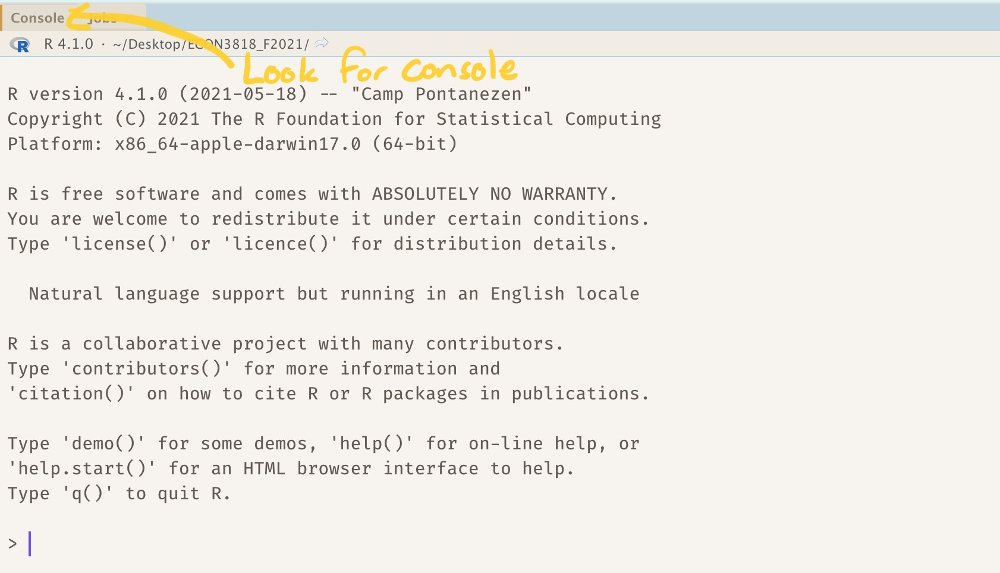
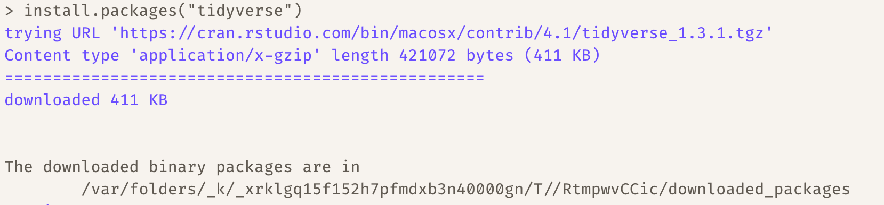
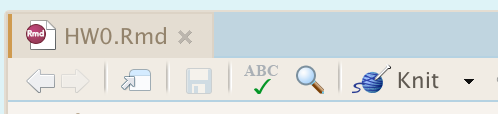

```{r preamble, child=here::here("document-preamble.Rmd")}
```


```{r, echo = F}
library(icons)
library(tidyverse)
library(gt)

output_format <- knitr::opts_knit$get('rmarkdown.pandoc.to')
```

<h1 class="hi text-2xl center">Instructions for R Homework 0</h1>


# Install R and RStudio

The first part of the assignment is aimed at getting your computers set up for the rest of the course. You need to download two different softwares. 

1. [R](https://cloud.r-project.org/) is the statistical software that we will use for this course.

2. [RStudio Desktop](https://www.rstudio.com/products/rstudio/download/) is a visual code editor that makes editing and running code way easier. This is what I will use to demonstrate all the coding in the class.

You will know that you have installed R and RStudio Desktop correctly if when you start RStudio, you see the following message in the Console tab.

```{r R-startup, echo = F, out.width = "50%"}

```

Good job! Now, we have to install two packages. Copy the following lines into the console and hit enter. This will take a minute or two, but once you have done this you will be ready for the semester.

```{r install-packages, eval = F}
install.packages("tidyverse")
install.packages("rmarkdown")
```

It should look like this when you are finished:

```{r R-installed, echo = F, out.width = "50%"}

```


---
# R Markdown

You should download the file `HW0.Rmd` from canvas. It's a good idea to put all the files for the course into a seperate folder so that they all stay together and you don't accidentally delete them. Students in the past just leave them in the messy Downloads folder which makes things hard to find. Double click `HW0.Rmd` and it should open up in RStudio automatically. 

Welcome to your first RMarkdown document! You might feel very lost, so the first thing 
we will do is have you read through some resources to familiarize yourself with 
Markdown and RMarkdown. To begin, read through these pages:

1. [Using Markdown](https://evalf21.classes.andrewheiss.com/resource/markdown/)

2. [Using RMarkdown](https://evalf21.classes.andrewheiss.com/resource/rmarkdown/)

## Instructions for Assignment

Two things for you to do for this assignment.

1. Chose a theme for our html_document

  At the top of the Rmd document, there is `YAML` data between the two `---` tags. Choose a theme by looking at this [Theme Gallery](https://www.datadreaming.org/post/r-markdown-theme-gallery/).  If it says from `____` package, you can install that package using `install.packages("____")`. 
  
  While you are there, change the name parameter to your name.

2. Fill out the few tasks given in the document. 

3. Click the `knit` button to creat html file. This will create the file in the same location as where you saved you HW0.Rmd file.

```{r R-knit, echo = F, out.width = "50%"}

```


4. Upload completed html file to canvas.

