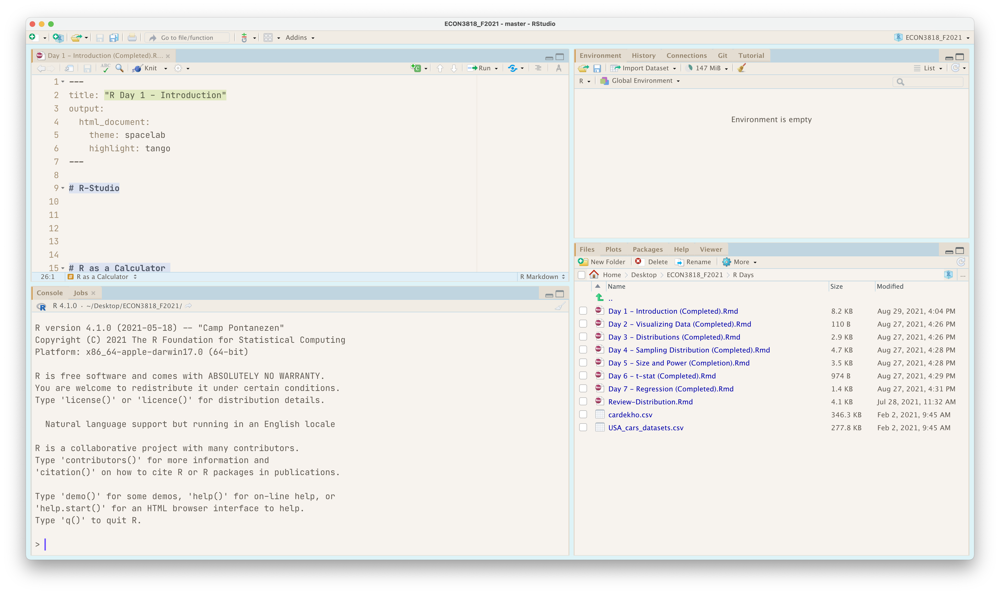
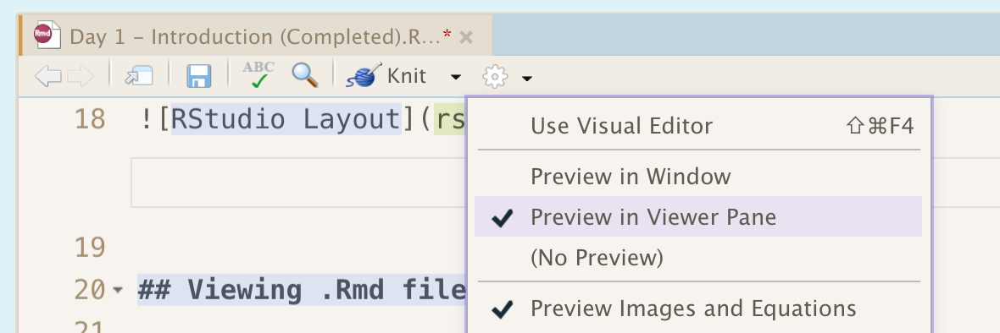
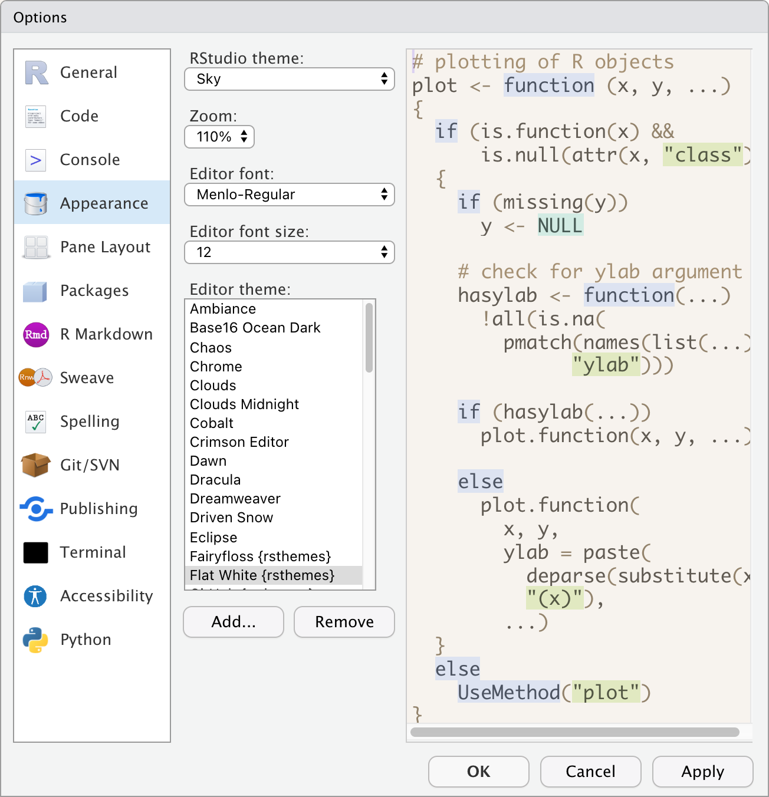

# R-Studio

There are 4 panes in RStudio:

1. Source: where you write code that you want to save in a file (`.R` or `.Rmd`)
2. Console: where you actually run code and see results
3. Environment Tab: where you can see variables you make
4. Files/Plots/Viewer: where you can view files, plots you make, and knited `.Rmd` files respectively.



## Viewing .Rmd file in RStudio

I recommend the following setting to be turned on: 

```{r, echo = F, out.width = "70%", fig.align = "center"}

```

It lets you view a knitted `.Rmd` file directly in RStudio without opening a new window. For this class, I will knit the file at the start and it will give us Notes/Instructions as we progress through the R Days. 


## Theming RStudio

If you click `Tools -> Options -> Appearance`, you can change the theme. I use the package `rsthemes` which you can use by going [here](https://github.com/gadenbuie/rsthemes) and following the instructions. You can take the next 3 minutes to pick a theme you may like for today.

```{r, echo = F, out.width = "70%", fig.align = "center"}

```


# R as a Calculator 

The first thing we will learn is how to use R as a calculator. You can use any of the math operators you want:

- `+` Addition
- `-` Subtraction
- `*` Multiplication
- `/` Division
- `^` Exponentiation 

Let's experiment with some arithmetic expressions: 

```{r}
4 + 8
5 * 14
7 / 4
4 + 5 + 3
4^3
```

Order of operations apply here too. Lets try this:

```{r}
(3 + 2) * 5
3 + 2 * 5
```

### Exercise

Compute the sample average of the following sample of baby weights (in lbs.):

(7.7, 8.2, 8.3, 7.6, 9.2, 7.4, 11.1)

```{r}

```


# R as a functional programming language

R is based around functions. A function takes an input (or multiple inputs) and produces an output. There are many many functions in R, but first lets learn some calculator type functions. For example, if I want to take the square root, I can use the function `sqrt`. Here are some example of math functions:

```{r}
sqrt(16)
abs(-3)
factorial(4) # 4 * 3 * 2 * 1
```

Note the form of a function call:

1. The function name, `sqrt`, `abs`, `factorial`
2. Opening parenthesis `(`
3. The input (in the future inputs)
4. Closing parenthesis `)`

For example `sqrt(16)` says to take the input `16` and take the `sqrt` of it.

### Exercise

Calculate the square root of 147

```{r}

```


# Creating Variables

Variables are immensely helpful in R. It lets you store values by giving them a `name` and then lets you access the variables later by name. I can assign variables using either `<-` or `=`.

```{r Assignment}
y <- 20
x <- 5

x + y
```


Note the form of creating the variable:

1. The variable name, `x` and `y`
2. Assignment operator `<-` or `=`
3. The value we want to store.

We can store even complex values. Let's say I want to calculate the mean of the sample of birthweights above. I can store this for later use as follows

```{r}
mean <- (7.7 + 8.2 + 8.3 + 7.6 + 9.2 + 7.4 + 11.1) / 7

mean
```

You can create a variable containing text by using `""`

```{r}
greeting <- "Hello class!"

greeting
```


### Exercise

Use quotation marks to create a string and call it `my_name`.

```{r}

```


# Vectors 

Vectors are a list of elements like integers, numbers, or strings. This is really useful for storing data! You use `c` to create a vector (c for combine).

```{r Vectors}
x <- c(1, 2, 3, 4, 5)
y <- c(6, 7, 8, 9, 10)

x
```

You can access elements of a vector by using `[#]`, where `#` is the n-th element you want 

```{r}
x[1]
x[2]
y[5]
x[1] * y[5]
```

Standard math operators work on vectors element by element:

```{r}
x + 1
x * 2
(x + 1) * 2
x^2
```
The math functions we learn also operate element by element:

```{r}
sqrt(x)
```

What happens when we add two vectors?

```{r}
x + y
```

What happens is that they add the vector element-by-element.


### Summarizing vectors

Typically, a vector contains observations of a particular variable. For example, let's create a vector of our baby weight sample:

```{r}
baby_weights <- c(7.7, 8.2, 8.3, 7.6, 9.2, 7.4, 11.1)
print(baby_weights)
```

R comes with a bunch of statistical functions that can be used to summarize variables: `summary()`, `sum()`, `mean()`, `median()`, `var()`, `sd()`, `fivenum()`, `IQR()`, `min()`, `max()`


Let's try to calculate the mean and standard deviation of birth weight:

```{r}
mean(baby_weights)
sd(baby_weights)
```

It appears that we have an outlier in our data. Let's use the five number summary instead:

```{r}
fivenum(baby_weights)
```


### Exercise

Try to find the mean and median of the total rebounds from the 1991-1992 NBA season.

```{r}
rebounds <- c(260, 114, 252, 310, 165, 236, 148, 336, 941, 127, 384, 278, 300, 6, 136, 145, 233, 142, 420, 35, 11, 161, 485, 1, 830, 81, 112, 16, 63, 513, 162, 296, 434, 239, 22, 269, 235, 222, 485, 245, 578, 162, 281, 344, 39, 99, 82, 79, 476, 3, 69, 84, 201, 52, 223, 244, 34, 728, 5, 423, 286, 346, 324, 549, 580, 152, 401, 58, 95, 187, 618, 189, 69, 184, 34, 101, 36, 7, 472, 78, 41, 631, 259, 12, 760, 33, 410, 672, 70, 227, 272, 247, 289, 63, 96, 500, 497, 739, 188, 178, 491, 1, 298, 202, 211, 307, 227, 439, 253, 24, 740, 168, 921, 61, 210, 213, 209, 150, 145, 220, 26, 144, 286, 190, 56, 182, 580, 105, 402, 660, 260, 118, 0, 231, 11, 184, 69, 432, 807, 257, 762, 24, 42, 342, 95, 185, 77, 310, 170, 447, 98, 271, 8, 41, 99, 85, 102, 593, 275, 24, 10, 206, 407, 51, 184, 0, 98, 10, 305, 43, 112, 30, 80, 312, 292, 292, 899, 182, 317, 511, 665, 78, 633, 314, 32, 11, 49, 205, 402, 296, 46, 26, 261, 429, 451, 66, 546, 206, 35, 5, 63, 161, 227, 394, 308, 118, 92, 249, 691, 257, 85, 220, 483, 233, 909, 744, 564, 208, 573, 25, 243, 16, 2, 30, 132, 34, 468, 460, 330, 268, 1, 252, 318, 453, 473, 33, 82, 494, 26, 450, 54, 110, 145, 870, 670, 111, 1, 179, 448, 700, 74, 845, 30, 27, 639, 15, 97, 705, 96, 54, 295, 312, 556, 39, 551, 426, 45, 258, 8, 233, 564, 630, 536, 5, 255, 95, 173, 11, 51, 106, 71, 393, 317, 149, 394, 301, 319, 19, 147, 257, 336, 350, 19, 416, 829, 2, 219, 1530, 171, 124, 54, 47, 296, 30, 26, 96, 168, 14, 118, 770, 310, 66, 934, 42, 415, 204, 634, 202, 301, 391, 177, 81, 256, 116, 188, 76, 417, 1, 28, 435, 191, 449, 270, 265, 5, 1, 0, 47, 183, 0, 22, 247, 0, 381, 19, 2, 862, 253, 469, 55, 37, 90, 246, 78, 88, 512, 0, 101, 265, 28, 238, 223, 257, 372, 21, 236, 94, 81, 295, 206, 704, 454, 607, 145, 129, 282, 405, 247, 1258, 15, 269, 9, 240, 260, 305, 75)
```


# Missing Data


In R, `NA` is a very special value meaning "Not Available"/"Missing". This comes up a lot in real world datasets. For example, maybe individuals don't answer a survey question. Lets say that for some reason, baby weights has a missing observation.

```{r "Create vector with NA"}
weights_w_na <- c(baby_weights, NA)
print(weights_w_na)
```

Try a few of the summary functions and see what happens. 

```{r}
sum(weights_w_na)
```


## Confusiong over functions

You can use `help("function name")` or `?function name` to get information the command. Type `help("sum")` to see how to fix this problem. 

```{r}
help("sum")
```


```{r}
sum(weights_w_na, na.rm = TRUE)

summary(weights_w_na, na.rm = TRUE)

sd(weights_w_na, na.rm = TRUE)
```


# Using Data in R

In R, you can either load data from a website or from a computer. Usually data is found in a .csv file, but sometimes it will be in different forms that R can read.  

```{r "Loading Data from Website"}
# From a website
housing_df <- read.csv("https://raw.githubusercontent.com/kylebutts/3818_fall_2020/master/data/housing_df.csv")
```

However, most common is to download the data and put it in the folder where your `.Rmd` file is. To load data you will need to find the file location. 

```{r "Loading Data from Computer", eval= FALSE}
penguins <- read.csv("~/Desktop/ECON3818_F2021/R Days/penguins.csv")
```

# Dataframes

Dataframes are a special object in R. The columns of a dataframe are each vectors that contain variables and a row contains an observation. If you are using RStudio, clicking the dataframe in the `Environment` tab or typing `View(dataframe)` into the console will let you interactively scroll though the data. 

```{r}
head(penguins, n = 10)
# View(penguins)
```


### Exercise

What constitutes a row in the penguins dataframe? What constitutes a column?
